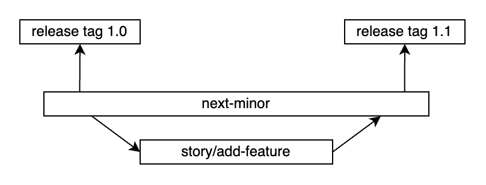
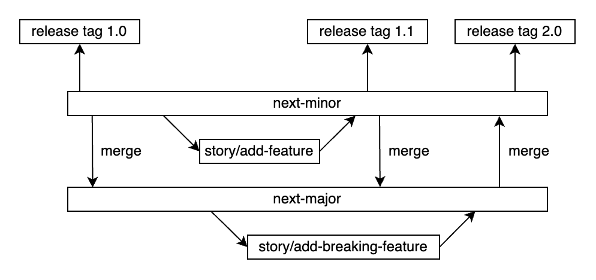
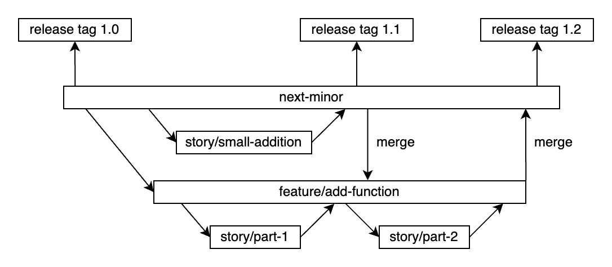
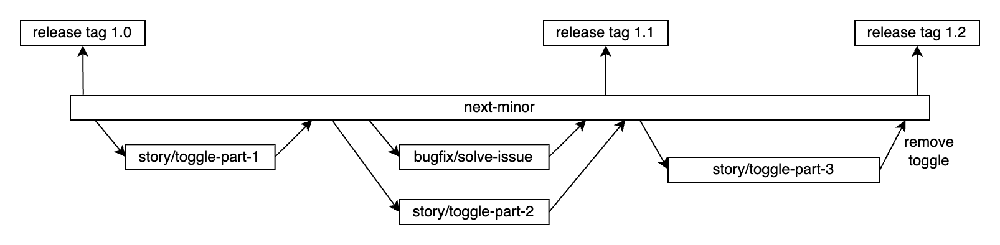
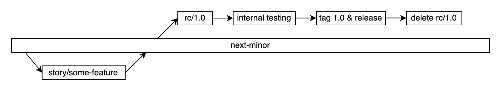
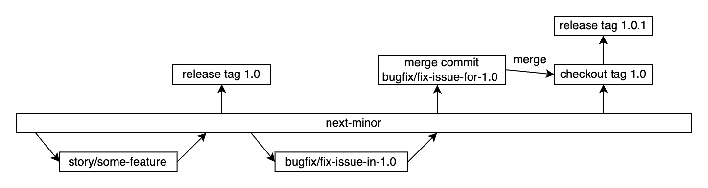

# Branching and release strategy

The Valtimo product team aims to deliver new functionality to its users quickly. Contributions from outside the core development team are very much appreciated and welcomed. To make this possible, the below branching and release strategy is used.

## Branching

### `next-minor`

Both [valtimo-frontend-libraries](https://github.com/valtimo-platform/valtimo-frontend-libraries) and [valtimo-backend-libraries](https://github.com/valtimo-platform/valtimo-backend-libraries/) are mainly developed in one single branch: `next-minor`. As its name implies, all commits made into `next-minor` will be included when the next minor version of the product is released.

|  |
| ---------------------------------------------------------------- |
| _Using the `next-minor` branch_                                  |

### `next-major`

Breaking changes for the product are developed in the `next-major` branch. Only changes related to the breaking change are made here. Unrelated changes are still committed to `next-minor`.

`next-minor` is frequently merged into `next-major`, in order to avoid future merge conflicts.

Once the breaking changes in `next-major` are finished and tested, `next-major` is merged into `next-minor`. The merge commit is then tagged and released. The branch `next-major` is not deleted after this merge and release.

Work then continues in the `next-minor` branch until a new breaking change needs to be made, which will again be developed in the `next-major` branch.

|  |
| ---------------------------------------------------------------- |
| _Using the `next-major` branch_                                  |

### Back-end libraries

Because of security reasons, back-end features are developed in feature branches, branched off from `next-minor`. Feature branches are named `feature/*`. Parts of the feature are developed in branches prefixed with `story/`, which include a story number, if a story is available. For example: `story/add-endpoint` or `story/12345-add-endpoint`. These story branches are merged into the feature branch as soon as possible. In addition, `next-minor` is merged frequently into the feature branch.

Bugfix branches follow the naming scheme: `bugfix/fix-security` or `bugfix/12345-fix-security`. They are either merged into `next-minor`, `feature/*` or to `next-major`.

|  |
| ------------------------------------------------------------------------------- |
| _Working with feature branches on `next-minor` for back-end libraries_          |

### Front-end libraries

All branches for the front-end libraries are branched off `next-minor` or `next-major`.

Since the front-end does not have the same security concerns as the back-end libraries, it is recommended to develop new features behind feature toggles. During development, the toggle can be enabled on the test environment, while remaining disabled in production. When the feature is done, the feature toggle is removed and the feature is made available to all.

In some cases, feature branches like explained above for the back-end libraries, can also be used for the front-end libraries. For this reason, branches for parts of a feature behind a feature toggle, are prefixed with `story/`, for example: `story/add-button` or `story/12345-add-button` (if a story number is available). The naming scheme `feature/*` is reserved for longer lived feature branches.

If the use case calls for it, feature toggles can be retained if a feature is finished, for example if the feature needs to be turned off by default.

|  |
| --------------------------------------------------------------------------------- |
| _Working with feature toggles on `next-minor` for front-end libraries_            |

## Releasing

Changes in `next-minor` in both `valtimo-frontend-libraries` and `valtimo-backend-libraries` are released as frequently as possible, but only when the branches are stable. There is a maximum of 4 weeks between releases.

A release is done by creating a release branch from the `next-minor` branch. After this, a short-lived release candidate is created from this branch for internal testing. If this release is satisfactory, the release branch is tagged, and a release is made. Afterward, the release branch is deleted.

|  |
| ------------------------------------------------------------ |
| _Release process from `next-minor` branch_                   |

### Bugfixes

If bugs are encountered for unreleased minor or major versions, fixes for these bugs are made in `bugfix/*` branches, branched off from `next-minor` and `next-major` respectively.

If bugs need to be fixed in previous releases, the fixes are done in `next-minor` if it all possible. After the fixes are tested and merged, they are cherry-picked into a branch based of the tags of the release(s) in which they need to be fixed. Afterward, a new patch release is made with the fix included. As a rule of thumb, bugs are only fixed in the last minor release, in order to avoid maintaining many releases at once.

An example scenario for a bugfix in a previous release:

`next-minor` is currently headed for release `12.4`. A bug has been encountered in release `12.3`. In this case, the fix for this bug is developed in the branch `bugfix/fix-issue`, branched off the `next-minor` branch. After `bugfix/fix-issue` is merged into `next-minor`, the merge commit is cherry-picked into a branch based on the `12.3` release tag. A release is made from this branch with the fix included, and the latest commit of this branch is tagged as `12.3.1`. The release branch is subsequently deleted.

With this way of working, bugfixes are always included in the next minor release. If another issue is encountered in `12.3.1`, the same process is followed, and a `12.3.2` release is made, based off the `12.3.1` release tag.

|  |
| -------------------------------------------------------------- |
| _Fixing a bug in a previous release in `next-minor` branch_    |
