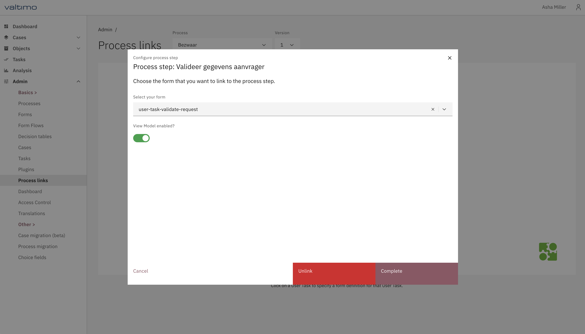

# Enabling the module

Add the following dependency to your project's `build.gradle` file:

```gradle
dependencies {
    implementation 'com.valtimo:form-view-model:12.1.0'
}
```

Enable the feature toggle in your project's environment.ts file:
```typescript
featureToggles: {
    enableFormViewModel: true
}
```

Enable the feature for a form via the process-link menu

