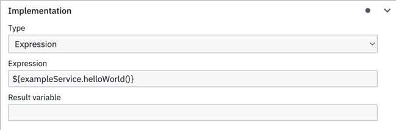

# How to integrate a Spring Bean into a process

It is possible to use custom code in your BPMN processes by referencing a [spring bean](https://docs.spring.io/spring-javaconfig/docs/1.0.0.M4/reference/html/ch02s02.html)
that contains the code you want to run. Any spring bean can be used in camunda expressions by using the bean name.
 
```java
@Component
public class ExampleService {
    public void helloWorld() {
        // code goes here
    }
}
```

This method can then be called in camunda expressions



Beans can be used in any BPMN activity that allow expressions as its implementation such as service or send tasks.
Execution listeners on any activity type also have access to these beans.    
