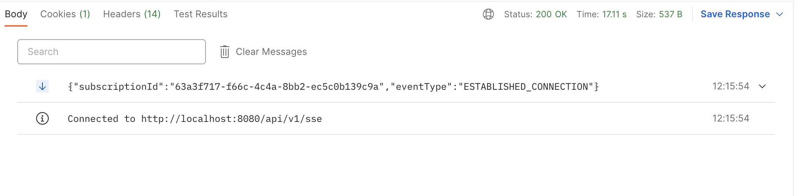

# Server sent events

Server-Sent Events (SSE) is a paradigm used to send information from the server to the client
without an explicit request. 

Valtimo provides an implementation of SSE to allow
web clients to listen to specific events or for implementations to create their
own events to be sent

### Creating events

To create events, implementations need to extend the `BaseSseEvent` class
and add any number of properties.

```kotlin
abstract class BaseSseEvent(val eventType: String) //provided by Valtimo

class CampaignSseEvent(
        val offerId: UUID,
        val offerDescription: String
    ) : BaseSseEvent("NEW_OFFER_EVENT") //example implementation
```

### Sending events

Valtimo provides a Spring Bean as a service to allow for events to be sent to
subscribers.

To do so Valtimo the SseSubscriptionService bean can be used as in the example bellow.

```kotlin
@Component
class CampaignService(val sseSubscriptionService: SseSubscriptionService){
    
    fun evaluateOfferAndNotifyUser(user: User){
        val offer: Offer = evaluateUser(user)
        if(offer.isAppliable()){
            sseSubscriptionService.notifySubscribers(
                CampaignSseEvent(
                    offer.id,
                    offer.description
                )
            )
        }
    }
    
}
```

### Client subscription to events

Valtimo provides public apis to subscribe to events that are fired by the Server
An event stream will be established and events will be listened to by the subscriber
```
GET https://valtimo-host/api/v1/sse 
GET https://valtimo-host/api/v1/sse/{subscriptionId}
```

After the connection is established the subscriptionId can be retrieved from the event
as used to reconnect/reestablish.



If the subscription id is used to establish a connection all the events that were fired while disconnected
will be received so there is no information loss on disconnect.

### Valtimo provided events

| Event type      | Event trigger                         |
|-----------------|---------------------------------------|
| CASE_CREATED    | Whenever a case is created in Valtimo |
| CASE_ASSIGNED   | Whenever a case assignee is updated   |
| CASE_UNASSIGNED | Whenever a case assignee is removed   |


