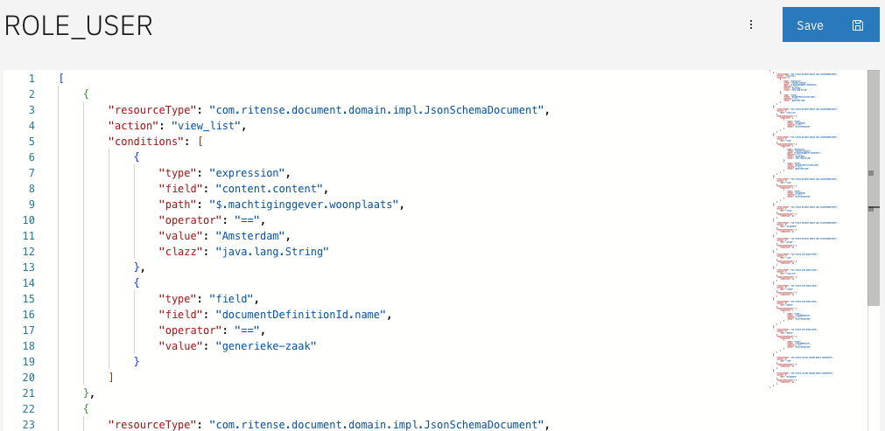
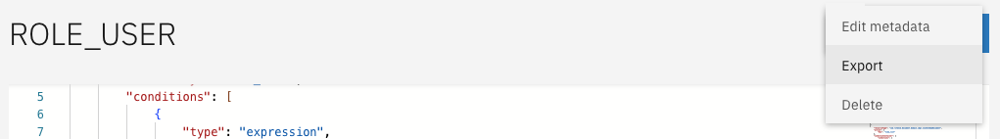

# Configuring permissions

In a new implementation of Valtimo no permissions are configured by default. `ROLE_ADMIN` always has access to the admin menu in order to allow primary setup. Access Control permissions can be configured by defining PERMISSIONS for each ROLE.


This page requires:

* Knowledge of [JSON](https://www.json.org/?_target=blank)


There are different ways of configuring Permissions in Valtimo.

* Upload a valid permissions JSON via the UI
* Edit permissions directly via the UI
* Place a valid permissions JSON in the codebase via an IDE

## Creating permissions



Creating permissions is done for a specific role. Assuming a role is present, clicking on that role in the `Access control` interface will allow permissions to be configured.



The image above shows all the permissions that have been configured for `ROLE_USER`. Here, permissions can be added, edited and removed. Since the list shown here is the full list of permissions for this role, removing a permission from the list and saving it will also result in the removal of that permission in Valtimo.

**Permission structure**

There are a lot of elements that can be specified for permissions. As an example, someone with `ROLE_USER` can have access to cases of type `example-document-definition`, or if that someone has been assigned to the case. The following two permissions are used to define this:

```json
[
  {
    "resourceType": "com.ritense.document.domain.impl.JsonSchemaDocument",
    "action": "view_list",
    "conditions": [
      {
        "type": "field",
        "field": "documentDefinitionId.name",
        "operator": "==",
        "value": "example-document-definition"
      }
    ]
  },
  {
    "resourceType": "com.ritense.document.domain.impl.JsonSchemaDocument",
    "action": "view_list",
    "conditions": [
      {
        "type": "field",
        "field": "assigneeId",
        "operator": "==",
        "value": "${currentUserId}"
      }
    ]
  }
]
```

Going over each element:

* `resourceType` is required to specify what resource type this permission applies to. For information on the resource types Valtimo provides out of the box, see [here](broken-reference). For information on how to register custom resource types, see [here](for-developers/registering-a-resource.md).
* `actionKey` specifies the kind of action that is being done. In this case, viewing a list. For a list of actions, see [here](broken-reference).
* `conditions` is a list describing all the conditions that apply to this particular permission. This requires knowledge of the code for the resource type, as fields can be specified in here correspond to fields inside the class. For information on the kinds of conditions that can be specified, as well as the fields, see [this page](broken-reference). Permission is only granted when all conditions for that permission are met.



The example below defines 2 permissions:

* A user with `ROLE_ADMIN` can `VIEW` any document
* A user with `ROLE_USER` can `VIEW` documents where:
  * the name of the document-definition equals `loans`
  * the `height` of the loan is less than 20000

`document.permission.json`:

```json
{
    "changesetId": "pbac-documents",
    "permissions": [
        {
            "resourceType": "com.ritense.document.domain.impl.JsonSchemaDocument",
            "action": "view",
            "roleKey": "ROLE_ADMIN"
        },
        {
            "resourceType": "com.ritense.document.domain.impl.JsonSchemaDocument",
            "action": "view_list",
            "roleKey": "ROLE_USER",
            "conditions": [
                {
                    "type": "expression",
                    "field": "content.content",
                    "path": "$.height",
                    "operator": "<",
                    "value": 20000,
                    "clazz": "java.lang.Integer"
                },
                {
                    "type": "field",
                    "field": "documentDefinitionId.name",
                    "operator": "==",
                    "value": "loans"
                }
            ]
        }
    ]
}
```

**Joining entities using a container**

The example below shows how container conditions can be used to join other entities. In this case, the permission is defined:

* A user with `ROLE_USER` can `VIEW` notes where
  * the related document-definition name equals `loans`
  * the related document is assigned to the current user

`note.permission.json`:

```json
{
    "changesetId": "pbac-notes",
    "permissions": [
        {
            "resourceType": "com.ritense.note.domain.Note",
            "action": "view",
            "roleKey": "ROLE_USER",
            "conditions": [
                {
                    "type": "container",
                    "resourceType": "com.ritense.document.domain.impl.JsonSchemaDocument",
                    "conditions": [
                        {
                            "type": "field",
                            "field": "documentDefinitionId.name",
                            "operator": "==",
                            "value": "loans"
                        },
                        {
                            "type": "field",
                            "field": "assigneeId",
                            "operator": "==",
                            "value": "${currentUserId}"
                        }
                    ]
                }
            ]
        }
    ]
}
```



## Exporting permissions



When exporting permissions from the permission configuration page, be sure to save the configurations first if any edits have been made. Exporting will add a few more fields that are not necessary when configuring permissions via the UI, but are necessary when doing auto-deployment.





## Deleting permissions



Deleting permissions will also delete the accompanying role. Deleting roles will not delete the role in Keycloak.

.png>)


