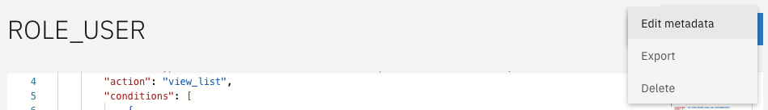

# Configuring roles

In a new implementation of Valtimo no roles are configured by default. `ROLE_ADMIN` always has access to the admin menu in order to allow primary setup. Access control permissions can be configured by defining PERMISSIONS for each ROLE.\
\
There are different ways of configuring roles in Valtimo.

* Upload a valid permissions JSON via the UI
* Edit the role directly via the UI
* Place a valid permissions JSON in the codebase via an IDE

## Creating roles



* Go to the `Admin` menu
* Go to the `Access Control` menu
* Click on **Add new role**

The "Add new role" modal opens and the new role name can be entered. Click create to add the role to the list. Each role name within Access control needs to be unique.

<figure><figcaption></figcaption></figure>



#### Auto-deployment

PBAC can be configured in the backend using auto-deployment. This is useful when you want to keep permissions identical over multiple environments. The deployment will scan for files on the classpath matching either `**/*.role.json` or `**/*.permission.json` for respectively role- and permission configurations.

Every deployment file for PBAC represents a changeset, much like Liquibase. These files contain a `changesetId` that should be unique over all deployment files that use changesets.

The contents of a changeset cannot change as long as the `changesetId` does not. A change to an existing changeset can only be made when the `changesetId` also changes. Changes made to the deployment files of PBAC will result in a full recreation of existing role- or permission configuration.

**Configuring roles**

The roles should be defined before permissions can be deployed. The file contains only a list of role names next to the mandatory `changesetId`.

`all.role.json`:

```json
{
    "changesetId": "pbac-roles",
    "roles": [
        "ROLE_USER",
        "ROLE_ADMIN"
    ]
}
```



## Editing roles



Roles can be edited by clicking on that role. This opens the detail page for that role.\
Then, by clicking on the three dots next to the `Save` button, the role can be edited by clicking on "Edit metadata".





## Deleting roles



Roles can be deleted by first clicking on that role. Then, by clicking on the three dots next to the **Save** button, the role can be deleted. Take caution, as deleting roles will also result in the deletion of related permission. Deleting roles will not delete the role in Keycloak.





## Bulk actions



Roles can also be deleted, or exported in bulk. These options will only show when one or more roles have been selected.


#### Export

Exporting a role not only exports the role itself, but also the configured permissions. This can be used to create or update auto-deployment files.

When exporting roles, there are two options. Either to export all selected roles as one single file, or alternatively downloading separate files per role.


#### Delete

Roles can also be deleted. Take caution, as deleting roles will also result in the deletion of related permission. Deleting roles will not delete the role in Keycloak.




