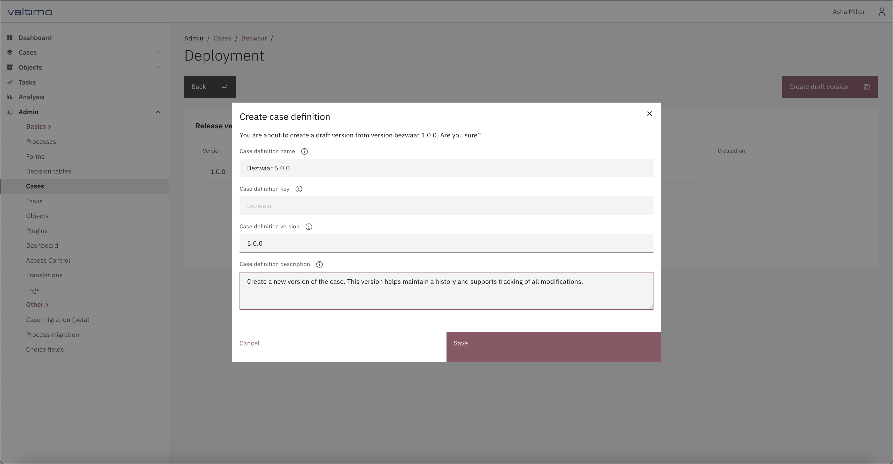

# 🗃️ Cases

## What is a case?

Case Management is a form of Business Process Automation. A 'Case' is created after an event, often a need from a person, organisation or external system. A case has the goal to fulfil this need, for example to answer the question, to ship the product or handle the complaint. After the result is achieved, the case is closed.

An example is the need for a permit to organize an event. After an application for a permit has been submitted (the trigger is always something that has happened - an event that took place), a case is created. If everything goes well from the applicant's perspective, this results in 'something': in this case, a permit.

A case is per definition short-lived, whereby the definition of 'short' can be discussed. However: a patient, car or tree are not 'short-lived' and so not a case within the definition of Case Management. To summarize: the case in Valtimo is a business process, with a clearly defined start and end.

### Cases and case definitions

To 'teach' Valtimo what it needs to do when it gets a request to execute a business process, models and definitions are used.

The definition of a business process is laid down in a _case definition_. Each _case_ is an instance of a _case definition_. A case definition contains everything the system needs to know to execute the business process from start to end. This entails the proces models, definitions of forms for user tasks, decision tables, the definition of the data to be stored, the definition of access rights and so forth.


In the Valtimo admin-menu, and in the day-to-day talk between developers the term 'case' is used for 'case definition'. This can be confusing, since end users use the same term 'case' for the instance of the case.



When you have a hammer, everything looks like a nail. Make sure to stick to a form of 'short lived'. While the length of 'short' can be debatable, creating everlasting cases is a risk. Bug fixing and fast improvement cycles can become complex when having to deal with long running cases. Since changes to the case definition do not change existing, running cases, case migration can be needed - which is complex, time consuming and error-prone.


### Data in a Case

Information provided by the event leading to the creation of the case is often the first data in the case. For example, a name, address and the complaint in case of a complaint process. During the proces of handeling the case, this data is enriched.

A definition of the data is made as part of a case definition. In the standard setup, this is a [document definition in JSON](document-definition.md).

The location of the data can be in- and outside Valtimo. The document is stored in the Valtimo database and forms the basis of a case. Data can also be stored in external systems - and referenced to. The case is conceptual: it is a reference to information - information can but does not have to be stored in the case.


The design of the datamodel and JSON document definition(s) are an often underestimated aspect of the quality of the case definition. Be aware that changes to a data model can require migrations from running case instances and can have impact in other parts of the case definition.



The document definition is non-relational. Do not try to convert a relational model into a document definition. Design and build a relational model and connect it via a plugin.


## Creating a case definition



* Go to the `Admin` menu
* Go to the `Cases` menu
* Click on **Create**
* Follow the steps of the wizard to create a new case definition

<figure><figcaption><p>Creating a new case definition</p></figcaption></figure>

After saving the case definition configuration, the case management page is opened. This page provides an overview of all the different elements that can and need to be configured for the case.



Case definitions can be created automatically by reading a configuration file. **This file will only be used when creating a case definition to avoid overriding user configuration.**

A file should be created on the classpath in the `*/resources/config/case/{case-definition-key}/{version-tag}/case/definition/` folder. The filename should be the name of the case definition and use the `.case-definition.json` file extension.


```json
{
    "key": "example",
    "name": "Example Case Definition",
    "versionTag": "1.0.0-beta"
    "final": false,
    "canHaveAssignee": true
    "autoAssignTasks": true
}
```




## Case definition versioning


Available since Valtimo `13.0.0`


Each case can have multiple versions of the case definition.



The **version selector** on the case management page allows users to switch between the available versions of a case definition. It provides contextual access to view or modify case configurations, depending on the state of the selected version (_draft_ or _final_), while also clearly indicating which version is globally active.

<figure><figcaption><p>Case version selector</p></figcaption></figure>

Every version of a case definition can be categorized as either _draft_ or _final_**.**

* A _**draft**_ version represents a case definition configuration in progress. It allows users to modify all case-related configurations before finalization.
* A _**final**_ version represents a deployed configuration of a case definition. All data associated with a final version is accessible in view mode only. No modifications are allowed.


**Visual indicators**

* **Draft Versions** are labeled with a red tag and explicitly include the word _draft_**.**
* **Final versions** are marked with a green tag in the version selector.


_**Globally active**_**&#x20;tag**

The _Globally active_ tag indicates which version of the case definition is set as the default configuration that is used throughout the system. A version can be set as _Globally active_ on the case management page:

* Click on **More**
* Click on **Set as active version**

<figure><figcaption><p>Set as active version</p></figcaption></figure>


**Note**

* Only one version can be globally active per case definition.
* This setting does **NOT** affect historical cases that were started from a previous version. It only applies to new cases after the change.


_**See all versions**_**&#x20;modal**

The version selector will show a maximum of five recent versions in the dropdown menu, and a sixth option, labeled **See all versions**, is provided at the end of the list.

Selecting **See all versions** opens a modal window containing:

* A full list of all available case definition versions.
* Metadata such as:
  * Version
  * Release date
  * Description
* The ability to select any version from this list.

<figure><figcaption><p><em>See all versions</em> modal</p></figcaption></figure>

**Deployment**

Before a case definition version can actually be used, it needs to be deployed first. This can be done on the case management page, by clicking on the **deployment** button.

<figure><figcaption><p>Case Details page</p></figcaption></figure>

When a draft version is selected, the **deployment** button enables direct actions to either finalize or discard the in-progress configuration.

* Users can finalize a draft, promoting it to a final version. This locks the contents and makes it available for operational use.
* Draft versions can be removed permanently if no longer relevant or needed.

<figure><figcaption><p>Draft versison Deployment page</p></figcaption></figure>


**Warning**

Deleting a draft version is irreversible and will discard all changes made within that draft version.


When a _**final**_ version is selected, the **deployment** button serves as a reference point for stable configurations.

* Users can create a new draft version based on any final version. This enables iteration or future changes without affecting the active version.

<figure><figcaption><p>Final version Deployment page</p></figcaption></figure>

To create a new case definition version from an existing one:

* Click on **Deployment**
* Click on **Create draft version** and configure a new draft version:

<figure><figcaption><p>Create a new version</p></figcaption></figure>


**Note**

Final versions are immutable and cannot be modified directly. All changes must be performed through a new draft.




A new version for a case definition can be created automatically by reading a configuration file. **This file will only be used when creating a case definition to avoid overriding user configuration.**

A file should be created on the classpath in the `*/resources/config/case/{case-definition-key}/{version-tag}/case/definition/` folder. The filename should be the name of the case definition and use the `.case-definition.json` file extension.


```json
{
    "key": "example",
    "name": "Example Case Definition",
    "versionTag": "1.0.1-beta"
    "final": false,
    "canHaveAssignee": true
    "autoAssignTasks": true
}
```




## Import and export

The **Import/Export** functionality enables users to seamlessly transfer complete case definition configurations between different environments (e.g., from a test/staging environment to acceptance or production). This ensures consistent deployment practices and reduces configuration errors across environments.

### Export <a href="#export" id="export"></a>

* Go to the `Admin` menu
* Go to the `Cases` menu, select the case you want to export
* Click on **More**
* Click on **Export**

<figure><figcaption><p>Exporting a case definition</p></figcaption></figure>

A `.zip` file will be automatically downloaded. This file includes all configuration elements related to the currently selected version of the case definition, such as:

* Forms
* Processes
* Business rules
* UI configurations
* Permissions and metadata

The exported configuration serves as a portable package that can be used for version migration or replication across environments.

### Import <a href="#import" id="import"></a>

* Go to the `Admin` menu
* Go to the `Cases` menu, select the case to do an import in
* Click on **More**
* Click on **Import**
* Upload the exported `.zip` file.
* Follow the steps of the wizard to select the file and start the import
* The system will process the package and register it as a new draft version.

<figure><figcaption><p>Importing a case definition</p></figcaption></figure>


**Please note**

* Importing a case definition always results in a _draft_ version, allowing final review and manual finalization before the configuration is used actively.
* All existing configurations will be overwritten by the configurations in the import.
* Access control and plugin configurations are not part of a case definition import/export and most likely need to be configured first for the newly imported case and process definitions. A full list of configurations and definitions that are included and excluded from imports and exports can be found [here](./#included-excluded-in-imports-exports).


### Recommended Workflow



#### Develop and finalize in Test

Configure, iterate, and finalize the case definition in the test environment.



#### Export

Once the version is finalized and validated, export it as a `.zip` file.



#### Import to ACC

Import the package into the acceptance environment for QA or stakeholder review.



#### Import to PROD

After approval, import the same package into production to make it available for live use.




**Environment permissions and constraints**

To ensure consistency and quality across environments, the following restrictions apply:

* **Acceptance (ACC) and Production (PROD)** environments are in **read-only mode** by default.
  * Users cannot create, edit, or finalize versions manually.
  * Only **Import** and **Export** actions are permitted.
* This enforces a strict lifecycle where:
  * All case definitions must be **configured and finalized** in the **Test** environment first.
  * Only validated and exported configurations can be imported into ACC or PROD.
  * This minimizes the risk of untested or inconsistent configurations being promoted to live environments.


### Included/excluded in imports/exports

Most configurations and definitions are included in exports and imports. Some related configurations are not imported and exported, as they are not case definition specific.

| Included in the import/export             | Excluded from the import/export |
| ----------------------------------------- | ------------------------------- |
| Case definition settings                  | Access control                  |
| Decision definitions                      | Dashboards                      |
| Document definition                       | Plugin configurations           |
| Form flows                                |                                 |
| Forms (including case summary if present) |                                 |
| List columns                              |                                 |
| Process definitions                       |                                 |
| Process document associations             |                                 |
| Process links                             |                                 |
| Search fields                             |                                 |
| Tabs                                      |                                 |
| Task list columns                         |                                 |
| ZGW Document columns                      |                                 |

## Access control

Access to the case definitions can be configured through access control. More information about access control can be found [here](https://docs.valtimo.nl/features/access-control).

### Resources and actions

<table><thead><tr><th width="329">Resource type</th><th width="143">Action</th><th>Effect</th></tr></thead><tbody><tr><td><code>com.ritense.case_.domain.definition.CaseDefinition</code></td><td><code>view</code></td><td>Allows viewing of a case definition.</td></tr><tr><td></td><td><code>view_list</code></td><td>Allows viewing of case definitions.</td></tr></tbody></table>

### Examples

<details>

<summary>Permission to view case definitions</summary>


```json
{
    "resourceType": "com.ritense.case_.domain.definition.CaseDefinition",
    "action": "view_list",
    "roleKey": "ROLE_ADMIN",
    "conditions": []
}
```


</details>
