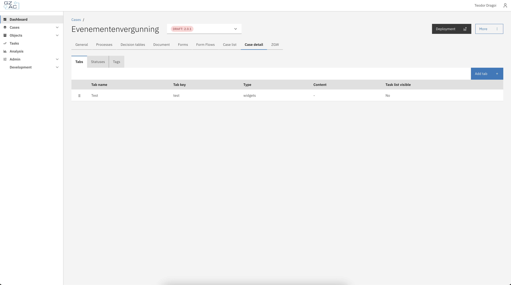

# Case detail

Under the case detail tab, the user can configure the view of a case detail instance.

This is further divided into 3 more tabs:

* Tabs
* Statuses
* Tags

<figure><figcaption></figcaption></figure>

