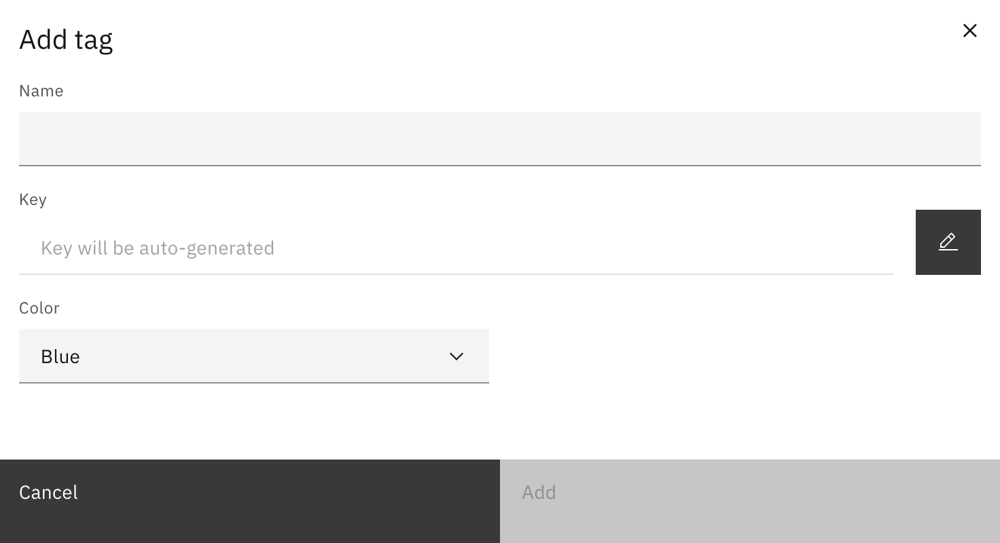
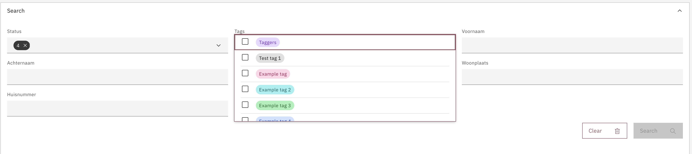
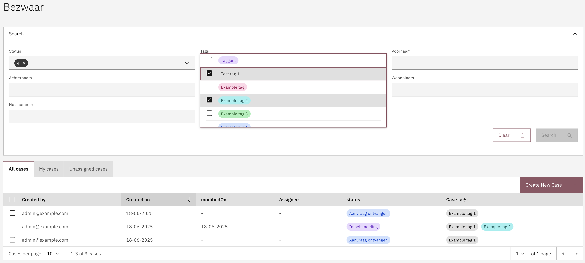
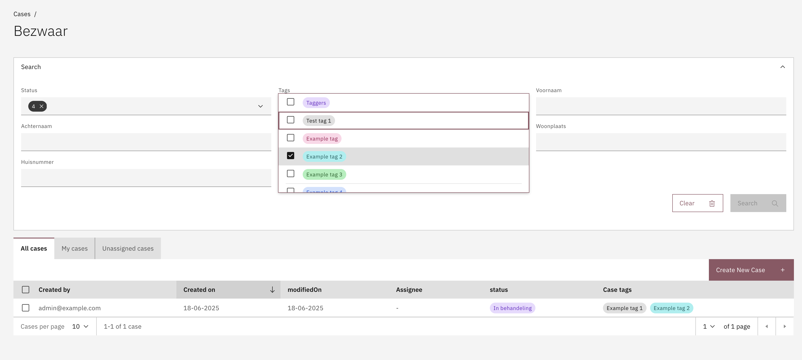

# Tags

The _case tag_ is a case property that can be configured to label different case instances based on user needs. Case tags are linked to a case definition version, they do not have to be the same throughout all versions of a definition.

This setting is particularly effective in environments that have a large amount of cases which can be bundled together for a better view. This approach allows for refined tracking and management of multiple case instances while maintaining a simplified view for external stakeholders.

## Configuring case tags



**Adding a status**

* Go to the `Admin` menu
* Go to the `Cases` menu and select the case to configure tags for
* Select the `Case detail` tab
* Select the `Tags` sub-tab

<figure><figcaption></figcaption></figure>

A tag can be added with the **Add tag** button. A modal will be shown with the configuration options.

<figure><figcaption></figcaption></figure>

* **Name**\
  &#xNAN;_&#x55;sed as a label in the case summary and case list, the name is presented in the UI._
* **Key**\
  &#xNAN;_&#x54;he identifier of the tag, this must be a unique value within the scope of the case it is added to. A key based on the name is generated automatically but can be overwritten via the pencil button._
* **Color**\
  &#xNAN;_&#x54;ags are are displayed as a badge in the case details and list screen UI. This badge will be displayed in the selected color._\
  \
  **List of available tag colors:**
  * Red (`RED`)
  * Magenta (`MAGENTA`)
  * Purple (`PURPLE`)
  * Blue (`BLUE`)
  * Teal (`TEAL`)
  * Green (`GREEN`)
  * Cyan (`CYAN`)
  * Gray (`GRAY`)
  * Cool gray (`COOLGRAY`)
  * Warm gray (`WARMGRAY`)
  * High contrast (`HIGHCONTRAST`)
  * Outline (`OUTLINE`)


**Tags are automatically added to the case search filters**

When tags are configured for a case an additional search filter will be added to default search of the case list screen. This search filter enables to hide cases on the case list by default based on tags associated with the case instance.\
\
When the visible indicator for a tag is set to false then cases that do not have that tag on them will disappear from the case list view, unless they have a different tag that is part of the search field filter. Via the search filter options on the case list screen these tags can be enabled to view all cases.




Status configurations can be auto-deployed by creating json files in the `*/resources/config/case/{case-definition-key}/{version-tag}/case/tag/` folder. The name of the file has to end with `.case-tag.json`.


```json
[
    {
        "key": "example-tag",
        "title": "Example tag",
        "color": "GRAY"
    },
    {
        "key": "example-tag-2",
        "title": "Example tag 2",
        "color": "TEAL"
    }
]

```




## Ordering and sorting

Tags can be ordered, which will be used for the following:

* Order of tags in the tags configuration screen
* Order of tags in the tag filter dropdown within the search filters

## Using tags

When tags are configured for a case, an additional search filter is automatically applied to the Search Filters UI. This filter enables users to display or hide cases based on their configured tags.

This functionality allows users to customize the visibility of cases in the case list, ensuring that case handlers can focus on the most relevant cases upon initial view.

<figure><figcaption></figcaption></figure>

### Setting a case tag

To enable the ability to set tags at certain phases in the process, an expression can be added to any element in the process model where the case tag should change. The following expression is available for setting a case tag via the documentDelegateService:\
\
`${documentDelegateService.addCaseTag(execution, 'key')}`

The tag could also be removed using the same documentDelegateService:

`${documentDelegateService.removeCaseTag(execution, 'key')}`

### Filtering cases

By adding the required tag changes to the process the case list will represent a clear overview of the workload and the progress for that case. These cases can be made visible via the search UI.\
\
Below are examples of filtering based on multiple or single tags



<figure><figcaption><p>Filtering based on a single tag applicable to a single case</p></figcaption></figure>

## Import and export

Case tag configuration is included in the Case definition export and import by default. The export structure and format of the case tags is exactly the same as described in [configuring statuses via IDE](statuses-1.md#via-ide).
