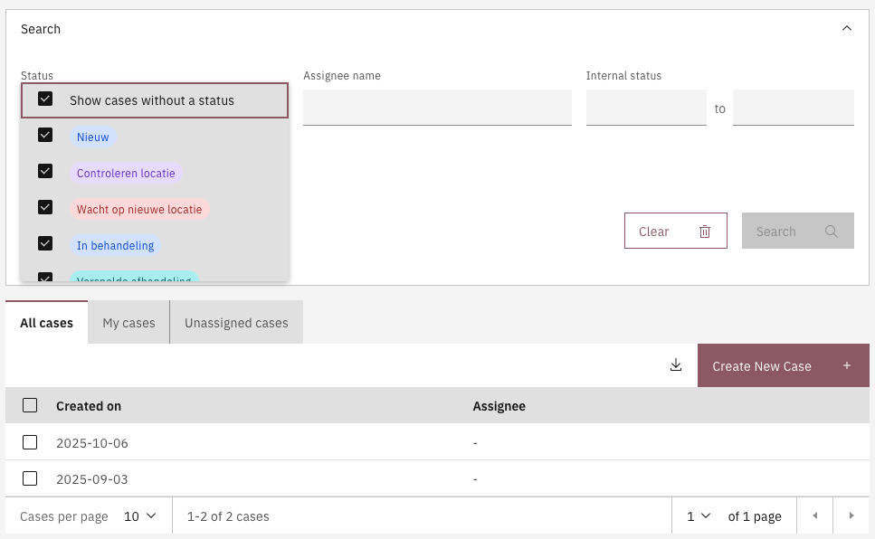
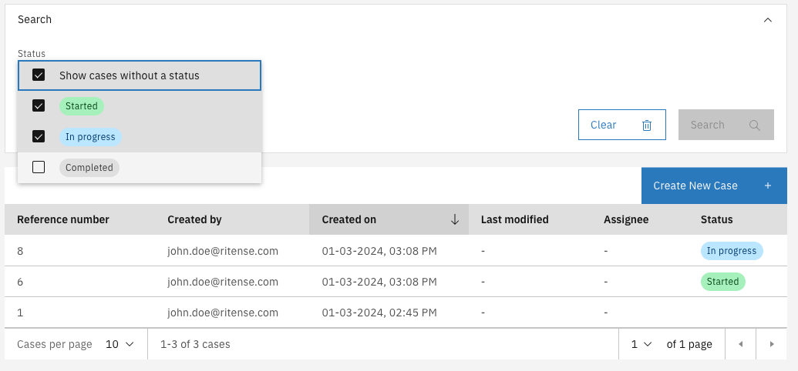

# Statuses

The _internal case status_ is a case property that indicates the current internal state or status of a case. The term "internal" reflects that, by default, this status is not intended for communication with customers. Instead, it is used solely to track te progress of case handling. These statuses are constant throughout all versions of a case definition.

This setting is particularly effective in environments that integrate case and process management. Storing an internal case status as metadata enables teams to establish specific internal statuses that case handlers can apply and track. Typically, case handlers work with a more extensive set of case statuses than those visible to customers or clients. This approach allows for refined tracking and management of case progression while maintaining a simplified view for external stakeholders.

## Configuring case statuses



**Adding a status**

* Go to the `Admin` menu
* Go to the `Cases` menu and select the case to configure statuses for
* Select the `Case detail` tab
* Select the `Statuses` sub-tab

      <figure><figcaption></figcaption></figure>

A status can be added with the **Add status** button. A modal will be shown with the configuration options.

<figure><figcaption></figcaption></figure>

* **Name**\
  _Used as a label in the case summary and case list, the name is presented in the UI._
* **Key**\
  _The identifier of the status, this must be a unique value within the scope of the case it is added to. A key based on the name is generated automatically but can be overwritten via the pencil button._
* **Retention date**\
  _When the **retention period** is set to 0 or higher, the **retention date** is calculated as soon as this internal state is applied to a case. The case will be removed once the retention period has expired.<br>_**Note:** If an internal state without a retention period is set, the retention date of the case will not be calculated or cleared when set.
* **Color**\
  _Statuses are are displayed as a badge in the case details and list screen UI._\
  _This badge will be displayed in the selected color._\
  \
  **List of available status colors:**
  * Red (`RED`)
  * Magenta (`MAGENTA`)
  * Purple (`PURPLE`)
  * Blue (`BLUE`)
  * Teal (`TEAL`)
  * Green (`GREEN`)
  * Cyan (`CYAN`)
  * Gray (`GRAY`)
  * Cool gray (`COOLGRAY`)
  * Warm gray (`WARMGRAY`)
  * High contrast (`HIGHCONTRAST`)
  * Outline (`OUTLINE`)
* **Visible**\
  Indication if cases in that status should be shown on the case list screen by default.


**Statuses are automatically added to the case search filters**

When statuses are configured for a case an additional search filter will be added to default search of the case list screen. This search filter enables to hide cases on the case list by default based on the status of the case.\
\
When the visible indicator for a status is set to false then cases that are currently in that status will not be displayed by default on the case list. Via the search filter options on the case list screen these statuses can be enabled to view all cases.




Status configurations can be auto-deployed by creating json files in the `*/resources/config/case/{case-definition-key}/{version-tag}/case/internal-status/` folder. The name of the file has to end with `.internal-case-status.json`.

In case `internal-case-status.json` files are different between versions in your auto-deployment files, the statuses of the last version to be deployed will be the ones available.


```json
[
  {
    "key" : "awaiting-processing",
    "title" : "Awaiting processing",
    "retentionPeriod": -1,
    "visibleInCaseListByDefault" : true,
    "color" : "BLUE"
  },
  {
    "key" : "processing-order",
    "title" : "Processing order",
    "retentionPeriod": -1,
    "visibleInCaseListByDefault" : true,
    "color" : "PURPLE"
  },
  {
    "key" : "shipped",
    "title" : "Shipped",
    "retentionPeriod": 365,
    "visibleInCaseListByDefault" : true,
    "color" : "GREEN"
  }
]

```




## Ordering and sorting

Statuses can be ordered, which will be used for the following:

* Order of statuses in the status configuration screen
* Order of statuses in the status filter dropdown within the search filters

When a case list column is configured to display the case status, this status column can be further configured to be sortable.

## Using statuses

When statuses are configured for a case, an additional search filter is automatically applied to the Search Filters UI. This filter enables users to display or hide cases based on their configured status. The **Visible** configuration setting for each status controls whether a particular status is enabled by default in the search filter when the case list page is accessed.

This functionality allows users to customize the visibility of cases in the case list, ensuring that case handlers can focus on the most relevant cases upon initial view.

<figure><figcaption></figcaption></figure>

### Setting a case status

To enable the ability to set statuses at certain phases in the process, an expression can be added to any element in the process model where the case status should change. The following expression is available for setting a case status via the documentDelegateService:\
\
`${documentDelegateService.setInternalStatus(execution, 'new')}`

Next to setting a status via the process model it is also possible to set the case status via Form.io forms that are connected to user tasks in the process. The Form.io submission data will then submit the new status in stead of the process.\
\
In order to change the case status via Form.io the `case:internalStatus` targetKey can be used on a hidden form field to add the status change to the form submission. Due to the `case:` prefix the data is registered as meta data in stead of case data.

### Filtering cases

By adding the required status changes to the process the case list will represent a clear overview of the workload and the progress for that case. By using the Visible setting as described above cases in a certain status can easily be hidden be default. These cases can be made visible via the search UI.\
\
Below screenshot shows a case where the _Completed_ status is configured not to be visible by default.\
This is what the search dropdown looks like when this is set. By enabling _Completed_ the cases are immediately visible. A reload of the case list will fall back to the configured settings and the cases will be hidden again.



<figure><figcaption><p>Completed status enabled via search UI</p></figcaption></figure>

## Import and export

Case status configuration is included in the Case definition export and import by default. The export structure and format of the case statuses is exactly the same as described in [configuring statuses via IDE](statuses.md#via-ide).
