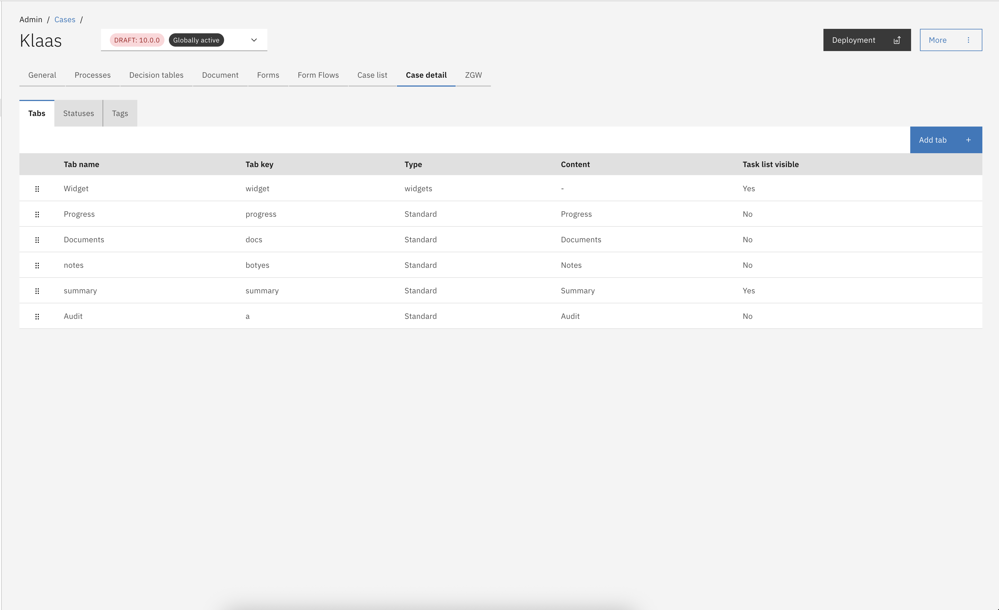

# Tabs

Each case and version of a case in Valtimo can be configured with a specific set of case tabs. Valtimo includes a standard set of tabs preconfigured for each case, which can be customized to meet specific case requirements. Standard tabs can be removed from the tab configuration, but they can also be easily re-created through the user interface (UI). In addition to the standard tabs, custom tabs can be added to the case tab configuration to provide further customization.

## Configuring case tabs



* Go to the `Admin` menu
* Go to the `Cases` menu and select the case you want to configure
* Select the `Tabs` tab
* Click on **Add tab**

<figure><figcaption></figcaption></figure>

The **Add tab** button opens the _Add new tab in \<case>_ modal, beginning with the configuration step to select the tab type. In this modal, **standard tabs** are available and next to this a **Form.io**, **Custom** or **Widget component** can be configured as a case tab.

* Click on the **Add tab** button.
*   Select which tab type you want to configure.

    <figure><figcaption><p>Case tab types</p></figcaption></figure>

**Tab name (optional)**\
\_Configured name that will be used to identify the Case tab in the UI._


This field is not mandatory and if left blank a translation of the key will be shown if configured. Each tab name follows this logic:

1. Show the Tab name if configured
2. Get the translation for the key if available
3. Display the key


**Key**\
\_This is the identifier of the tab and needs to be unique within a case definition. Possible translations need to be configured with this key._

**Choose standard content**\
\_A list of available standard tabs is presented in a dropdown menu. Already configured tabs are filtered from this list._

**Task list visible on tab**\
\_When set the task list will be displayed on the right side of the tab in the UI._



Case tabs can be auto-deployed from a JSON file at startup. This is useful to keep the case tab configuration identical across multiple environments. Case tabs are auto-deployed by scanning files on the classpath that end in `.case-tab.json`.

**Deployment file hierarchy**

In order to auto-deploy a tab configuration, the JSON with the above mentioned extension needs to be placed under a specific hierarchy: `*/resources/config/case/{case-definition-key}/{version-tag}/case/tab/`

This will make sure that the tabs are deployed to a specific version of the case definition.

**Example**

You can find an example of the JSON below.

In this example a tab is created with type `standard`. Different tab types can be used to customize the tab.


```json
[
  {
    "name": "Summary",
    "key": "summary",
    "type": "standard",
    "contentKey": "summary"
    "showTasks": true
  },
  {
    "name": "Progress",
    "key": "progress",
    "type": "standard",
    "contentKey": "progress"
  },
  {
    "name": "Zaak objects",
    "key": "zaakobjecten",
    "type": "standard",
    "contentKey": "zaakobjecten"
    "showTasks": false
  }
]
```




## Disabling case tabs

Case tabs are enabled by default since Valtimo `13`. This feature can be disabled with a feature toggle in the front-end implementation. Set the `enableTabManagement` feature toggle to `false` to disable the ability to add tabs next to the Valtimo standard case tabs. For more information on available feature toggles, visit [this page](../../../../running-valtimo/application-configuration/feature-toggles.md).

## Case tab types

Valtimo supports the following types of case tabs.

<table><thead><tr><th width="138" valign="top">Type</th><th width="130" valign="top">Type key</th><th valign="top">Description</th></tr></thead><tbody><tr><td valign="top"><strong>Standard</strong></td><td valign="top">standard</td><td valign="top">A collection of tabs is available to support various Valtimo features. These tabs include options for displaying a summary form, viewing an audit log, and displaying the current state of the BPMN process. The available tabs are listed below.</td></tr><tr><td valign="top"><strong>Form.io</strong></td><td valign="top">formio</td><td valign="top">Form.io tabs can be configured to display a Form.io form as the tab content. These tabs are intended solely for information display, as there is no functionality to submit data from these tabs, even if a submit button is included in the form definition.</td></tr><tr><td valign="top"><strong>Custom</strong></td><td valign="top">custom</td><td valign="top">Custom tabs can be configured to show a custom Angular component.</td></tr><tr><td valign="top"><strong>Widgets</strong></td><td valign="top">widgets</td><td valign="top">Case data, external source data, tables, collections and custom angular components can be presented on a case widget page. Each widget on a case widget tab can be configured separately.</td></tr></tbody></table>

<details>

<summary>Standard tab</summary>

The standard tab option is only available if all standard tabs have not yet been added to the case. When all standard tabs are already included in a case definition, this option will appear grayed out. In the modal to configure a standard tab, a dropdown menu displays the available standard tabs for selection and configuration.

<figure><figcaption><p>Selectable standard case tabs</p></figcaption></figure>

The following tabs are created by default for each new case in Valtimo. These case tabs are standard across all Valtimo editions; however, additional standard tabs may be available depending on the specific edition. Standard tabs can be deleted as needed, as they can be easily re-added using the **Add tab** button.

#### Valtimo standard tabs

<table><thead><tr><th width="169.79296875" valign="top">Tab</th><th valign="top">Description</th></tr></thead><tbody><tr><td valign="top"><strong>Summary</strong></td><td valign="top">Displays case specific data from the case JSON document or external data sources. This page links to a specific Form.io form with the name <code>&#x3C;caseDefinitionKey>.summary</code></td></tr><tr><td valign="top"><strong>Progress</strong></td><td valign="top">Shows the current state of any active process and the history of all processes that have been executed while handling the case</td></tr><tr><td valign="top"><strong>Audit</strong></td><td valign="top">Shows a log of all performed case actions. Information on who did what and when was that action done is logged and displayed on this tab.</td></tr><tr><td valign="top"><strong>Documents</strong></td><td valign="top">Displays all files that where generated or uploaded while handling the case.</td></tr><tr><td valign="top"><strong>Notes</strong></td><td valign="top">Allows case handlers to leave case specific comments for internal use.</td></tr></tbody></table>

#### GZAC edition additional tabs

<table><thead><tr><th width="169.99609375" valign="top">Tab</th><th valign="top">Description</th></tr></thead><tbody><tr><td valign="top"><strong>Case objects</strong></td><td valign="top">Lists all JSON objects that are linked to the "Zaak" that is connected to the case. A "Zaak" can be created in "OpenZaak" and linked to the GZAC case. Objects connected to this "Zaak" are displayed on this tab.</td></tr></tbody></table>

</details>

<details>

<summary>Form.io component</summary>

This case tab type makes it possible to select any Form.io form within the implementation. Configurable options are exactly the same as for a standard tab except for selecting the component. Now a dropdown menu is shown with all available Form.io forms that exists within the implementation.

</details>

<details>

<summary>Custom component</summary>

The Custom component button gives access to the available custom components within the Valtimo implementation. Custom components need to be added to the codebase via plugins or implementation specific code. Once added to the codebase these will become available in this modal to configure as a tab.

</details>

<details>

<summary>Widgets component</summary>

The widgets component makes it possible to configure a case tab with widgets that can be configured via the UI. Multiple widget types are available to present case data. When a widgets component is selected only the **Tab name**, **Key** and **task list visibility** can be configured for the tab.


When a widgets component tab is added the tab will be listed as a configured tab. Normally when an item in the list is clicked the tab configuration modal opens. A widget type tab however opens the widget configuration when clicked. Tab configuration is still available by clicking the 3-dotted (kebab) menu on the far right of each item in the list and click `Edit`.


Below a screenshot of the widget configuration UI for a newly created widgets tab. This page opens when a widget type tab is clicked on the tab configuration page.

For widget configuration, check [this page](widgets.md).

<figure><figcaption><p>Widget configuration UI</p></figcaption></figure>

</details>

## Access control

Access to the case tabs and case notes can be configured through access control. More information about access control can be found [here](https://docs.valtimo.nl/features/access-control).

### Resources and actions

**Case tabs**

<table><thead><tr><th width="357" valign="top">Resource type</th><th width="111" valign="top">Action</th><th valign="top">Effect</th></tr></thead><tbody><tr><td valign="top"><code>com.ritense.case.domain.CaseTab</code></td><td valign="top"><code>view</code></td><td valign="top">Allows viewing tabs of a case.</td></tr></tbody></table>

**Case notes**

<table><thead><tr><th width="329" valign="top">Resource type</th><th width="143" valign="top">Action</th><th valign="top">Effect</th></tr></thead><tbody><tr><td valign="top"><code>com.ritense.note.domain.Note</code></td><td valign="top"><code>view_list</code></td><td valign="top">Allows viewing notes.</td></tr><tr><td valign="top"></td><td valign="top"><code>create</code></td><td valign="top">Allows creating a note</td></tr><tr><td valign="top"></td><td valign="top"><code>modify</code></td><td valign="top">Allows modifying a note</td></tr><tr><td valign="top"></td><td valign="top"><code>delete</code></td><td valign="top">Allows deleting a note</td></tr></tbody></table>

### Examples

<details>

<summary>Permission to view all tabs</summary>

<pre class="language-json" data-overflow="wrap"><code class="lang-json">{
<strong>    "resourceType": "com.ritense.case.domain.CaseTab",
</strong>    "action": "view",
    "conditions": []
}
</code></pre>

</details>

<details>

<summary>Permission to view all tabs of one specific case type</summary>


```json
{
   "resourceType": "com.ritense.case.domain.CaseTab",
   "action": "view",
   "conditions": [
      {
         "type": "field",
         "field": "id.caseDefinitionId.key",
         "operator": "==",
         "value": "evenementenvergunning"
      }
   ]
}
```


</details>

<details>

<summary>Permission to view one specific tab</summary>


```json
{
   "resourceType": "com.ritense.case.domain.CaseTab",
   "action": "view",
   "conditions": [
      {
         "type": "field",
         "field": "id.key",
         "operator": "==",
         "value": "summary"
      }
   ]
}
```


</details>

<details>

<summary>Permission to view all notes</summary>

<pre class="language-json" data-overflow="wrap"><code class="lang-json">{
<strong>    "resourceType": "com.ritense.note.domain.Note",
</strong>    "action": "view_list",
    "conditions": []
}
</code></pre>

</details>

<details>

<summary>Permission to delete notes created by the logged-in user</summary>


```json
{
   "resourceType": "com.ritense.note.domain.Note",
   "action": "delete",
   "conditions": [
      {
         "type": "field",
         "field": "createdByUserId",
         "operator": "==",
         "value": "${currentUsername}"
      }
   ]
}
```


</details>
