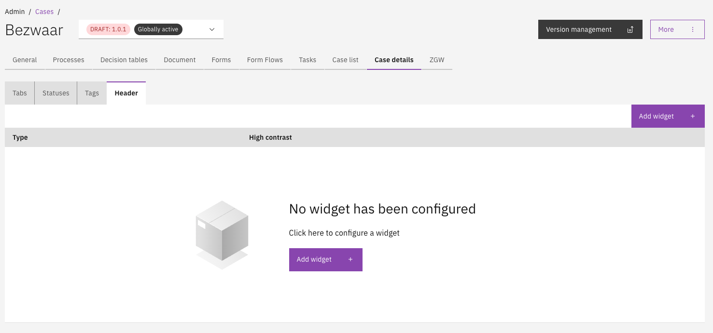

# Case header widget

A case header widget enables the presentation of case data at the top of the case detail page. This information is
always shown, regardless of which tab is selected on the case detail page.

## Configuring a case header widget

Case header widget configuration is part of the configuration for a case definition.

* Go to the `Admin` menu
* Go to the `Cases` menu and select the case to configure widgets for
* Select the `Case details` tab
* Select the `Header` tab

On this page, a single header widget can be configured. To do so, click the `Add widget` button.

Next, three steps are shown to configure the widget:
* Choose widget type
* Choose widget style
* Choose widget content

No width and conditions steps are available for case header widgets, and only the `Fields` widget type is supported.

These configuration steps are described in more detail in the [widget configuration documentation](./widgets.md).

<figure><figcaption></figcaption></figure>

## Access control

Access to the case header widgets can be configured through access control. More information about access control can be
found [here](https://docs.valtimo.nl/features/access-control).

### Resources and actions

<table><thead><tr><th width="329" valign="top">Resource type</th><th width="143" valign="top">Action</th><th valign="top">Effect</th></tr></thead><tbody><tr><td valign="top"><code>com.ritense.document.domain.impl.JsonSchemaDocument</code></td><td valign="top"><code>view</code></td><td valign="top">Allows viewing a case header widget on the case detail page</td></tr></tbody></table>

## Autodeployment via IDE

A case header widget can be autodeployed via the IDE. More information about autodeployment can be found
[here](https://docs.valtimo.nl/features/autodeployment).

A case header widget autodeployment file can be added to the `header-widget` folder inside a case definition. 

For example, the following file would autodeploy a case header widget to version 1.01 of the `bezwaar` case definition.

`config/case/bezwaar/1-0-1/case/header-widget/bezwaar.case-header-widget.json`

```json
{
    "type": "fields",
    "highContrast": false,
    "properties": {
        "columns": [
            [
                {
                    "key": "voornaam",
                    "title": "Voornaam",
                    "value": "doc:voornaam",
                    "displayProperties": { "type": "text" }
                },
                {
                    "key": "achternaam",
                    "title": "Achternaam",
                    "value": "doc:achternaam",
                    "displayProperties": { "type": "text" }
                }
            ],
            [
                {
                    "key": "aangemaakt-op",
                    "title": "Aangemaakt op",
                    "value": "case:createdOn",
                    "displayProperties": { "type": "date" }
                }
            ],
            [
                {
                    "key": "aangemaakt-door",
                    "title": "Aangemaakt door",
                    "value": "case:createdBy",
                    "displayProperties": { "type": "text" }
                }
            ],
            [
                {
                    "key": "e-mail",
                    "title": "E-mail",
                    "value": "doc:e-mailadres",
                    "displayProperties": { "type": "text" }
                }
            ]
        ]
    }
}

```
