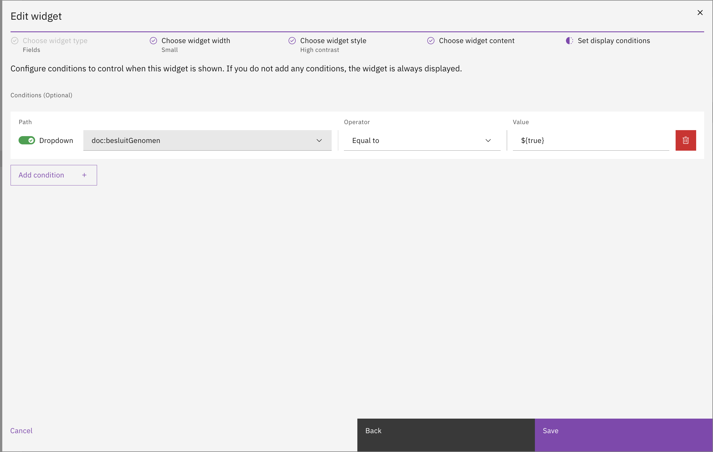

# Widgets

Widgets enable the presentation of case-specific data, either from the case's own data objects or from external data sources. This approach standardizes the display of case data across all cases and eliminates the need for knowledge of Form.io or HTML to present case data effectively.

## Configuring widgets

Widget configuration is part of tab configuration for a case definition.

* Go to the `Admin` menu
* Go to the `Cases` menu and select the case to configure widgets for
* Select the `Case details` tab
* Select the `Tabs` tab

The list of configured tabs for a case is displayed within the case settings. To configure widgets, select an existing tab with its type set to Widgets, or add a new widget-type tab to the configuration by clicking the **Add tab** button as documented [here](./). Upon selection, the widget configuration for the chosen tab will open, displaying a list of widgets created for that tab.

<figure><figcaption><p>Widget configuration UI</p></figcaption></figure>

Click **Add widget** to open the create new widget modal that will guide the widget creation in 4 steps.



**Choose widget type**

Five types of widgets are currently supported:

* **Fields**\
  \&#xNAN;_A set of single data elements in a widget._
* **Custom component**\
  \&#xNAN;_An option to direct to a custom Angular component in de codebase._
* **Form.io form**\
  \&#xNAN;_This type makes is possible to display a Form.io form within a widget. The form is prefilled with case data._
* **Table**\
  \&#xNAN;_Present array case data in a table within a widget._
* **Collection**\
  \&#xNAN;_Present array case data in a collection of cards within a widget._

<figure><figcaption><p>Choosing widget type</p></figcaption></figure>



**Choose widget width**

The widget can be configured to display on any number of columns between 1 and 4.

<figure><figcaption><p>Choosing widget width</p></figcaption></figure>



**Choose widget style**

A widget can either have a "Default" color scheme or it can be "High Contrast" to attract focus to that widget and it's content.

<figure><figcaption><p>Choosing widget style</p></figcaption></figure>



**Choose widget content**

Depending on the widget type, the content is filled in differently. Click the widget type below to view the details for configuration.



**Choose widget conditions**

By default each widget is shown in the UI. However, it is possible to add conditions to a widget that need to be met in order for the widget to be shown. This helps keep the widget page clean by hiding widgets that are not relevant to the current case.

<figure><figcaption><p>Choosing widget conditions</p></figcaption></figure>



<details>

<summary>Fields widget</summary>

To create a fields widget the following configurations need to be done.

* **Widget title**\
  \&#xNAN;_The widget title is presented in the UI at the top-left corner of the widget and should describe the content for that widget._
* **Configure widget fields**\
  \&#xNAN;_Each field can be configured to display case data in a certain way._

For each field that is added to the widget the following configuration is required in order to display the data correctly in the UI.

* **Field title**\
  \&#xNAN;_This is presented as the label of the field_
* **Field value**\
  \&#xNAN;_Add the exact path to the data in the JSON document._
* **Display type**\
  \&#xNAN;_Select the way the data is presented in the UI. Please find the available display types below._

#### Display types

The following display types are supported in the case widgets configuration.

<table><thead><tr><th width="171" valign="top">Display type</th><th valign="top">Presentation</th></tr></thead><tbody><tr><td valign="top"><strong>Text</strong></td><td valign="top">Value is presented in the UI as regular text.</td></tr><tr><td valign="top"><strong>Yes/No</strong></td><td valign="top">This converts a Boolean value to "Yes"/"No".</td></tr><tr><td valign="top"><strong>Date</strong></td><td valign="top">Accepts a UTC date string as input. A format can be specified for how you wish the date to be displayed (this is optional).</td></tr><tr><td valign="top"><strong>Number</strong></td><td valign="top">The number display type is based on the DecimalPipe* from Angular.<br>Optional formatting can be specified for how you wish the number to be displayed.<br><br></td></tr><tr><td valign="top"><strong>Percentage</strong></td><td valign="top">The percentage display type is based on the PercentPipe* from Angular.<br>Optional formatting can be specified for how you wish the percentage to be displayed.<br><br>By default any value is divided by 100, unless a format is specified. This has been done because of the values that the Angular PercentPipe* expects.</td></tr><tr><td valign="top"><strong>Currency</strong></td><td valign="top">The currency display type is based on the CurrencyPipe* from Angular. Optional formatting can be specified for how you wish the currency to be displayed.</td></tr><tr><td valign="top"><strong>Enum</strong></td><td valign="top">Enum (or enumerate) is meant to assign a value to a key as to display data more accurately. The key is stored in the JSON document, the value is configured in the enum, based on the key the corresponding value is displayed.</td></tr></tbody></table>


Below descriptions are from the following Angular documentation pages:

* [https://v17.angular.io/api/common/DecimalPipe](https://v17.angular.io/api/common/DecimalPipe#digitsinfo)
* [https://v17.angular.io/api/common/PercentPipe](https://v17.angular.io/api/common/PercentPipe)
* [https://v17.angular.io/api/common/CurrencyPipe](https://v17.angular.io/api/common/CurrencyPipe)


**\*Angular DecimalPipe**

The value's decimal representation is specified by the `digitsInfo` parameter, written in the following format:

```
{minIntegerDigits}.{minFractionDigits}-{maxFractionDigits}
```

* `minIntegerDigits`: Minimum number of integer digits before the decimal point. Default is 1.
* `minFractionDigits`: Minimum number of digits after the decimal point. Default is 0.
* `maxFractionDigits`: Maximum number of digits after the decimal point. Default is 3.

If the formatted value is truncated it will be rounded using the "to-nearest" method:

```
{{3.6 | number: '1.0-0'}}
<!--will  '4'-->

{{-3.6 | number:'1.0-0'}}
<!--will  '-4'-->
```

**\*Angular PercentPipe**

Decimal representation options, specified by a string in the following format:\
`{minIntegerDigits}.{minFractionDigits}-{maxFractionDigits}`.

* `minIntegerDigits`: Minimum number of integer digits before the decimal point. Default is `1`.
* `minFractionDigits`: Minimum number of digits after the decimal point. Default is `0`.
* `maxFractionDigits`: Maximum number of digits after the decimal point. Default is `0`.

**\*Angular CurrencyPipe**

The format for the currency indicator. One of the following:

* `code`: Show the code (such as `USD`).
* `symbol`(default): Show the symbol (such as `$`).
* `symbol-narrow`: Use the narrow symbol for locales that have two symbols for their currency.\
  For example, the Canadian dollar CAD has the symbol `CA$` and the symbol-narrow `$`.\
  If the locale has no narrow symbol, uses the standard symbol for the locale.
* String: Use the given string value instead of a code or a symbol.\
  For example, an empty string will suppress the currency & symbol.
* Boolean (marked deprecated in v5): `true` for symbol and false for `code`.

#### Widget columns

The fields widget is also able to display data on multiple columns. As such a column can be added or removed. However you cannot have more columns than the width of the widget (For example, if a widget has a width set to _Medium_ you cannot add more than 2 columns to it)

<figure><figcaption></figcaption></figure>

</details>

<details>

<summary>Custom component widget</summary>


**Knowledge requirements**

* Angular

Once a component is configured in Angular any user is able to configure the component in a widget. Adding the component itself is a developers task and programming skills are required. Documentation is available [on this page](../../for-developers/register-angular-component.md) to register a custom Angular component.


Adding a custom component widget to a page is easily done.

* **Widget title**\
  \&#xNAN;_The widget title is presented in the UI at the top-left corner of the widget and should describe the content for that widget._
* **Angular component**\
  \&#xNAN;_Registered Angular components in the front-end implementation of Valtimo will be listed in a dropdown menu. This component defines the widget content._

<figure><figcaption></figcaption></figure>

</details>

<details>

<summary>Form.io widget</summary>

For the Form.io widget there's only two fields that need to be configured:

* **Widget title**\
  \&#xNAN;_The widget title is presented in the UI at the top-left corner of the widget and should describe the content for that widget._
*   **Form.io form**\
    \&#xNAN;_A dropdown is available with all Form.io definitions that are available in the implementation_

    <figure><figcaption></figcaption></figure>


**Color tokens:**

For the Form.io forms to be properly displayed in both normal and high contrast widgets, some custom CSS adjustments might be necessary. Form.io text should use the Carbon color tokens instead of regular hex values. For example:

```
color: var(--cds-text-primary)
```


</details>

<details>

<summary>Table widget</summary>


**Knowledge requirements**

* Basic knowledge of JSON file structure.


A table widget can be used when arrays (lists) are stored in the case data structure and need to be presented as such in the case UI. The following fields need to be configured for a table widget.

* **Widget title**\
  \&#xNAN;_The widget title is presented in the UI at the top-left corner of the widget and should describe the content for that widget._
* **Rows per page**\
  \&#xNAN;_If the content exceeds the number of rows pagination will be added in the UI._
* **Path to table data**\
  \&#xNAN;_The exact path in the JSON document that contains the array with data._
* **Table columns**\
  \&#xNAN;_Columns need to be based on the available fields within the array data._

#### Configuring table columns

For each column in the table the following configurations needs to be done.

* **Title**\
  \&#xNAN;_The title will be displayed as the label of the field in the widget._
* **Value**\
  \&#xNAN;_The value itself will not actually be configured, the path targeting the value in the JSON document is configured. The value is passed through by the widget._
* **Display type**\
  \&#xNAN;_Select the way the data is presented in the UI. Please find the available display types below._


The available [display types](widgets.md#fields-widget) are the same as for the fields widget.



**Table widget configuration example**

Below example shows the configuration for a table that displays uploaded files by there name and creation date.

**The path in the JSON document for the array:**\
`doc:/uploadedFiles`

\
**The information from the array that is shown:**

Since the location of the array itself is known it is no longer need to define a full JSON path for the values of the table columns. Only define the data location within the array like so:\
`data/name`

`data/createdOn`

\
To gather the data the widget code will combine the "Path to table data" field with the value fields from the column configuration. This results in the following JSON paths where x is filled by iterating over the array data.

`doc:/uploadedFiles[x]/data/name`

`doc:/uploadedFiles[x]/data/createdOn`

\
This configuration is based on below JSON.\
The uploadedFiles object exists in the root of this JSON document.\
\
Below the JSON a screenprint of the configuration in the Widget configuration UI.


```json
"uploadedFiles": [ 
  {
    "data": { 
      "key": "Upload Test-22b44a2f-9790-4730-b2bf-d8f017711046.docx", 
      "name": "Upload Test.docx",
      "createdOn": "2024-10-30T07:15:33.121Z",
      "bucketName": "exampleFiles",
      "resourceId": "85a1b768-41b4-4f62-adbc-40dcbe0e7adf",
      "sizeInBytes": 12668 
    },
    "size": 12668,
    "type": "docx",
    "storage": "url",
    "customUpload": true,
    "originalName": "Upload Test.docx"
  } 
]
```

<figure><figcaption><p>Uploaded files table widget configuration</p></figcaption></figure>

#### Table widget options

Below option there is a toggle available named "_First column is the title of the row"_. Enabling this will display the first column with italics and no underline. See below screenshots for the difference in presentation in the result of above configuration. 6 files where uploaded for this example so 3 pages of each 2 files are shown in the widget.

<figure><figcaption></figcaption></figure>

<figure><figcaption><p>Uploaded files with first column set as title column</p></figcaption></figure>

</details>

<details>

<summary>Collection widget</summary>


**Knowledge requirements**

* Basic knowledge of JSON file structure.


A collection widget can be used when arrays (lists) are stored in the case data structure and need to be presented as such in the case UI. The following fields need to be configured for a collection widget.

* **Widget title**\
  \&#xNAN;_The widget title is presented in the UI at the top-left corner of the widget and should describe the content for that widget._
* **Number of cards per page**\
  \&#xNAN;_If the content exceeds the number of rows pagination will be added in the UI._
* **Path to collection data**\
  \&#xNAN;_The exact path in the JSON document that contains the array with data._
* **Card title display type**\
  Same as each text field, the title of the card can also be set to a certain [display type](widgets.md#fields-widget).

#### Configuring cards

For each card in the collection the following configurations needs to be done.

* **Card title**\
  \&#xNAN;_The title of each card can be set to a value from the array items._\
  \&#xNAN;_So the card title is not a label in this case, but a value from a array item._
* **Display type**\
  \&#xNAN;_Select the way the card title is presented in the UI. Please find the available display types below._

#### Configuring card fields

A set of fields can be configured that will display the data for each card.\
The following configuration needs to be done to add a field to a card.

* **Title**\
  \&#xNAN;_Will be displayed as the fields label in the UI._
* **Value**\
  \&#xNAN;_The value itself will not actually be configured, the path targeting the value in the JSON document is configured. The value is passed through by the widget._
* **Display type**\
  \&#xNAN;_Select the way the data is presented in the UI. Please find the available display types below._
* **Field width**\
  \&#xNAN;_For each field the choice can be made to use the full width of the card or half._


The available [display types](widgets.md#fields-widget) are the same as for the fields widget.



**Collection widget configuration example**

Below example shows the configuration for a collection that displays uploaded files.\
Each card in the collection will get it's title and the card fields from the array data.\
\
The card name will be set to the file name.\
The card fields will show following information:

* Created on
* Storage bucket
* Size (in bytes)\\

**The path in the JSON document for the array:**\
`doc:/uploadedFiles`

\
**The information from the array that is shown:**

Since the location of the array itself is known it is no longer need to define a full JSON path for the values of the card fields. Only define the data location within the array like so:\
\
**Card title:**\
`data/name`\
\
**Card fields:**

`data/createdOn`

`data/storageBucket`

`data/sizeInBytes`

\
To gather the data the widget code will combine the "Path to collection data" field with the value fields from the card configuration. This results in the following JSON paths where x is filled by iterating over the array data.

`doc:/uploadedFiles[x]/data/name`

`doc:/uploadedFiles[x]/data/createdOn`

`doc:/uploadedFiles[x]/data/storageBucket`

`doc:/uploadedFiles[x]/data/sizeInBytes`

\
This configuration is based on below JSON.\
The uploadedFiles object exists in the root of this JSON document.\
\
Below the JSON a screenprint of the configuration in the Widget configuration UI.


```json
"uploadedFiles": [ 
  {
    "data": { 
      "key": "Upload Test-22b44a2f-9790-4730-b2bf-d8f017711046.docx", 
      "name": "Upload Test.docx",
      "createdOn": "2024-10-30T07:15:33.121Z",
      "bucketName": "exampleBucket",
      "resourceId": "85a1b768-41b4-4f62-adbc-40dcbe0e7adf",
      "sizeInBytes": 12668 
    },
    "size": 12668,
    "type": "docx",
    "storage": "url",
    "customUpload": true,
    "originalName": "Upload Test.docx"
  } 
]
```

<figure><figcaption><p>Uploaded files collection widget configuration</p></figcaption></figure>

#### Presentation in the UI

See below screenshot for the presentation result of a collection. 6 files where uploaded for this example so 3 pages of each 2 cards are shown in the widget.\
\
.png>)

</details>

## JSON Editor

Widgets for a case can also be configured directly through a JSON editor. For process engineers, configuring widgets in JSON may offer greater control and efficiency. In the second tab of the Widget configuration UI, a JSON editor displays the complete widget configuration in JSON format. This editor includes error-checking functionality to ensure the JSON structure is correct.

<figure><figcaption></figcaption></figure>

## Access control

Access to the case widgets can be configured through access control. More information about access control can be found [here](https://docs.valtimo.nl/features/access-control).

### Resources and actions

<table><thead><tr><th width="329" valign="top">Resource type</th><th width="143" valign="top">Action</th><th valign="top">Effect</th></tr></thead><tbody><tr><td valign="top"><code>com.ritense.case_.domain.tab.CaseWidgetTabWidget</code></td><td valign="top"><code>view</code></td><td valign="top">Allows viewing a case widget</td></tr></tbody></table>

### Examples

<details>

<summary>Permission to view all case widgets</summary>

<pre class="language-json" data-overflow="wrap"><code class="lang-json">{
<strong>    "resourceType": "com.ritense.case_.domain.tab.CaseWidgetTabWidget",
</strong>    "action": "view",
    "conditions": []
}
</code></pre>

</details>

<details>

<summary>Permission to view all case widgets of one specific case type</summary>


```json
{
   "resourceType": "com.ritense.case_.domain.tab.CaseWidgetTabWidget",
   "action": "view",
   "conditions": [
      {
         "type": "field",
         "field": "id.caseWidgetTab.id.caseDefinitionName",
         "operator": "==",
         "value": "evenementenvergunning"
      }
   ]
}
```


</details>

<details>

<summary>Permission to view one specific case widget</summary>


```json
{
   "resourceType": "com.ritense.case_.domain.tab.CaseWidgetTabWidget",
   "action": "view",
   "conditions": [
      {
         "type": "field",
         "field": "key",
         "operator": "==",
         "value": "personal-data"
      }
   ]
}
```


</details>
