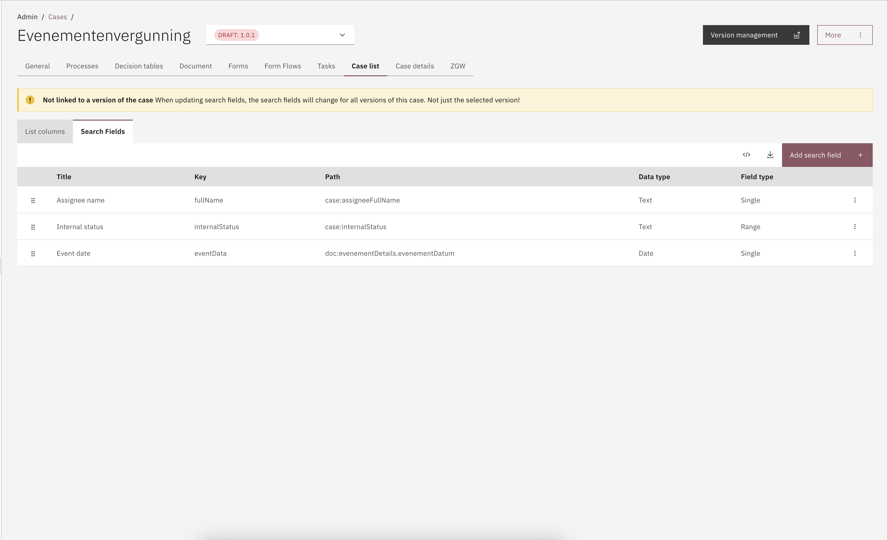

# Case list

Under the Case list tab, the user can configure the view of a case list pertaining to a case definition.

Anything found under the Case list tab is applied for all versions of a case definition

This is further divided into two more tabs:

* Search fields
* Columns

<figure><figcaption></figcaption></figure>
