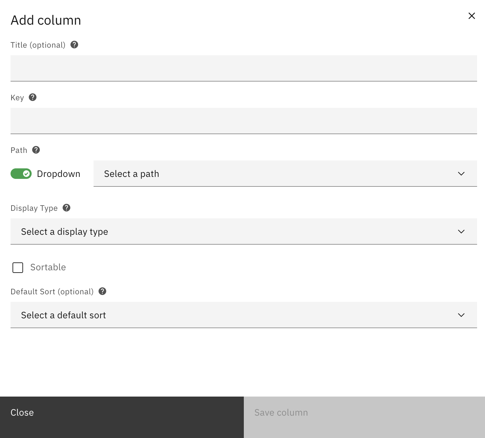
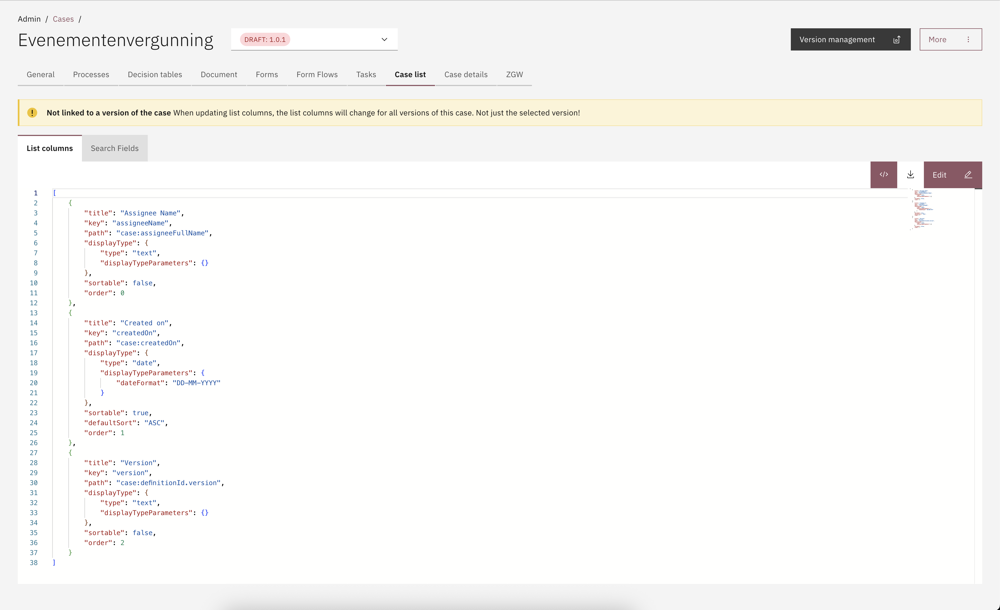

# Columns

To configure the columns of the case list overview the same prefixes can be used as described for the [search fields](search-fields.md) configuration.

In the **Case list > Columns** tab of the Case Definition, the columns displayed in the list of cases for end users in the Valtimo UI can be configured. When a case type is selected from the **Cases** menu, the list screen opens and displays all cases of that type in accordance with this configuration.

<figure><figcaption></figcaption></figure>

## Configuring case list columns

To configure the columns of the case list overview the same type of prefixes can be used as for the search fields configuration.



* Go to the `Admin` menu
* Go to the `Cases` menu
* Select the `Case list` tab
* Select the `Columns` tab
* Click on **Add column**
* Configure a new column

<figure><figcaption></figcaption></figure>

With help from the List field types information on the top of this page each column can be configured. The Save button becomes available once all mandatory fields are configured.


The first column added to a configuration immediately disables all default metadata columns. As a result, only the configured column will be displayed in the user interface.




A case list column configuration file can be added to the resource folder. These configuration files are automatically deployed when the application starts.\
\
Column configuration files are only automatically deployed when they are located on this path: `*/resources/config/case/{case-definition-key}/{version-tag}/case/list/`

The name of the configuration file must have the extension `.case-list.json`.

The content of a list configuration file can look like this:


```json
[
    {
        "key": "createdOn",
        "title": "Created on",
        "path": "case:createdOn",
        "displayType": {
            "type": "date",
            "displayTypeParameters": {
                "dateFormat": "yyyy-MM-dd"
            }
        },
        "sortable": false,
        "defaultSort": "DESC",
        "order": 0
    }
]
```




Case list columns can also be configured via a JSON editor:


* Go to the `Admin` menu
* Go to the `Cases` menu
* Select the `Case list` tab
* Select the `Columns` tab
* Click on **The code icon**
* Click on **Edit**
* Configure a new column, delete a column or edit an existing column
* Click **Save**

<figure><figcaption></figcaption></figure>

<figure><figcaption></figcaption></figure>

This allows for faster editing of columns or exchanging different column configurations throughout different environments.

## List field types

Overview of available configuration fields and the corresponding field types.

* **Title**\
  The title is an optional field that appears as the label in the search field case list UI. This field is not mandatory and if left blank a translation of the Key will be shown. If no translation for the Key is set, the Key will be shown.
* **Key**\
  This field needs to be unique within this case, submission will be prevented if duplicates are found.
*   **Path**\
    The path input gives access to the data fields and meta data of the case. These can easily be identified by there prefix. Case data can be targeted by using the `doc:` prefix. Use the `case:` prefix to target the case meta data.

    The path can also be provided via a Value path selector, which gives paths that Valtimo can recognize on its own


**Prefix examples**\
\
**Path:** `case:assigneeFullname`\
This path targets the assigned case handlers full name.\
\
**Path:** `doc:request.budget`\
This path targets the case data itself. The `doc:` prefix directs to the content object of the case document so the same JSON paths that where used in the Form.io forms to store the data.


* **Display Type**\
  With this setting the behavior of the UI in the list overview can be set. Data can be displayed as normal text, but also as dates, booleans, or tags for example. Try out the types to see what works for each case.
* **Sortable** and **Default Sort**\
  If set the header column will have the sort options available for this column, default sort setting is executed on page enter. A default sort order can be selected when Sortable is checked.
