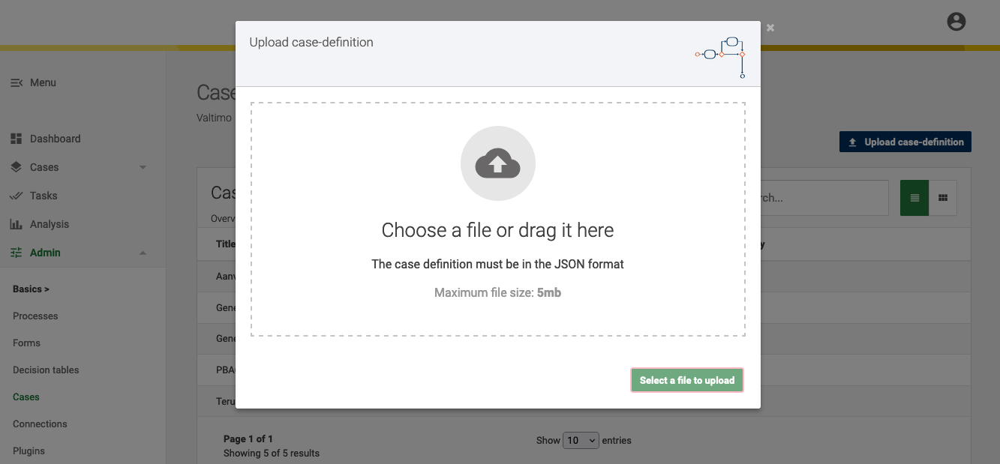
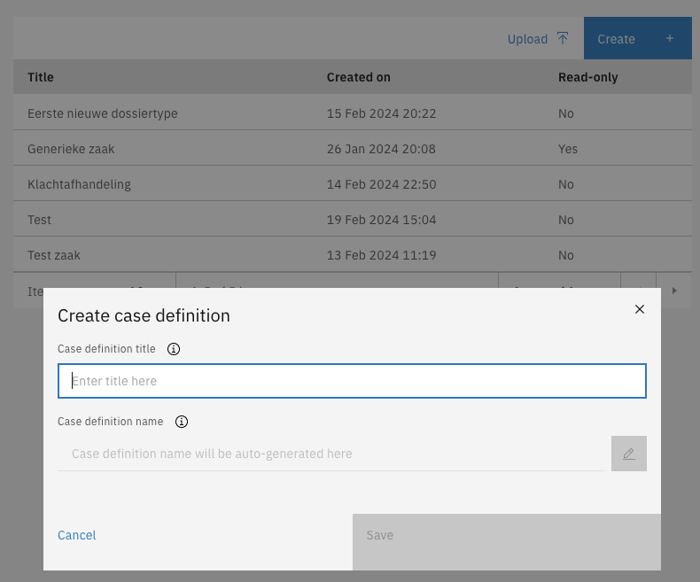

# Document definition

A **document definition** is the **blueprint** for the JSON documents that are created when creating **new cases** in Valtimo. It defines the structure of the case and contains validation rules for the data that is stored by the actual JSON documents that are created when executing processes for that case in Valtimo. This page shows how to create a document definition, and how to add validation to properties.


This page requires:

* Knowledge of [JSON schema](https://json-schema.org/)


## Creating a document definition

There are three ways of creating new document definitions in Valtimo.

* Upload a valid JSON schema via the UI
* Create an empty case via the UI
* Place a valid JSON schema in the codebase via an IDE


Best practices:

* **Always create a JSON schema.** A JSON schema enforces a certain quality for each document. Experience shows that a JSON schema is necessary for production-grade systems.
* **Ensure a stable design and minimize changes to the model.** Discuss the impact of changes thoroughly before implementing them. For example, if in a version 2 of the schema an attribute is made mandatory that wasn't required in version 1, the forms that provide this data must be duplicated and adapted to the new Document Definition.
* **The case detail object must be usable for Formio forms.** Complexities such as arrays within arrays can complicate the form-building process. Tip: do not blindly adopt a JSON schema from a source.
* **Do not store technical or control information in the JSON document.** Process variables are available for this.
* **Do store** information that is needed in case search and case list pages. Though information from external sources can be displayed in a Case, it cannot be used to search or filter on.




#### Upload a valid JSON schema

* Go to the `Admin` menu
* Go to the `Cases` menu
* Click on **Upload case-definition**
* Upload the document definition

It's possible to upload valid JSON schemas to create new cases since Valtimo 5. During the upload the JSON schema structure is validated and the uniqueness of the case ID is checked. If no validation errors occur, the JSON schema is uploaded and the case definition is created.

In Valtimo 12 the case configuration upload has been improved by adding all the newly available case configurations to the upload functionality. More detailed information on this functionality can be found [here](./#exporting-and-importing-case-definitions).



#### Create an empty case


Available since Valtimo `12`


* Go to the `Admin` menu
* Go to the `Cases` menu
* Click on **Create**
* Enter the title, and optionally edit the name
* Click on **Save**, this takes you to the document definition overview



The chosen title will be validated and based upon the title a read-only case definition name will be generated. This is to create a unique identifier for that case definition without spaces or special characters. Click the **Save** button to create the case with the chosen title.\
\
The case definition is created and the case details page is displayed upon completion.\
A valid empty JSON schema is created with the title and id based on the given title.

<figure><figcaption><p>Newly created example case</p></figcaption></figure>


<mark style="color:blue;">**Please note**</mark>

The `properties` section is empty. This section contains the data structure for the case. The case JSON schema validation has to be placed here.

The option `additionalProperties` is set to `false` by default. This disables the possibility to save other data than configured in the `properties` section of the document definition.

When uploading a JSON schema to create a new case, make sure that the `$id` and `title` fields both have the correct value. These fields are used when a case definition is uploaded and will be displayed in the case list view.




#### Place a valid JSON schema in the codebase

To create a document definition, the following steps are necessary:

*   Create a document definition file (ending with `.schema.json`) under the following path: **/src/main/resources/config/document/definition**. The name should correspond with the ID of the document ID. The ID itself should end with `.schema`.

    **`person.schema.json`**

    ```json
    {
      "$id": "person.schema",
      "$schema": "http://json-schema.org/draft-07/schema#",
      "title": "Person",
      "type": "object",
      "properties": {
      }
    }
    ```
*   Properties as well as validation rules can be added to the definition as per the JSON schema standard as seen [here](https://json-schema.org/understanding-json-schema/index.html). Below is an example of what this definition could look like.

    ```json
    {
      "$id": "person.schema",
      "$schema": "http://json-schema.org/draft-07/schema#",
      "title": "Person",
      "type": "object",
      "properties": {
        "firstName": {
          "type": "string",
          "description": "The person's first name.",
          "maxLength": 15
        },
        "age": {
          "description": "Age in years which must be equal to or greater than zero.",
          "type": "integer",
          "minimum": 0
        },
        "birthday": {
          "description": "Birthday",
          "type": "string",
          "format": "date"
        },
        "hasPet": {
          "description": "Has pet.",
          "type": "boolean"
        }
      }
    }
    ```



## Editing a document definition

Same as for creating cases there are three ways of editing document definitions.

* Upload a valid JSON schema with the same ID.
* Edit the document definition directly via the UI.
* Edit the document definition in the codebase via an IDE.



#### Upload a valid JSON schema with the same ID

* Go to the `Admin` menu
* Go to the `Cases` menu

<figure><figcaption></figcaption></figure>

Click on the **Upload** button to open the **Import case definition** modal\*. This modal contains a wizard that will guide users through the import process. The following steps are defined in this wizard.

1. Informative step regarding plugins.
2. Select the edited document definition from your system\
   &#xNAN;_&#x57;hen the file is successfully uploaded a warning is displayed that current configurations for that case can be overwritten by this upload._
3. Start the upload\
   The file will be validated and if it passes all checks the document definition is updated.

#### Edit the document definition

* Go to the `Admin` menu
* Go to the `Cases` menu
* Select the case that you want to edit
* Click on **Edit**
* Edit the document definition as per the JSON schema standard
* Click on **Save**

<figure><figcaption></figcaption></figure>

Visually nothing happens when switching to edit mode. Only the Download and Edit buttons are replaced by a **Cancel** and a **Save** button. The **Save** button is disabled by default until valid changes are made.

**Constant validation**

In edit mode, the UI editor will constantly validate the JSON file structure. The **Save** button is only available when the JSON structure is valid. Errors in the file structure will be indicated with a red curly line below or near the issue. In large files, errors can easily be found with the minimised tree view on the right side of the editor.

<figure><figcaption><p>JSON structure validation in edit mode</p></figcaption></figure>



#### Edit the document definition in the codebase

Open the document definition in the IDE and edit the definition as per the JSON schema standard. More information on JSON schema can be found [here](https://json-schema.org/).\
\
The location of the document definitions in the Valtimo Java/Kotlin backend: `/src/main/resources/config/document/definition`\
\
Changes will only be available in the application once the changes have been deployed via the CI/CD pipeline.




<mark style="color:orange;">**Please note**</mark>

Changes to document definitions **have immediate effect on newly created cases** based on this document definition. Changing this file means changing the blueprint that is used to validate each case that is created in Valtimo based on this blueprint. Changes will have impact, so create backups when unsure of the result.


## Access control

Access to document definitions can be configured through access control. More information about access control can be found [here](https://docs.valtimo.nl/features/access-control).

### Resources and actions

<table><thead><tr><th width="357">Resource type</th><th width="111">Action</th><th>Effect</th></tr></thead><tbody><tr><td><code>com.ritense.document.domain.impl.JsonSchemaDocument</code></td><td><code>assign</code></td><td>Allows assigning users to a case document.</td></tr><tr><td></td><td><code>assignable</code></td><td>Allows users to be assigned to a case document.</td></tr><tr><td></td><td><code>create</code></td><td>Allows creating of a case document.</td></tr><tr><td></td><td><code>claim</code></td><td>Allows claiming of a case document.</td></tr><tr><td></td><td><code>delete</code></td><td>Allows deleting of a case document.</td></tr><tr><td></td><td><code>modify</code></td><td>Allows modifying of a case document.</td></tr><tr><td></td><td><code>view</code></td><td>Allows viewing of a case document.</td></tr><tr><td></td><td><code>view_list</code></td><td>Allows viewing of case documents.</td></tr><tr><td><code>com.ritense.document.domain.impl.JsonSchemaDocumentDefinition</code></td><td><code>create</code></td><td>Allows creating of a case document definition.</td></tr><tr><td></td><td><code>delete</code></td><td>Allows deleting of a case document definition.</td></tr><tr><td></td><td><code>modify</code></td><td>Allows modifying of a case document definition.</td></tr><tr><td></td><td><code>view</code></td><td>Allows viewing of a case document definition.</td></tr><tr><td></td><td><code>view_list</code></td><td>Allows viewing of case document definitions.</td></tr></tbody></table>

### Examples

<details>

<summary>Permission to view access to all case document definitions</summary>

<pre class="language-json" data-overflow="wrap" data-full-width="false"><code class="lang-json">{
<strong>    "resourceType": "com.ritense.document.domain.impl.JsonSchemaDocumentDefinition",
</strong>    "action": "view",
    "conditions": []
}
</code></pre>

</details>

<details>

<summary>Permission to view access to all documents of one case document definition</summary>


```json
{
   "resourceType": "com.ritense.document.domain.impl.JsonSchemaDocument",
   "action": "view",
   "conditions": [
      {
         "type": "field",
         "field": "documentDefinitionId.name",
         "operator": "==",
         "value": "evenementenvergunning"
      }
   ]
}
```


</details>

<details>

<summary>Permission to view access to one specific document definition</summary>


```json
{ 
   "resourceType": "com.ritense.document.domain.impl.JsonSchemaDocumentDefinition",
   "action": "view",
   "conditions": [
      {
         "type": "field",
         "field": "id.name",
         "operator": "==",
         "value": "evenementenvergunning"
      }
   ]
}
```


</details>
