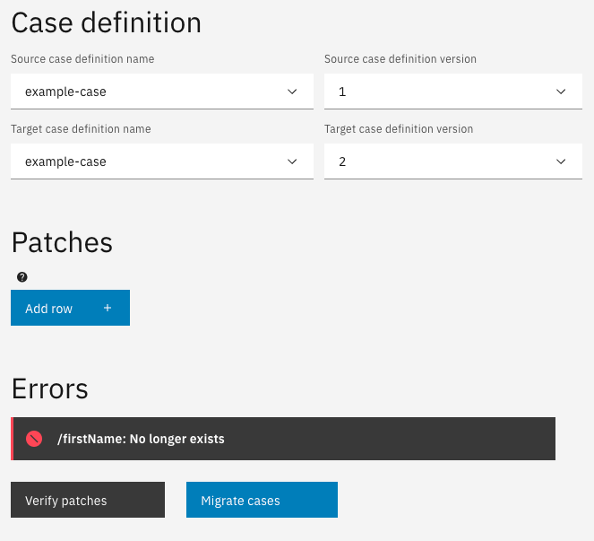
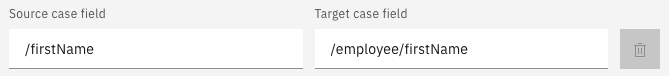
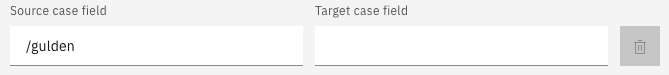
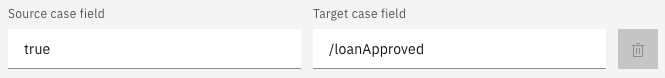
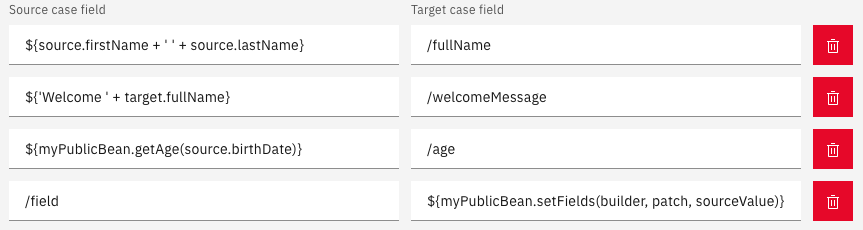

# Case migration


**Warning:** Case migration is still in beta. Migrating cases might give unexpected results. Please use with care.


Making changes to the JSON schema document of a case definition can cause problems. The JSON schema document can be easily updated but the cases that were already existed, still use the old schema version. Case migration exists to solve this problem. Cases can be migrated from an old version of the JSON schema document to a newer version.

## Enabling case migration

To add case migration to your implementation, several changes have to be made to the code of your front-end implementation.

### Library

The following library has to be added to the `/pakage.json` in your front-end implementation.

```json
{
    "dependencies": {
        "@valtimo/case-migration": "<valtimo_frontend_version>"
    }
}
```

### Adding the module

The following module has to be added to the `src/app/app.module.ts` in your front-end implementation.

```
...
import {CaseMigrationModule} from '@valtimo/case-migration';
...

@NgModule({
    ...
    imports: [
        ...
        CaseMigrationModule,
        ...
    ]
    ...
})
```

### Menu item

A new 'Admin' menu item has to be added to the `/src/environments/environment.ts` in your front-end implementation.

```
export const environment: ValtimoConfig = {
    ...
    menu: {
        menuItems: [
            ...
            {
                roles: [ROLE_ADMIN], title: 'Admin', iconClass: 'icon mdi mdi-tune', sequence: 5, children: [
                    ...
                    {link: ['/case-migration'], title: 'Case migration (beta)', sequence: 15},
                    ...
                ]
            }
        ]
    }
}
```

## Using case migration

Case migration works by applying JSON patches to the old version. A JSON patch can move, add and remove JSON properties from the old case until the case meets the new schema.

### Example: moving a property

In this example we move the property `/firstName` from the old JSON schema to a new location `/employee/firstName`. The old JSON schema version 1 looks like this:

```json
{
    "$id": "example-case.schema",
    "type": "object",
    "title": "Example case",
    "$schema": "http://json-schema.org/draft-07/schema#",
    "properties": {
        "firstName": {
            "type": "string"
        }
    }
}
```

We now have created a new JSON schema version 2:

```json
{
    "$id": "example-case.schema",
    "type": "object",
    "title": "Example case",
    "$schema": "http://json-schema.org/draft-07/schema#",
    "properties": {
        "employee": {
            "type": "object",
            "properties": {
                "firstName": {
                    "type": "string"
                }
            }
        }
    }
}
```

When clicking the verify button, the tool will check if there are any possible issues if we were to migrate the cases. In our example we will get the error shown in the image below. Verification is limited. The verify button has detected an error, but has not detected all potential problems. It _has_ detected the new schema no longer has the property `/firstName` at root level. It has _not_ detected that there is a new property available in the new schema called `/empoyee/firstName`.



To solve the error, a new patch has to be added which will move the property:



After verifying that there are no errors, the cases are ready to be migrated. Click the button 'Migrate cases' to migrate all cases from the source version to the target version.

### Patch: remove property

If the new case definition no longer contains a property, the property should be removed from all old cases. This can be done by leaving the target field empty. For example, if we want to remove the property `/gulden`:



### Patch: add property

When the new case definition contains a completely new property, this new field can be given a default value by entering this value in the source field. The case migrator will always try to case the value from the source field to the type that is needed for the target field.



### Patch: SpEL expression

SpEL expressions can be used for more advanced manipulations.


