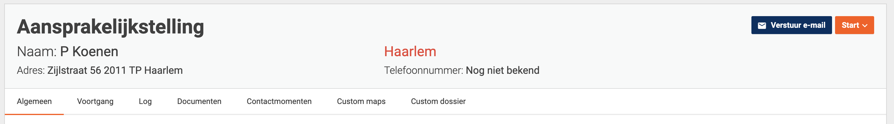

# Custom case headers

This page explains how a header that is shown above every case can be customized.

## Introduction

Instead of the default case header - which only shows a case name - each case header can be customized using configuration in the environment file of a front-end implementation.

The custom header uses the Bootstrap grid system which is based on blocks of varying sizes that can be created by using CSS classes. This way any layout can be created.

By default, the case header looks like this:



## Defining a custom case header

To create a case header as shown in the screenshot above, the configuration in the environment looks like this:

#### **`environment.ts`**

```typescript
...

export const environment: ValtimoConfig = {
  ...
  customDossierHeader: {
      aansprakelijkstelling: [
          {
              labelTranslationKey: 'aansprakelijkstelling',
              columnSize: 12,
              textSize: 'xl',
              customClass: 'font-weight-bold'
          },
          {
              labelTranslationKey: 'aansprakelijkstelling.naam',
              propertyPaths: ['aanvrager.persoonsgegevens.voorletters', 'aanvrager.persoonsgegevens.achternaam'],
              columnSize: 6,
          },
          {
              propertyPaths: ['aanvrager.adres.woonplaats'],
              columnSize: 3,
              textSize: 'md',
              customClass: 'text-danger'
          },
          {
              columnSize: 3
          },
          {
              labelTranslationKey: 'aansprakelijkstelling.adres',
              propertyPaths: ['aanvrager.adres.adres', 'aanvrager.adres.huisnummer', 'aanvrager.adres.postcode', 'aanvrager.adres.woonplaats'],
              columnSize: 6,
              textSize: 'sm',
          },
          {
              labelTranslationKey: 'aansprakelijkstelling.telefoonnummer',
              propertyPaths: ['aanvrager.persoonsgegevens.telefoonnummer'],
              columnSize: 3,
              textSize: 'sm',
              noValueText: 'Nog niet bekend'
          },
          {
              labelTranslationKey: 'geboortedatum',
              propertyPaths: ['aanvrager.geboortedatum'],
              modifier: 'age',
              columnSize: 3,
              textSize: 'sm'
          },
      ]
  }
  ...
};
```

`customDossierHeader` is the main object that contains all custom case header configurations. The `customDossierHeader` has a property for each case type that requires a custom header. The key is the name of case definition and the value an array of `customDossierHeaderItem` elements. In the example above, a custom case header configuration for a case with the id `aansprakelijkstelling` is added.

Each `customDossierHeaderItem` in `customDossierHeader` can have the following properties:

* **labelTranslationKey** (Optional). A key for the label translation. This refers to a translation key in the translation files. This can also be used to show a static text in the header without data from the document by leaving the `propertyPaths` property empty. If left blank, no label will be shown.
* **propertyPaths** (Optional). An array of paths to the data from the document that is displayed. When this contains multiple items they are placed one after the other.
* **modifier** (Optional). Modify how data is rendered using one of the predefined modifiers.
  * Available modifiers:
    * `age` renders a date string as an age in years relative to the current date.
* **columnSize** (Optional). The column size based on Bootstrap columns (1-12). Bootstrap divides a row in 12 columns. If blocks are added after the first 12 columns, the blocks will be pushed to the next row. If no `columnSize` is specified, the default size is 3.
* **textSize** (Optional) The size of the text for this item (xs, sm, md, lg, xl). If no textSize is specified, the default size is md.
* **noValueText** (Optional). The text that will be shown if the data is not available in the document. If no `noValueText` is specified, the default value is '-'.
* **customClass** (Optional). A string of classes to be applied to this item. This offers a lot of freedom in formatting the custom header items. All Bootstrap classes are available by default. Further customisation can be achieved by adding classes with corresponding styling in the implementation's style sheets.
