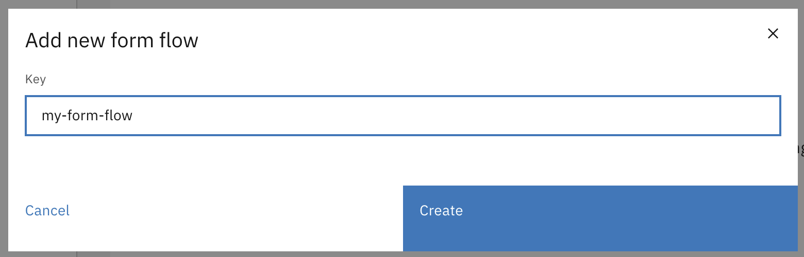

# Form flows

Form flow allows users to create a sequence of forms, similar to a flow chart or form wizard. A form flow definition contains the configuration for each step, what the subsequent steps are, and the conditions under which they can be reached. A form flow can be linked to a task, which consequently allows for more forms for the same task. Form flow supports forwards and backwards movement between steps without completing the task, reducing complexity in a BPMN model.

Form flow offers a way to configure a flow between different Form IO forms inside the same user task.

## Creating a form flow definition

A form flow definition is a JSON document that defines steps and which steps can be reached under what conditions when the current step is completed. Each step can have zero or more actions (e.g. retrieve external data) that trigger when the task is opened or completed. Depending on the type of step, the step can be handled in a different way. The way a form is handled can differ from a payment, for example.

For information on how to link a form flow definition to a task, see [here](../process/process-link.md#creating-a-form-flow-process-link).



<figure><figcaption></figcaption></figure>

* Go to the `Admin` menu.
* Go to the `Cases` menu and select the case to configure form flows for.
* Select the `Form Flows` tab

Form flows can be added to draft case definitions via the **Add new form flow** button. A modal will be shown where the form flow key can be set and the form flow can be created.

<figure><figcaption></figcaption></figure>

After creating a form flow, the contents of it can be edited. The steps and different step types are described below.&#x20;

<figure><figcaption></figcaption></figure>

Add each individual step to the form flow definition, e.g.:

```
{
    "key": "my-form-flow",
    "startStep": "personalDetailsStep",
    "steps": [
        {
            "key": "personalDetailsStep"
        },
        {
            "key": "loanApprovedStep"
        },
        {
            "key": "loanDeniedStep"
        },
        {
            "key": "summaryStep"
        }
    ]
}
```

More details can be found in the **Via IDE** tab.



To create form flow definition, the following steps are necessary:

* Create a form flow `.form-flow.json` file under the following path: `*/resources/config/case/{case-definition-key}/{version-tag}/form-flow/`.
* Add each individual step to the form flow definition, e.g.:


```json
{
    "startStep": "personalDetailsStep",
    "steps": [
        {
            "key": "personalDetailsStep"
        },
        {
            "key": "loanApprovedStep"
        },
        {
            "key": "loanDeniedStep"
        },
        {
            "key": "summaryStep"
        }
    ]
}
```


* Add the next steps for each of the individual steps. This can be done through the `nextStep` property, which supports a single step, or `nextSteps`, which supports multiple next steps. Each step should correspond to the key of another step defined in this form flow.


```json
{
    "startStep": "personalDetailsStep",
    "steps": [
        {
            "key": "personalDetailsStep",
            "nextSteps": [
                {
                    "step": "loanApprovedStep"
                },
                {
                    "step": "loanDeniedStep"
                }
           ]
        },
        {
            "key": "loanApprovedStep",
            "nextStep": "summaryStep"
        },
        {
            "key": "loanDeniedStep",
            "nextStep": "summaryStep"
        },
        {
            "key": "summaryStep"
        }
    ]
}
```


* The `personalDetailsStep` is now followed by two other steps. This is only allowed when at least one of the two steps is conditional. The order of next step matters. The first `nextStep` with `condition` that is evaluated to `true` will be the next step. When all the conditions are evaluated to `false` the next step will be the default step; which is the step without condition. If no next step is found, the form flow will end. The expression inside the condition is further explained [here](form-flow.md#step-types).


```json
{
    "startStep": "personalDetailsStep",
    "steps": [
        {
            "key": "personalDetailsStep",
            "nextSteps": [
                {
                    "step": "loanApprovedStep",
                    "condition": "${step.submissionData.personalDetails.age >= 21}"
                },
                {
                    "step": "loanDeniedStep"
                }
           ]
        },
        {
            "key": "loanApprovedStep",
            "nextStep": "summaryStep"
        },
        {
            "key": "loanDeniedStep",
            "nextStep": "summaryStep"
        },
        {
            "key": "summaryStep"
        }
    ]
}
```


*   Configure the step type. Currently, the only step type supported is `form`, which requires a `definition` property to be set. This refers to the key of the form. For more information on step types, see [here](form-flow.md#step-types).

    Which properties are required to be set depends on the step type.


```json
{
    "startStep": "personalDetailsStep",
    "steps": [
        {
            "key": "personalDetailsStep",
            "type": {
                "name": "form",
                "properties": {
                    "definition": "personal-details-form"
                }
            },
            "nextSteps": [
                {
                    "step": "loanApprovedStep",
                    "condition": "${step.submissionData.personalDetails.age >= 21}"
                },
                {
                    "step": "loanDeniedStep"
                }
           ]
        },
        {
            "key": "loanApprovedStep",
            "type": {
                "name": "form",
                "properties":  {
                    "definition": "loan-approved-form"
                }
            },
            "nextStep": "summaryStep"
        },
        {
            "key": "loanDeniedStep",
            "type": {
                "name": "form",
                "properties":  {
                    "definition": "loan-denied-form"
                }
            },
            "nextStep": "summaryStep"
        },
        {
            "key": "summaryStep",
            "type": {
                "name": "form",
                "properties":  {
                    "definition": "summary-form"
                }
            }
        }
    ]
}
```


* Add triggers to steps where necessary (e.g. to store data externally). See below for more information.



## Creating a Form.io form



**Completing a step**

To complete a step in the form flow, the button should be configured with:

* Action: `Submit`&#x20;

For example:

<figure><figcaption></figcaption></figure>

**Going back to the previous form**

A button can be configured to go back to the previous form of the form flow. This 'Back' button should be configured with:

* Action: `Event`&#x20;
* Button event: `back`&#x20;

For example:

<figure><figcaption></figcaption></figure>



## Step types

The following step types are supported by form flow:

### Form

The `form` step type is used to associate a step with a specific form. The following properties are supported:


```json
    ...
      "type": {
        "name": "form",
        "properties": {
          "definition": "String" //The ID of the form
        }
      }
    ...
```


### Custom component

The `custom-component` step type is used to associate a step with a custom-made front-end component. The following properties are supported:


```json
    ...
      "type": {
        "name": "custom-component",
        "properties": {
          "componentId": "String" //The key of the component in the front-end
        }
      }
    ...
```


More information on custom form flow components can be found [here](forms/forms/create-custom-component.md).

## Expressions

Form flow supports Spring Expression Language (SpEL) expressions to allow for more complex actions when a step is opened or completed. Expressions can be recognized by the surrounding `${ }` characters. The following additional properties are supported for steps:

* `onBack`. Triggers the expressions when navigating to the previous step, e.g. to remove data from a document.
* `onOpen`. Triggers the expressions when the step is opened, e.g. to retrieve external data.
* `onComplete`. Triggers the expressions when the step is complete, e.g. to store the results in a document.

Each of these properties supports more than one expression, e.g. when a step is opened, external data from more than one source is retrieved. These expressions are evaluated in order.

Valtimo provides access to certain variables in the SpEL context, e.g. what the current step is. Which properties are available can be found [here](forms/forms/whitelist-spring-bean.md#available-properties-in-spel-context).

### Examples

The step condition below will only go to the step `loanApprovedStep` when a user has entered an age that is above 21:


```json
{
    "step": "loanApprovedStep",
    "condition": "${step.submissionData.personalDetails.age >= 21}"
}
```


The `onOpen` expression below will call an external `@FormFlowBean` called `someService` to retrieve some data. The `additionalProperties` is a [form flow parameter](forms/forms/whitelist-spring-bean.md#available-properties-in-spel-context):


```json
{
  "onOpen": [
    "${someService.retrieveData(additionalProperties)}"
  ]
}
```


The `onComplete` expressions below will change the data submitted by the user. It adds a `fullName` and removes the `firstName` and `lastName`:


```json
{
  "onComplete": [
    "${step.submissionData.person.fullName = step.submissionData.firstName + ' ' + step.submissionData.lastName}",
    "${step.submissionData.firstName = null}",
    "${step.submissionData.lastName = null}"
  ]
}
```


The `onOpen` expressions delete any existing submission data of the step, before opening the form flow:


```json
{
  "onOpen": [
    "${step.submissionData = null}"
  ]
}
```


An example of a complete form flow:


```json
{
    "startStep": "personalDetailsStep",
    "steps": [
        {
            "key": "personalDetailsStep",
            "type": {
                "name": "form",
                "properties": {
                    "definition": "personal-details-form"
                }
            },
            "onOpen": ["${someService.retrieveData(additionalProperties)}"],
            "nextSteps": [
                {
                    "step": "loanApprovedStep",
                    "condition": "${step.submissionData.personalDetails.age >= 21}"
                },
                {
                    "step": "loanDeniedStep"
                }
            ]
        },
        {
            "key": "loanApprovedStep",
            "type": {
                "name": "form",
                "properties": {
                    "definition": "loan-approved-form"
                }
            },
            "onBack": ["${someService.removeData(additionalProperties)}"],
            "nextStep": "summaryStep"
        },
        {
            "key": "loanDeniedStep",
            "type": {
                "name": "form",
                "properties": {
                    "definition": "loan-denied-form"
                }
            },
            "nextStep": "summaryStep"
        },
        {
            "key": "summaryStep",
            "onComplete": ["${valtimoFormFlow.completeTask(additionalProperties, step.submissionData)}"],
            "type": {
                "name": "form",
                "properties": {
                    "definition": "summary-form"
                }
            }
        }
    ]
}
```


By default, SpEL allows access to every Spring bean from inside expressions. For security reasons, this has been changed to a whitelist instead. More information on how to whitelist Spring beans is available [here](forms/forms/whitelist-spring-bean.md) and more information on SpEL can be found [here](https://docs.spring.io/spring-framework/docs/current/reference/html/core.html#expressions).

## Bread crumbs

If the [feature toggle](../../running-valtimo/application-configuration/feature-toggles.md) `enableFormFlowBreadCrumbs` is enabled, users will see a new breadcrumb trail on top of every form flow. This allows a user to quickly navigate between the different steps of the form flow.

Every form flow step has an optional field called `title` which is shown in the example below. This field is used to display the title of the step inside the breadcrumb trail. If the title field is left empty, the breadcrumb trail will try to fill the title field by looking for existing translations inside the `en.json` or the `nl.json` files, that can be found in the frontend code.

The breadcrumb trail uses a simple way to predict which breadcrumbs to display in all future steps. The breadcrumb trail takes the first step inside the `nextSteps` field to determine all future steps. In the example below, the breadcrumb trail would be: `1. Personal details -> 2. Loan approved` because the `loanApprovedStep` is the first step in the `nextSteps` field.


```json
{
  "startStep": "personalDetailsStep",
  "steps": [
    {
      "key": "personalDetailsStep",
      "title": "1. Personal details",
      "type": {
        "name": "form",
        "properties": {
          "definition": "personal-details-form"
        }
      },
      "nextSteps": [
        {
          "step": "loanApprovedStep",
          "condition": "${step.submissionData.personalDetails.age >= 21}"
        },
        {
          "step": "loanDeniedStep"
        }
      ]
    }
  ]
}
```

