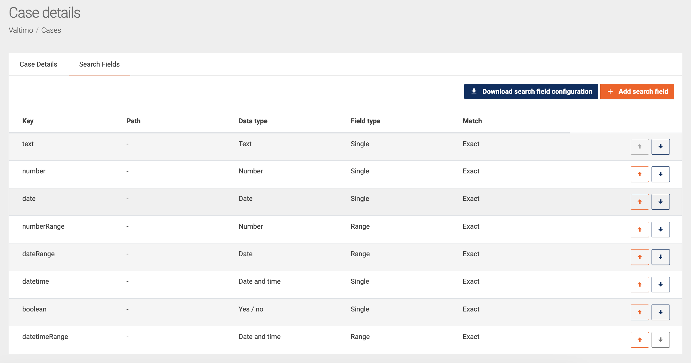
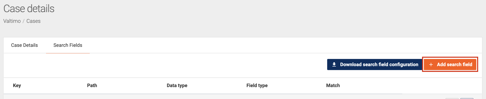
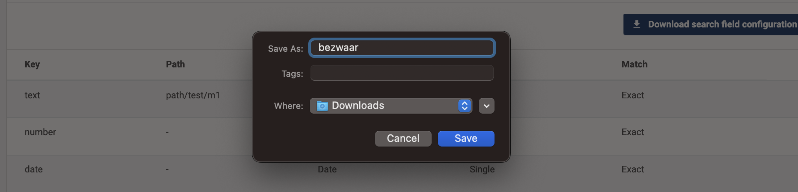
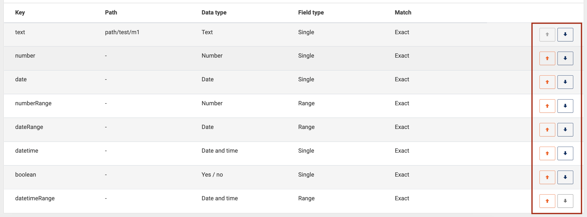

# Search fields

Search fields add the ability to filter cases. Each search field adds the ability to filter on a specific field. This page describes how the search fields are used within Valtimo.

## Using search fields

Configured search fields can be found on the list page of every case type. So in order to find the search fields click on `Cases` in the menu and then select a specific case.

Above the list of cases is a box called `Search`.


By clicking on that box it will expand showing all the available search fields.


## Configure search fields



An administrator is able to add, change, remove, reorder and download a file with all search fields. To see all the configured search fields go the menu `Admin > Cases` and select a specific case. Then click on the tab named `Search fields`.



**Available actions**

**Edit**: When clicking on an entry in the list of `search fields`, a modal opens with the fields pre-filled with the selected item's data. It is possible to edit all the fields, except for the key. When clicking `submit`, the field data is automatically updated in the list.


**Create**: Because each case holds its own set of data, search fields can be configured per case. A button to create a new search field is available at the top of the displayed search field list. A modal for filling in the data will be presented when clicking on this button. It is necessary to fill in all the required data to enable the `submit` button. The key field is specific identification data, so if the key is not unique, you will not be able to save the search field.



<figure><figcaption><p>Create Configured search fields</p></figcaption></figure>

**Delete**: By clicking on an entry `search fields`, a modal opens with the fields pre-filled with the data of the selected row. At the end of the modal, the button to delete the selected line is available. By clicking this button, the item is removed from the list.


**Download**: A button to download the list of `search fields` is available at the top of the displayed list. A file with all the information in the list, in json format, will be downloaded to the user's local machine.





**Reorder**: At the end of each row of the `search fields` list, there are two buttons for reordering the data. The line will be moved in the corresponding direction by clicking the up or down arrow button. When there is no possibility of moving the line, the reorder buttons will be disabled.





A search field configuration file can be added to the resource folder. These configurations files are automatically deployed when the application starts.

Configuration files are only automatically deployed when they are located on this path:

`/resource/config/search/`

The name of the configuration file must match the name of the document definition. This ensures that the search field configuration is linked to the correct document definition. For example, if the name of the document definition is `profile`, the configuration file name must be:

`/resource/config/search/profile.json`

The content of the configuration file can look like this:

```json
{
  "searchFields": [
    {
      "title": "Last Name",
      "key": "customerLastName",
      "path": "doc:customer.lastName",
      "dataType": "text",
      "fieldType": "single",
      "matchType": "like"
    }
  ]
}
```



The component handles these types of search fields:

| Search field   | Available types                                                           | Editable       |
| -------------- | ------------------------------------------------------------------------- | -------------- |
| **Title**      | Text                                                                      | _Editable_     |
| **Key**        | Text                                                                      | _Not editable_ |
| **Path**       | Text                                                                      | _Editable_     |
| **Data type**  | <p>Text<br>Number<br>Date<br>Date and time<br>Boolean</p>                 | _Editable_     |
| **Field type** | <p>Single<br>Range<br>Multi select dropdown<br>Single select dropdown</p> | _Editable_     |
| **Match type** | <p>Exact<br>Contains</p>                                                  | _Editable_     |

* **Title**\
  The title is an optional field that appears as the label in the search field case list UI. This field is not mandatory and if left blank a translation of the Key will be shown. If no translation for the Key is set, the Key will be shown.
* **Key**\
  This field needs to be unique within this case, submission will be prevented if duplicates are found.
* **Path**\
  The path input gives access to the data fields and meta data of the case. These can easily be identified by there prefix. Case data can be targeted by using the **doc:** prefix. To target the meta data of the use the **case:** prefix.


**Example configuration for doc: and case: prefixes:**\


**Path:** _case:assigneeFullname_\
This path targets the assigned case handlers full name and will search that fiels when used in the UI.\
\
**Path:** _doc:request.budget_\
This path targets the case data itself. The doc: prefix direct to the content object of the case document so the same JSON paths can be used as where used in the formIO forms to gather the data.


* **Data type**\
  Select the correct data type for the best UI expierience on the data fields that are configured.\
  In the end, everything is stored as text in JSON but by setting the correct data type a date input can be a date picker and the input can be validated.
* **Match**\
  This let's you select the behaviour of the search. Selecting **Exaxt** will only give results when the exact match is made and selecting **Contains** will start returning results if the input as part of the data.
* **Field type**\
  Fine tune the search with the field type. Change the search field UI from Single text input to Ranged input or set a single or multi select dropdown.


The best advice to learn how the search fields react to certain types of data is to try it out. Play around with the data, match and field type fields to see what works for each case.

