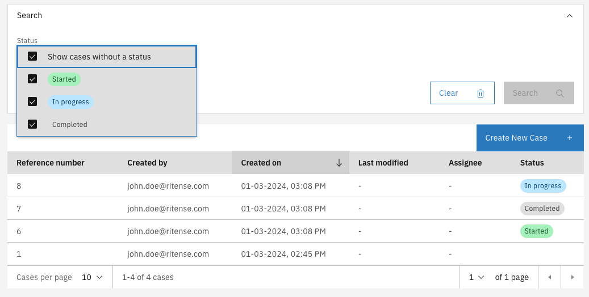

# Statuses

The internal case status is a case property which defines what the current state or status of the case is. The status is called 'internal', because by default it is not related to any status beyond the scope of Valtimo / GZAC (though implementations are not restricted to use it for that purpose).

This is a very powerful setting when combining case and process management. Being able to store an internal case status as meta data of the case makes it possible to define an internal case status for case handlers to use. Usually case handlers work with a larger set of case statuses then is presented to the customer or client. This can easily be configured with the case statusses.

<figure><figcaption><p>Example case statuses</p></figcaption></figure>

Once configured an extra search item will be added to the search UI of the case list. The visible by default option can be used the exclude certain statuses from the list by default.

## Configuring case statuses



Statuses can be configured in the Case admin screen, at the 'Statuses' tab.

<figure><figcaption></figcaption></figure>

### Adding a status

A status can be added with the **Add status** button. A modal will be shown where you can set the status name and key, choose a color and decide if the status should be added by default to the case list search.\
&#x20;

**Field explanation**

* **Name:** used as a label in the case summary and list, the name is presented in the UI.
* **Key:** the identifier of the status, this is only shown on configuration pages in the UI.
* **Color:** used for the label/tags of a status. The following colors are available:
  * Red (`RED`)
  * Magenta (`MAGENTA`)
  * Purple (`PURPLE`)
  * Blue (`BLUE`)
  * Teal (`TEAL`)
  * Green (`GREEN`)
  * Cyan (`CYAN`)
  * Gray (`GRAY`)
  * Cool gray (`COOLGRAY`)
  * Warm gray (`WARMGRAY`)
  * High contrast (`HIGHCONTRAST`)&#x20;
  * Outline (`OUTLINE`)
* **Visible:** If enabled, the status is included in the case search filter by default. When disabled, the user has to manually enable it in the filter so see any results with that status.



Status configurations can be autodeployed by creating json files in the `classpath*:config/` folder. The name of the file has to end with `.internal-case-status.json`. You can find an example of the JSON below:

`example-case.internal-case-status.json`:

```json
{
  "changesetId" : "example-case.internal-case-status.1721636149935",
  "internalCaseStatuses" : [
    {
      "key" : "awaiting-processing",
      "caseDefinitionName" : "example-case",
      "title" : "Awaiting processing",
      "visibleInCaseListByDefault" : true,
      "color" : "BLUE"
    },
    {
      "key" : "processing-order",
      "caseDefinitionName" : "example-case",
      "title" : "Processing order",
      "visibleInCaseListByDefault" : true,
      "color" : "PURPLE"
    },
    {
      "key" : "shipped",
      "caseDefinitionName" : "example-case",
      "title" : "Shipped",
      "visibleInCaseListByDefault" : true,
      "color" : "GREEN"
    }
  ]
}
```



### Import and export

The configuration is also included when importing or exporting a case. It uses the same format as the [autodeployment](statuses.md#autodeployment).

### Ordering

Statuses can be ordered, which will be used for the following:

* Order of statuses in the admin screen
* Order of statuses in the filter dropdown
* Sorting of cases by status

## Using statuses

Now that the statuses have been configured, not much has changed yet for the user. A filter and a status column is now visible to the user, but it does not add any value yet since no statuses are set to the cases:&#x20;

<figure><figcaption></figcaption></figure>

### Setting a status

To make sure statuses are updated during the process, a task expression can be added to any task where you want the status to change: `${documentDelegateService.setInternalStatus(execution, 'new')}`

### Filtering cases

Now that the process sets the correct statuses to the case, it can be used to filter and sort cases:&#x20;

<figure><figcaption></figcaption></figure>


