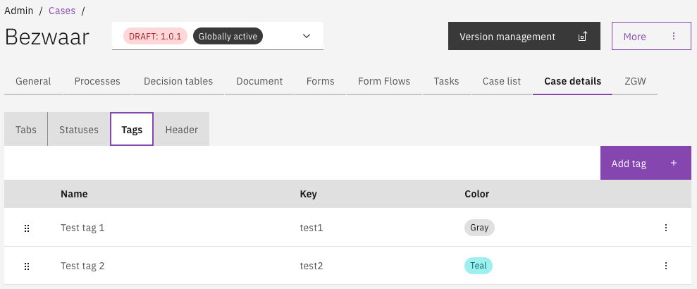

# Tags

Tags can be added to a case in order to add extra information to a case. Tags can be displayed in the column list, are shown on the case details page and can be used for searching. &#x20;


## Configuring case tags



### Adding a tag

* Go to the `Admin` menu
* Go to the `Cases` menu and select the case to configure tags
* Select the `Case details` tab
* Select the `Tags` tab

<figure><figcaption><p>Case tags admin interface</p></figcaption></figure>

A tag can be added with the **Add tag** button. A modal will be shown with the configuration options.

\


* **Name**\
  &#xNAN;_&#x55;sed as a label in the case summary and case list, the name is presented in the UI._
* **Key**\
  &#xNAN;_&#x54;he identifier of the tag, this must be a unique value within the scope of the case it is added to. A key based on the name is generated automatically but can be overwritten via the pencil button._
* **Color**\
  &#xNAN;_&#x54;ags are are displayed as a badge in the case details and list screen UI._\
  _This badge will be displayed in the selected color._


**Tags are automatically added to the case search filters**

When tags are configured for a case an additional search filter will be added to default search of the case list screen. This search filter makes it possible to only show cases with certain tags. The search is an OR search.




Tags configurations can be auto-deployed by creating json files in the `classpath*:config/` folder. The name of the file has to end with `.case-tags.json`.&#x20;
Create an case tags file under the following path: `*/resources/config/case/{case-definition-key}/{version-tag}/case/tag/`. The name of the file has to end with `.case-tag.json`.



```json
[
    {
        "key": "test1",
        "title": "Test tag 1",
        "color": "GRAY"
    },
    {
        "key": "test2",
        "title": "Test tag 2",
        "color": "TEAL"
    }
]


```



## Ordering and sorting

Tags can be ordered, which will be used for the following:

* Order of tags in the tags configuration screen
* Order of tags in the tags filter dropdown within the search filters
* Order of tags in the case list column
* Order of tags on the case details screen

## Using tags

When tags are configured for a case, an additional search filter is automatically applied to the Search Filters UI. This filter enables users to display or hide cases based on their configured tags.&#x20;

### Setting a case tag

To enable the ability to set tags at certain phases in the process, an expression can be added to any element in the process model where the case tags should set. The following expression is available for setting a case tag via the documentDelegateService:\
\
`${documentDelegateService.addCaseTag(execution, "the-key-of-the-tag")}`&#x20;

### Removing a case tag

To remove a tag, an expression can be added to any element in the process model where the case tags should be removed. The following expression is available for removing a case tag via the documentDelegateService:\
\
`${documentDelegateService.removeCaseTag(execution, "the-key-of-the-tag")}`&#x20;

## Import and export

Case tags configuration is included in the Case definition export and import by default.&#x20;


