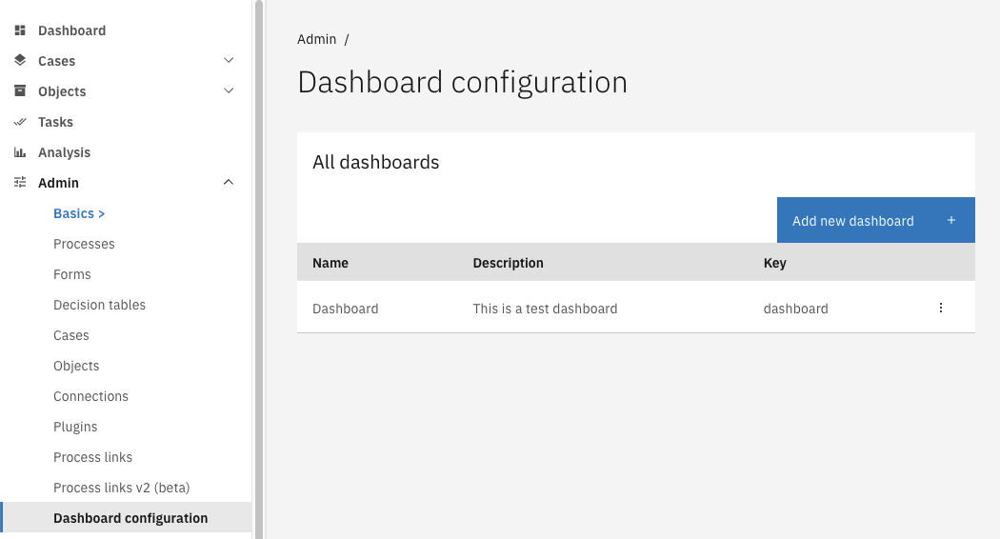
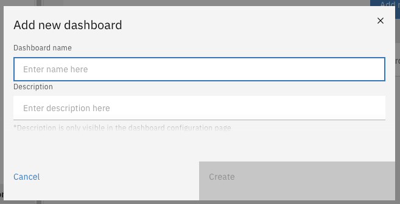
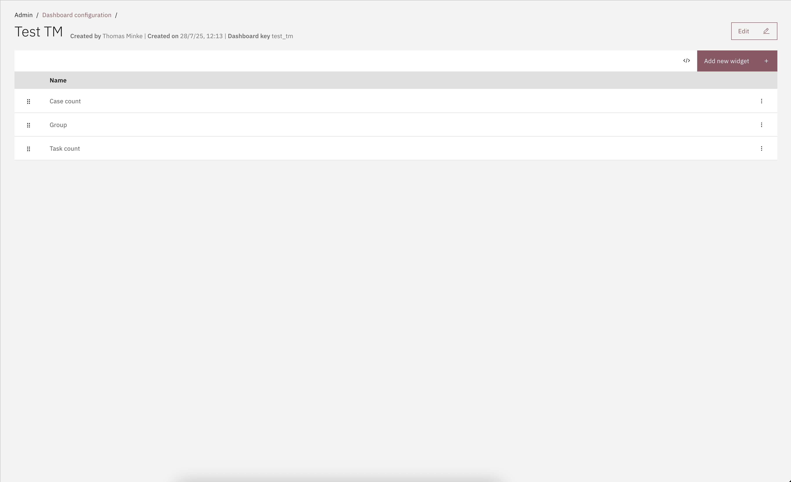
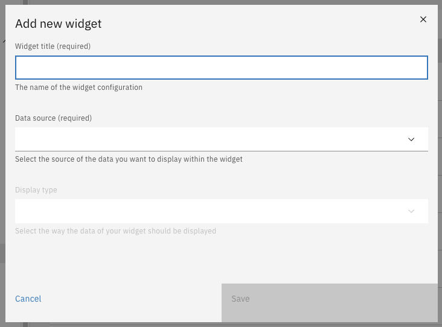
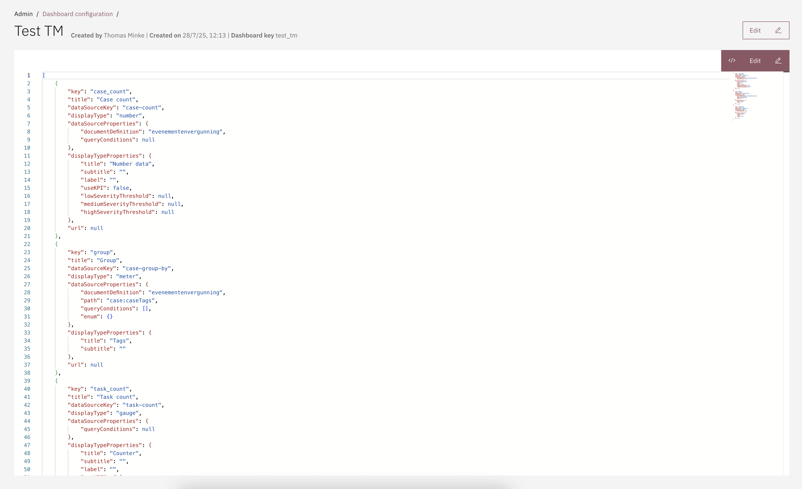
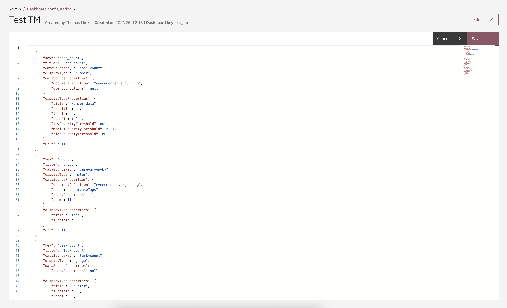

# 📊 Dashboard

The dashboard is used to display useful information to Valtimo users at a glance. Dashboards can provide the user with statistical information. Using this information, the user will be enabled to prioritize and focus on specific tasks.

A dashboard contains a set of widgets that display data in a customised way. These dashboards and widgets can be configured by an administrator accordingly.


**Concepts**

* **Dashboard** A container for any number of widgets. Multiple dashboards can be configured, which will be shown to the user as tabs.
* **Widget** Presents data from a datasource using a display-type to the user.
* **Data-source** Every dashboard widget retrieves its data from a data-source.
* **Display-type** A display type is responsible for the visualisation of data. For example: bar char, big number, meter, gauge, or any custom. Display types are only available for data-sources that return the required data.


## Creating a dashboard

There are two ways of configuring dashboards:

* Manually via the UI
* Using auto-deployment via the IDE




Configuring dashboards requires:

* Admin privileges


* Go to the `Admin` menu
* Go to the `Dashboard` menu
* Click on **Add new dashboard**
* Fill in the form

 

When creating a dashboard, two fields need to be filled in:

* The 'Dashboard name' will be shown to the user on the dashboard page.
* The 'Description' field is only visible for the system administrator. It will not be shown to the end users.



Dashboards can be auto-deployed from a json file at startup. This is useful to keep the dashboard configuration identical across multiple environments. Dashboards are auto-deployed by scanning files on the classpath that end in `.dashboard.json`.

**Changesets**

Every deployment file for represents a changeset. These files are required to contain a changesetId that should be unique over all deployment files that use changesets. When starting up, changesets that have already been executed will be ignored. A checksum of the changeset is created when it is executed. Changesets that have already been deployed should not change. Changesets that have been changed since a previous time will result in an error and failure to start the application.

All changesets can be executed again, even when the content has changed, by setting the `valtimo.changelog.dashboard.clear-tables` property to `true`.

**Example**

You can find an example of the JSON below.

In this example a widget is created with display type `number` and data source `case-count`. Different [display types](widget-display-types.md) and [data sources](dashboard.md) can be used to customize the layout of the dashboard.

```json
{
  "changesetId": "example-dashboard-v1",
  "dashboards": [
    {
      "key": "example-dashboard",
      "title": "Dashboard",
      "description": "This is an example dashboard",
      "order": 1,
      "widgetConfigurations": [
        {
          "key": "nr_of_cases_awaiting_customer_feedback",
          "title": "Nr of cases awaiting customer feedback",
          "dataSourceKey": "case-count",
          "dataSourceProperties": {
            "documentDefinition": "generic-case-type",
            "queryConditions": [
              {
                "queryPath": "doc:status",
                "queryOperator": "==",
                "queryValue": "AWAITING_FEEDBACK"
              }
            ]
          },
          "displayType": "number",
          "displayTypeProperties": {
            "title": "Nr of cases awaiting customer feedback",
            "subtitle": "Of type ",
            "label": null,
            "useKPI": true,
            "lowSeverityThreshold": 25,
            "mediumSeverityThreshold": 50,
            "highSeverityThreshold": 75
          }
        }
      ]
    }
  ]
}
```



## Adding widgets

After creating a dashboard, widgets can be added to the dashboard.



* Go to the `Admin` menu
* Go to the `Dashboard` menu
* Click the dashboard that needs to be configured
* Click on **Add new widget**
* Fill in the form

 



Widgets can also be configured via a JSON editor:




- Go to the `Admin` menu
- Go to the `Dashboards` menu
- Select a dashboard
- Click on **The code icon**
- Click on **Edit**
- Configure a new widget, delete a widget or edit an existing widget
- Click **Save**

<figure><figcaption></figcaption></figure>

<figure><figcaption></figcaption></figure>

This allows for faster editing of widgets or exchanging different dashboard widgets configurations throughout different environments.

## Access control

Access to dashboards can be configured through access control. More information about access control can be found [here](https://docs.valtimo.nl/features/access-control).

### Resources and actions

<table><thead><tr><th width="357">Resource type</th><th width="111">Action</th><th>Effect</th></tr></thead><tbody><tr><td><code>com.ritense.dashboard.domain.Dashboard</code></td><td><code>view</code></td><td>Allows viewing the data of one dashboard.</td></tr><tr><td></td><td><code>view_list</code></td><td>Allows viewing the dashboard tabs.</td></tr></tbody></table>

### Examples

<details>

<summary>Permission to view all dashboards and data</summary>

<pre class="language-json" data-overflow="wrap"><code class="lang-json">[
    {
<strong>        "resourceType": "com.ritense.dashboard.domain.Dashboard",
</strong>        "action": "view",
        "conditions": []
    },
    {
        "resourceType": "com.ritense.dashboard.domain.Dashboard",
        "action": "view_list",
        "conditions": []
    }
]
</code></pre>

</details>

<details>

<summary>Permission to view the data of one specific dashboard</summary>


```json
[
   {
      "resourceType": "com.ritense.dashboard.domain.Dashboard",
      "action": "view",
      "conditions": [
         {
            "type": "field",
            "field": "key",
            "operator": "==",
            "value": "management-dashboard"
         }
      ]
   },
   {
      "resourceType": "com.ritense.dashboard.domain.Dashboard",
      "action": "view_list",
      "conditions": [
         {
            "type": "field",
            "field": "key",
            "operator": "==",
            "value": "management-dashboard"
         }
      ]
   }
]
```


</details>
