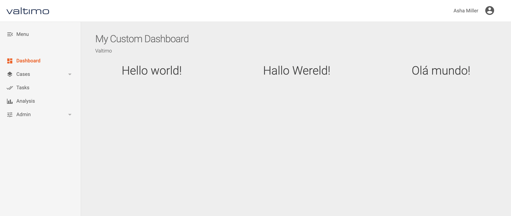

# Custom dashboards

Valtimo provides the possibility to introduce your own dashboard and add functionality to your project.\
The following example will provide details on how you can introduce your own custom dashboard.

#### Creating an angular component

To use a custom dashboard you must first create a component to hold both the functionality and user interface.\
First create a package under 'src/app/' and then create an angular component such as the example below

```typescript
import { Component, OnInit } from '@angular/core';

@Component({
    selector: 'app-dashboard',
    templateUrl: './dashboard.component.html',
    styleUrls: []
})
export class DashboardComponent implements OnInit {

    constructor() { }

    ngOnInit(): void {
    }

}
```

Create the html file that will serve your user interface. Note that the name of the file must be the same as in the templateUrl property in the example above.

More information on angular components can be found [here](https://angular.io/guide/component-overview#creating-a-component)

```html
<div style="display: grid;grid-template-columns: auto auto auto;"> 
  <div style="text-align: center"><h1>Hello world!</h1></div> 
  <div style="text-align: center"><h1>Hallo Wereld!</h1></div> 
  <div style="text-align: center"><h1>Olá mundo!</h1></div>  
</div>
```

#### Routing

Valtimo already provides an off the shelf dashboard which must first be overridden in order for your custom dashboard to be used.\
To achieve that you can import and declare the route as in the example below.

For more details on routing follow this [link](https://angular.io/guide/router-reference#configuration)

```typescript
import {DashboardComponent} from './custom-components/dashboard/dashboard.component';

const routes: Routes = [{
  path: '',
  component: DashboardComponent,
  data: {title: 'My Custom Dashboard', roles: ['ROLE_USER']},
  canActivate: [AuthGuardService]
}];
```

The path variable in the example above is the key for overriding components. As it stands the default Valtimo dashboard exists under the root path so the value must be an empty string.\
The title property can be defined, and it will be shown in the header of the page, and the roles defines which role can access the page (more on roles [here](creating-a-custom-dashboard.md))

#### Declaring the component

In order for your component to be used by the application you must import and declare it in 'app.module.ts'

```typescript
@NgModule({
  declarations: [
    AppComponent,
    DashboardComponent
  ]
})
```


