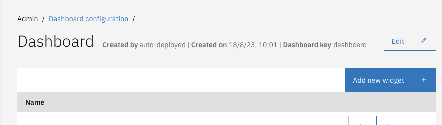
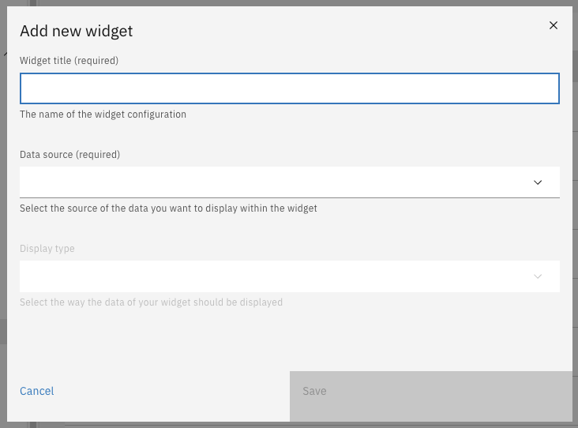

# Widgets

## Adding widgets

After creating a dashboard, widgets can be added to the dashboard.

* Go to the `Admin` menu
* Go to the `Dashboard` menu
* Click the dashboard that needs to be configured
* Click on **Add new widget**
* Fill in the form

 

### Adding widget: Case count

Valtimo 10.7, there is one supported widget, with datasource 'Case count' and display type 'Big number'. This widget can be created by following the instructions above. More information on how to fill in the form, can be found [here](../../nog-een-plek-geven/reference/modules/dashboard.md#case-count)
