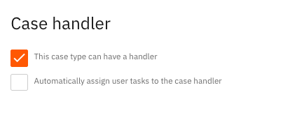

# Automatic task assignment

It is possible to have user tasks be automatically assigned to a case assignee making the tasks in a case appear under the case assignee's task list.

## Functionality

This feature causes user tasks (existing and new) to be assigned to the current case assignee if there is one assigned.\
Upon the (re-)assignment of a case all user tasks from all processes currently using the same business key will have their assignee updated to match the new case assignee.\
Removal of an assignee from the case will also clear the assignee on all assigned user tasks withing all processes using the same business key.

## Prerequisites

This feature requires the following:

* Valtimo 10.7.0 or newer

## How to configure automatic assignment of tasks

Automatic assignment of tasks can be enabled at the bottom of an individual case configuration page (`Admin` -> `Case` -> `[your case definition]`). This option becomes visible when the Case is allowed to have an assignee.

## Limitations

* Only tasks that the user has access to (user has the required role) are assigned to the case assignee.
* Tasks already loaded on a dossier detail page do not automatically show the new assignment. A component reload (switching tabs or reload the page) is required to see the up-to-date assignee in the task modal.
