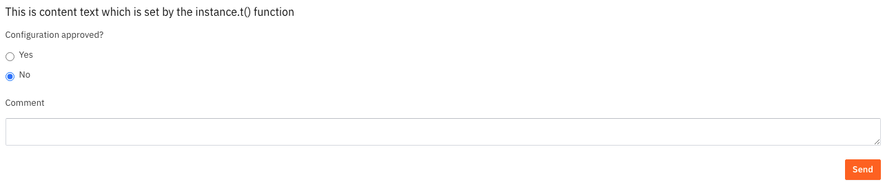

# 📋 Forms

Valtimo uses the [Form.io](https://www.form.io/) form builder to create forms that can be used for multiple purposes, such as:

* Task forms
* Process start forms
* Case detail view

## Translations

To display forms in different languages, we can utilize translations. This involves translating all the labels based on their label property, and using a function `instance.t('translationKey')` to display content from the translation file inside the htmlContent.

An example of a translated form.io definition:

```json
{
  "display": "form",
  "components": [
    {
      "key": "html",
      "type": "htmlelement",
      "input": false,
      "label": "HTML",
      "content": "<p>{{ instance.t('contentX') }}</p>",
      "tableView": false,
      "refreshOnChange": false
    },
    {
      "key": "isApproved",
      "type": "radio",
      "input": true,
      "label": "configurationApproved",
      "inline": false,
      "values": [
        {
          "label": "yes",
          "value": "true",
          "shortcut": ""
        },
        {
          "label": "no",
          "value": "false",
          "shortcut": ""
        }
      ],
      "default": true,
      "tableView": false,
      "defaultValue": false,
      "optionsLabelPosition": "right"
    },
    {
      "key": "comment",
      "type": "textarea",
      "input": true,
      "label": "comment",
      "tableView": true,
      "autoExpand": false
    },
    {
      "key": "send",
      "type": "button",
      "input": true,
      "label": "send",
      "tableView": false,
      "customClass": "float-right",
      "saveOnEnter": false,
      "showValidations": false
    }
  ]
}
```

Where form.io definition is using the following translation properties:

```json
{
  "formioTranslations": {
    "contentX": "This is content text which is set by the instance.t() function",
    "ConfigurationApproved": "Configuration approved?",
    "yes": "Yes",
    "no": "No",
    "comment": "Comment",
    "send": "Send"
  }
}
```

Which results in:

<figure><figcaption></figcaption></figure>
