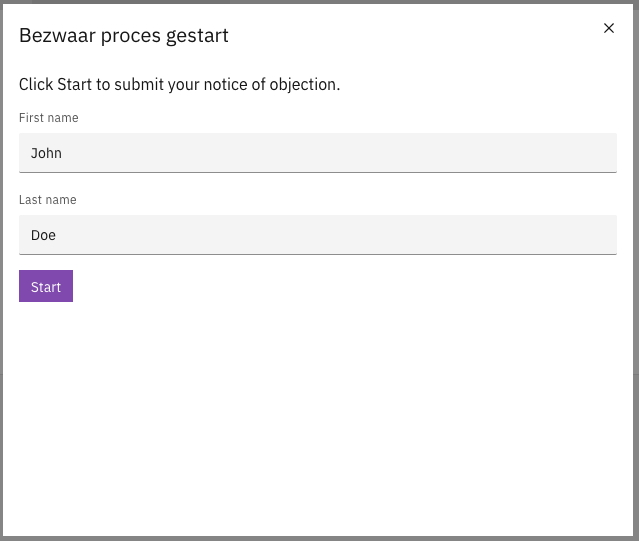

# 📋 Forms

Valtimo uses the [Form.io](https://www.form.io/) form builder to create forms that can be used for different purposes, such as:

* Task forms
* Process start forms
* Case detail views

## Translations

Form.io supports translations within its form definitions. You can use any translations available in your implementation that come from the [configured translation resources](../localization/configuring-localization.md).

To make something in your form translated, use the syntax: `translate:translationKey`.

You can use this anywhere in the form definition, including inside HTML elements.

When the form is displayed, the translation key will be replaced with the correct translated text.

Here’s an example of a translated Form.io definition:

```json
{
  "display": "form",
  "components": [
    {
      "key": "html",
      "type": "htmlelement",
      "input": false,
      "label": "translate:bezwaarStartForm.htmlLabel",
      "content": "translate:bezwaarStartForm.startInstruction",
      "tableView": false,
      "refreshOnChange": false
    },
    {
      "key": "voornaam",
      "type": "textfield",
      "input": true,
      "label": "translate:bezwaarStartForm.firstName",
      "tableView": true,
      "attributes": {
        "data-testid": "start-form-bezwaar-voornaam"
      },
      "applyMaskOn": "change",
      "defaultValue": "translate:bezwaarStartForm.firstNameDefault"
    },
    {
      "key": "achternaam",
      "type": "textfield",
      "input": true,
      "label": "translate:bezwaarStartForm.lastName",
      "tableView": true,
      "attributes": {
        "data-testid": "start-form-bezwaar-achternaam"
      },
      "applyMaskOn": "change",
      "defaultValue": "translate:bezwaarStartForm.lastNameDefault"
    },
    {
      "key": "submit",
      "type": "button",
      "input": true,
      "label": "translate:bezwaarStartForm.start",
      "tableView": false,
      "disableOnInvalid": true
    }
  ]
}
```

This form.io definition uses the following translation keys (defined for English, Dutch and German):

```json
"bezwaarStartForm": {
    "htmlLabel": "HTML",
    "startInstruction": "Click Start to submit your objection.",
    "firstName": "First name",
    "lastName": "Last name",
    "start": "Start",
    "firstNameDefault": "John",
    "lastNameDefault": "Doe"
}
```

```json
"bezwaarStartForm": {
    "htmlLabel": "HTML",
    "startInstruction": "Klik op Start om uw bezwaar in te dienen.",
    "firstName": "Voornaam",
    "lastName": "Achternaam",
    "start": "Start",
    "firstNameDefault": "Jan",
    "lastNameDefault": "Doo"
}
```

```json
"bezwaarStartForm": {
    "htmlLabel": "HTML",
    "startInstruction": "Klicken Sie auf Start, um Ihren Einspruch einzureichen.",
    "firstName": "Vorname",
    "lastName": "Nachname",
    "start": "Start",
    "firstNameDefault": "Johann",
    "lastNameDefault": "Doh"
}
```

Which produces the following results:

<figure><figcaption></figcaption></figure>

<figure><figcaption></figcaption></figure>

<figure><figcaption></figcaption></figure>
