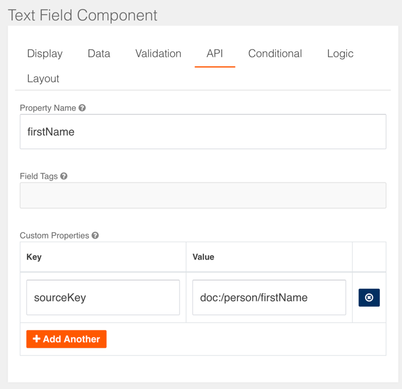
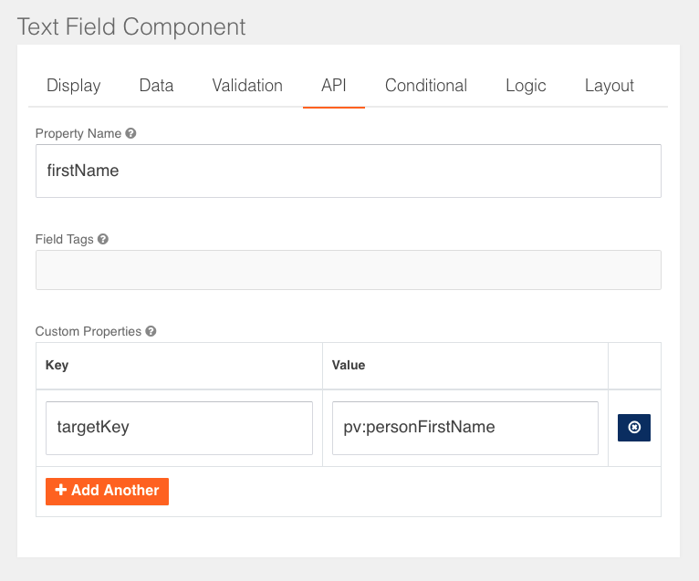

# Prefilling data

In Valtimo, forms can be prefilled with data from a case or from other external sources. This page describes how

## Value resolvers


Available since Valtimo `11.0.0`


Value resolvers provide a framework to retrieve and/or store data in several sources like process variables (`pv:`), documents (`doc:`), and more.

[Custom value resolvers](forms/custom-value-resolvers.md) can be created for external sources.

### Supported value resolvers

<table data-full-width="false"><thead><tr><th valign="top">Data</th><th valign="top">Description</th><th valign="top">Prefix</th><th valign="top">Postfix</th><th valign="top">Example</th></tr></thead><tbody><tr><td valign="top"><strong>Case JSON data</strong></td><td valign="top">Resolves values from the JSON content of the JsonSchemaDocument</td><td valign="top"><code>doc:</code></td><td valign="top">Json path to a field</td><td valign="top">doc:person.firstName</td></tr><tr><td valign="top"><strong>Case columns</strong></td><td valign="top">Resolves values from the database columns of the JsonSchemaDocument</td><td valign="top"><code>case:</code></td><td valign="top">database column name in camel case</td><td valign="top">case:assigneeFullName</td></tr><tr><td valign="top"><strong>Process variables</strong></td><td valign="top">Resolves values form the Camunda BPMN process variables</td><td valign="top"><code>pv:</code></td><td valign="top">Process variable name</td><td valign="top">pv:lastName</td></tr></tbody></table>

### ZGW value resolvers

Valtimo contains additional value resolvers for ZGW services:

* `zaak` (Zaken API)
* `zaakstatus` (Zaken API & Catalogi API)
* `zaakobject` (Zaken API)

<table><thead><tr><th valign="top">Data</th><th valign="top">Description</th><th valign="top">Prefix</th><th valign="top">Postfix</th><th valign="top">Example</th></tr></thead><tbody><tr><td valign="top"><strong>Zaken API zaak</strong></td><td valign="top">Resolves values from the Zaken API zaak response</td><td valign="top"><code>zaak:</code></td><td valign="top">Name of the field from the <a href="https://redocly.github.io/redoc/?url=https://raw.githubusercontent.com/VNG-Realisatie/zaken-api/master/src/openapi.yaml#tag/zaken/operation/zaak_create">zaak response</a></td><td valign="top">zaak:identificatie</td></tr><tr><td valign="top"><strong>Zaken API zaakstatus</strong></td><td valign="top">Resolves values from the Zaken API zaakstatus response</td><td valign="top"><code>zaakstatus:</code></td><td valign="top">Name of the field from the <a href="https://redocly.github.io/redoc/?url=https://raw.githubusercontent.com/VNG-Realisatie/catalogi-api/master/src/openapi.yaml#tag/statustypen/operation/statustype_retrieve">zaak statustypen response</a></td><td valign="top">zaakstatus:omschrijvingGeneriek</td></tr><tr><td valign="top"><strong>Zaken API zaakobject</strong></td><td valign="top">Resolves values form the Zaken API zaakobject</td><td valign="top"><code>zaakobject:</code></td><td valign="top">The object type and a reference to a property</td><td valign="top">zaakobject:profile:/person/firstName</td></tr></tbody></table>

More information can be found [here](broken-reference)

### Custom properties

#### sourceKey

Value resolvers can be used to prefill a form with external data by adding the custom property `sourceKey`:



The following prefixes are supported by default:

* `doc` (Document)
* `pv` (Process variable)

#### targetKey

Value resolvers can also be used to handle submitted form values using the custom property `targetKey`. If the custom property `targetKey` is added, it will store submitted values to the reference provided in the `targetKey`:



If a `sourceKey` is provided, it will store submitted values using the reference provided in the `sourceKey`. Unless there is a `targetKey` provided. Then the `targetKey` takes priority.

## External data types

This table lists which types of data can be referred to from a form field, and which prefix to use.

<table><thead><tr><th valign="top">Prefix</th><th valign="top">Type of data</th></tr></thead><tbody><tr><td valign="top"><a href="creating-forms-in-valtimo.md#case-data">No prefix</a></td><td valign="top">The data in the document of a case.</td></tr><tr><td valign="top"><a href="creating-forms-in-valtimo.md#zaakeigenschappen"><code>openzaak</code></a></td><td valign="top">The 'zaakeigenschappen' stored for the zaak in the Zaken API. Not to be confused with the properties of a zaak.</td></tr><tr><td valign="top"><a href="creating-forms-in-valtimo.md#process-variables"><code>pv</code></a></td><td valign="top">Process variables stored for any process instance that is linked to the case</td></tr><tr><td valign="top"><a href="creating-forms-in-valtimo.md#zaakobjecten"><code>zaak</code></a></td><td valign="top">The properties of a zaak in the Zaken API</td></tr><tr><td valign="top"><a href="creating-forms-in-valtimo.md#zaakobjecten"><code>zaakstatus</code></a></td><td valign="top">The properties of 'zaakstatus' linked to a zaak in the Zaken API</td></tr><tr><td valign="top"><a href="creating-forms-in-valtimo.md#zaakobjecten"><code>zaakobject</code></a></td><td valign="top">The properties of 'zaakobjecten'. Objects linked to a zaak in the Zaken API</td></tr></tbody></table>

<details>

<summary>Case data</summary>

Prefix: No prefix

Uses a reference to data from the json document that stores case data in Valtimo. The dot (`.`) can be used to access data in nested objects.

Example: `person.firstName`

</details>

<details>

<summary>Zaakeigenschappen</summary>

Prefix: `openzaak`

Gets the [zaakeigenschap](https://zaken-api.vng.cloud/api/v1/schema/#operation/zaakeigenschap_list) that is indicated in the field expression. The available items are defined for a 'zaaktype' in de Catalogi API.

Example: `openzaak:firstName`

</details>

<details>

<summary>Process variables</summary>

Prefix: `pv`

Accesses process variables for the case for which the form is loaded. It can access all variables of all process instances for the case.

Example: `pv:firstName`

</details>

<details>

<summary>Zaak</summary>


Available since Valtimo `11.2.0`


Prefix: `zaak`

With the `zaak` prefix, all data inside a [zaak response](https://redocly.github.io/redoc/?url=https://raw.githubusercontent.com/VNG-Realisatie/zaken-api/master/src/openapi.yaml#tag/zaken/operation/zaak_create) can be used to prefill the form. Some examples:

<table><thead><tr><th valign="top">Source key</th><th valign="top">Type of data</th><th valign="top">Example</th></tr></thead><tbody><tr><td valign="top">zaak:url</td><td valign="top">A URL reference to the zaak</td><td valign="top">https://example.com/zaken/api/v1/zaken/f4086828-b0b7-4e6c-a0ac-5ca1e44c5b06</td></tr><tr><td valign="top">zaak:uuid</td><td valign="top">Zaak UUID</td><td valign="top">f4086828-b0b7-4e6c-a0ac-5ca1e44c5b06</td></tr><tr><td valign="top">zaak:identificatie</td><td valign="top">The zaak identifier</td><td valign="top">ZK2023-00001</td></tr><tr><td valign="top">zaak:startdatum</td><td valign="top">The date at which the execution of the zaak was started</td><td valign="top">2023-12-12</td></tr><tr><td valign="top">zaak:status</td><td valign="top">A URL reference to the zaak status</td><td valign="top">https://example.com/zaken/api/v1/statussen/8265450b-9a96-4948-8a0f-eb40a26f7aea</td></tr></tbody></table>

</details>

<details>

<summary>Zaakstatus</summary>


Available since Valtimo `11.2.0`


Prefix: `zaakstatus`

With the `zaakstatus` prefix, all data inside a [zaak statustypen response](https://redocly.github.io/redoc/?url=https://raw.githubusercontent.com/VNG-Realisatie/catalogi-api/master/src/openapi.yaml#tag/statustypen/operation/statustype_retrieve) can be used to prefill the form. Some examples:

| Source key                      | Type of data                      | Example                                                                         |
| ------------------------------- | --------------------------------- | ------------------------------------------------------------------------------- |
| zaakstatus:url                  | A URL reference to the zaakstatus | https://example.com/zaken/api/v1/statussen/8265450b-9a96-4948-8a0f-eb40a26f7aea |
| zaakstatus:omschrijvingGeneriek | Zaak status description           | Intake finished                                                                 |
| zaakstatus:volgnummer           | The status trace number           | 2                                                                               |

</details>

<details>

<summary>Zaakobjecten</summary>

Prefix: `zaakobject`

In order to use this type the following plugins have to be configured:

* Zaken API
* Objecten API
* Objecttypen API

References a property in a Objecten API object referenced as 'zaakobject'. The field expression contains both the name of the 'objecttype' and a JSON Pointer to the property within the JSON store in the zaakobject. There can only be one object of the requested type linked to the zaak as zaakobject. If no or multiple objects are found, an exception will be thrown when loading the form. When the object is found, the JSON Pointer is used to find the property in the JSON stored in the `data` field of the object.

In order for Valtimo to find the correct object, the following needs to be configured correctly:

* A zaak is linked to the current case by using a zaak instance link
* A Zaken API configuration exists that has a base URL matching the zaak instance link URL
* A zaakobject exists in the Zaken API that links the zaak to an object in the Objects API
* An Objecten API configuration exists that has a base URL matching the object URL in the zaakobject
* An Objecttypen API configuration exists that has a base URL matching the type from the object found

Example: `zaakobject:profile:/person/firstName`

</details>

## Case data

By default, when creating fields in a form the data will be retrieved from and stored in the case. The property of the case that is used depends on the 'Property Name' field on the 'API' tab of the field settings.


This behaviour has been deprecated as of version `11.0.0` and will be removed in the future. Please use [value resolvers](creating-forms-in-valtimo.md#value-resolvers) instead.


In the example below a document definition is defined with the `firstName` property. A form field is created that corresponds to this property to allow data to be loaded and saved.

Document definition:

```json
{
  "$id": "example.schema",
  "type": "object",
  "title": "Example",
  "$schema": "http://json-schema.org/draft-07/schema#",
  "properties": {
    "firstName": {
      "type": "string",
      "description": "First name"
    }
  }
}
```

Field configuration:


It is also possible to load properties from an object within the document. In the example below the document definition contains an object 'person', that has a 'firstName' property. This property can be accessed by using `person.firstName` as the field property name.

Document definition:

```json
{
  "$id": "example.schema",
  "type": "object",
  "title": "Example",
  "$schema": "http://json-schema.org/draft-07/schema#",
  "properties": {
    "person": {
      "type": "object",
      "properties": {
        "firstName": {
          "type": "string",
          "description": "First name"
        }
      }
    }
  }
}
```

Field configuration:


## External data


This behaviour has been deprecated as of version `11.0.0` and will be removed in the future. Please use [value resolvers](creating-forms-in-valtimo.md#value-resolvers) instead.


In some cases there is other data related to the case, but not part of the document that needs to be displayed in a form. The form module allows for `FormFieldDataResolver` to fetch data by using expressions as property name in forms. On loading the form the data is automatically preloaded. The expression generally looks like `<prefix>:<field-expression>` where the prefix indicates which `FormFieldDataResolver` is used. The `<field-expression>` in this expression gives the resolver information on what data to load. For example, when using the expression `openzaak:firstName` for a field, the `OpenZaakFormFieldDataResolver` is used to access the zaakeigenschappen in the Zaken API and get the `firstName` property.

Even though technically a `FormFieldDataResolver` is not used, the prefix `pv` is available to access the process variables in functionally the same way. For example, the expression `pv:age` would try to get the 'age' variable from the process variables.

A list of `FormFieldDataResolvers` that are available on the [forms reference page](broken-reference).

A description on how to create a new `FormFieldDataResolver` is available on the [creating form data resolver page](forms/creating-form-field-data-resolver.md)

## Disabling prefill


Available since Valtimo `10.5.0`


In some cases it is desirable to be able to disable a form input prefill. For example, an upload input might result in duplicate files when prefilled.

Prefilling can be disabled for specific input fields by configuring a `prefill` property in the JSON of the form definition as follows:

```json
{
  "display": "form",
  "components": [
    {
      "key": "firstName",
      "type": "textfield",
      "input": true,
      "prefill": false
    }
  ]
}
```

In contrast to [Disabled fields](creating-forms-in-valtimo.md#disabled-fields), setting this property to false will still save the result in the document.

## Disabled fields

Disabled form fields are prefilled and saved by default. This behaviour deviates from the web-standard where disabled elements are not included in the submit body.

This behaviour can be changed by setting a toggle in `application.yml`:

```yaml
valtimo:
    form:
      ignoreDisabledFields: true
```

When set to true, disabled fields will no longer be prefilled or saved. The default value is false.
