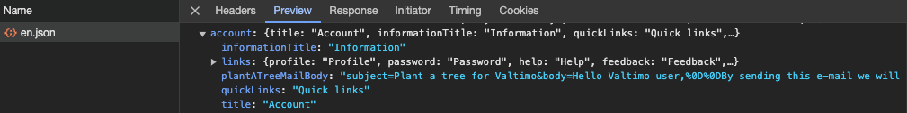
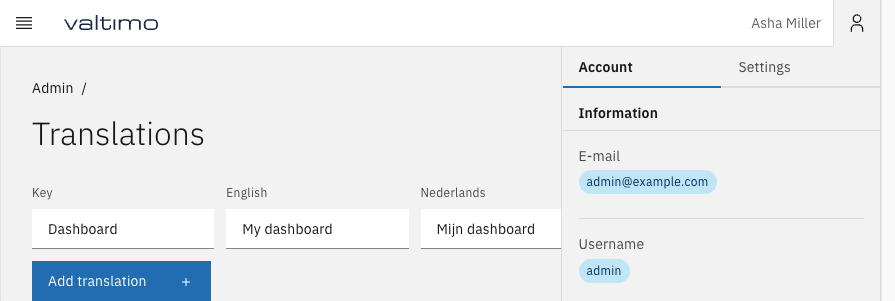
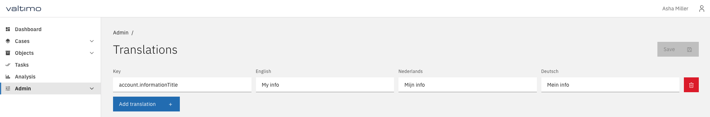
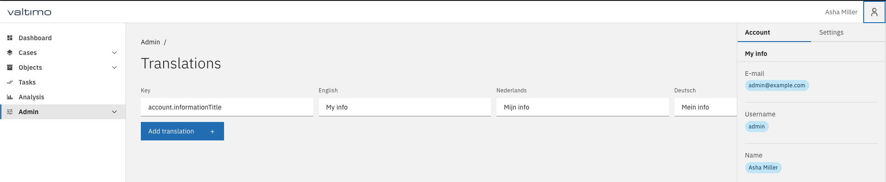

# 🌍 Localization

The front-end of Valtimo supports localization. The front-end libraries include default translations for main application functionality. These translations can be extended and overridden in a variety of ways.


From Valtimo front-end and back-end libraries version `12.0.0` and up, it is possible for an administrator to configure translations from the user interface.


## Admin configuration of translations

After following the above-mentioned steps, an administrator can now navigate to `/translation-management`. On this page, custom translation keys can be configured, which will be available directly in any custom component code using the `translate` pipe provided by `'@ngx-translate/core'`.

In addition, any existing translations can be overridden by supplying its exact key. In this example, the title displayed for Dashboard in the left sidebar is overridden by supplying the translation key it uses, which is `Dashboard`. Now, `My dashboard` is displayed when the application is set to English.

Any nested translations can also be overridden by using the dot notation. For example, notice `account.informationTitle` is defined in the translation files:

This translation is displayed in the right sidebar as "Information":

We can override this text by providing the exact key using the dot notation, and then providing our own translations:

Finally, our custom translation is displayed in the sidebar on reloading the page:

