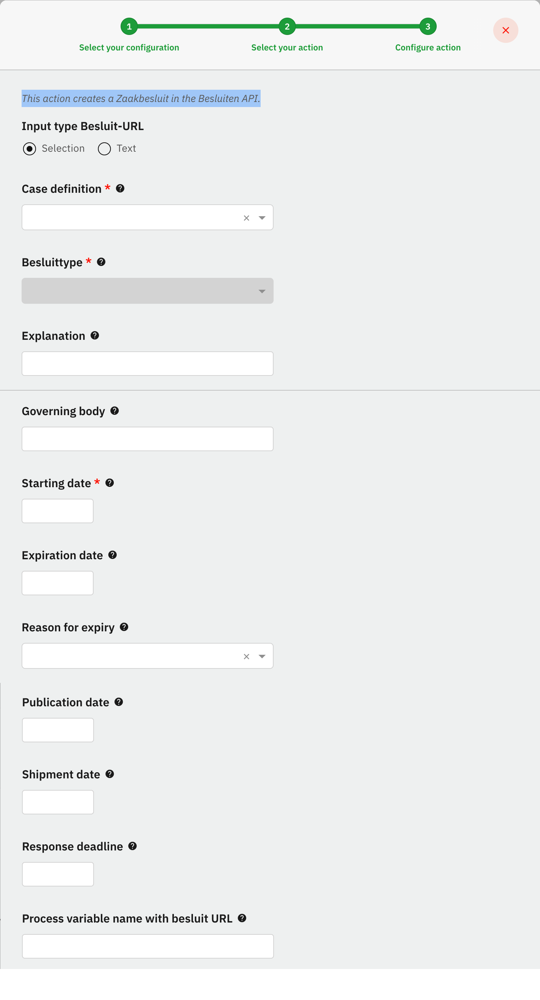
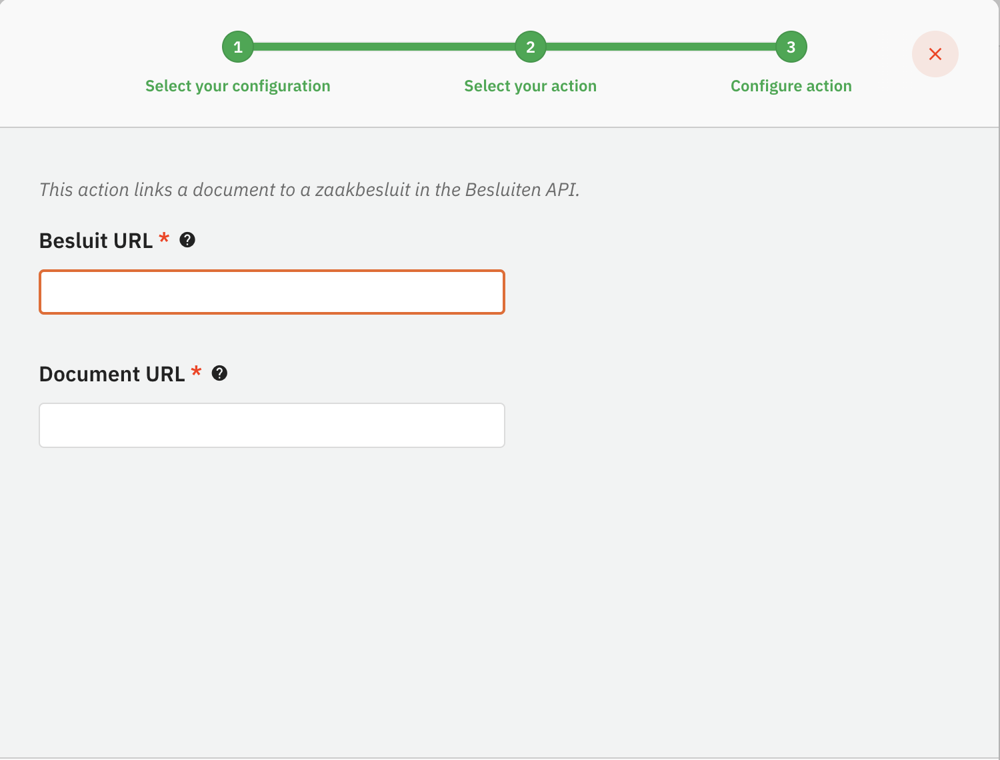

# Besluiten Plugin


The Besluiten API plugin is a ZGW plugin and can only be used in the GZAC edition.


The Besluiten API plugin is used to store information about besluiten (decisions) in an application that supports the Besluiten API standard created and used by the Dutch government.

## Configure the plugin

A plugin configuration is required before the plugin can be used. A general description on how to configure plugins can be found [here](./#configuring-plugins).

If the Besluiten API plugin is not visible in the plugin menu, it is possible the application is missing a dependency. Instructions on how to add the Besluiten API dependency can be found [here](../../fundamentals/getting-started/modules/zgw/besluiten-api.md).

To configure this plugin the following properties have to be entered:

* **URL.** Contains the complete base URL of the Besluiten API to connect to. This generally includes the path `/api/v1/`.
* **Authentication plugin configuration.** Reference to another plugin configuration that will be used to add authentication to any request performed on the Besluiten API. If no option is available in this field a plugin has to be configured that is able to authenticate for the specific application that hosts the Besluiten API.

An example plugin configuration:&#x20;

* **URL (`url`)**. Contains the complete base URL of the Besluiten API to connect to. This generally includes the path `/api/v1/`.
* **RSIN (`rsin`).** Legal entities and partnership number
* **Authentication plugin configuration (`authenticationPluginConfiguration`).** Reference to another plugin configuration that will be used to add authentication to any request performed on the Besluiten API. If no option is available in this field a plugin has to be configured that is able to authenticate for the specific application that hosts the Besluiten API.

## Available actions

The Besluiten API plugin supports the following actions that can be configured in process links in order to retrieve type data.

A general description on how to create process links can be found [here](../process/process-link.md#creating-a-plugin-process-link).

### Create besluit

This action creates a Zaakbesluit in the Besluiten API.

When creating a process link the following properties have to be entered:

* **Besluittype-URL** URL reference to the besluit type.
* **Explanation** Explanation to the besluit.
* **Governing body** A body of a legal person established under public law or a person or body with any public authority under whose responsability the decision has been adopted.
* **Starting date** Commencement date of the effective period of the besluit.
* **Expiration date** Date on which the period of operation of the besluit ends.
* **Reason for expiry** The description that indicates on the basis of which the decision has been or will be cancelled.
* **Publication date** Date on which the besluit is published.
* **Shipment date** Date on which the besluit was sent.
* **Response deadline** The date until which a defense against the decision is possible.
* **Process variable name with besluit URL** The process variable in which the besluit url is stored locally.

An example action configuration:&#x20;

<figure><figcaption></figcaption></figure>

### Link document to besluit

This action links a document to a zaakbesluit in the Besluiten API.

When creating a process link the following properties have to be entered:

* **Besluit URL**. URL reference to the besluit
* **Document URL**. URL reference to the document

An example action configuration:&#x20;

<figure><figcaption></figcaption></figure>

### Patch besluit
This action updates specific properties of a besluit in the Besluiten API. 
When creating a process link the following properties can be provided:

* **Besluit URL** URL reference to the besluit.
* **Decision date** (Optional) Date on which the besluit is decided.
* **Explanation** (Optional) Explanation to the besluit.
* **Governing body** (Optional) A body of a legal person established under public law or a person or body with any public authority under whose responsability the decision has been adopted.
* **Starting date** (Optional) Commencement date of the effective period of the besluit.
* **Expiration date** (Optional) Date on which the period of operation of the besluit ends.
* **Reason for expiry** (Optional) The description that indicates on the basis of which the decision has been or will be cancelled.
* **Publication date** (Optional) Date on which the besluit is published.
* **Shipment date** (Optional) Date on which the besluit is sent.
* **Response deadline** (Optional) The date until which a defense against the decision is possible.

Note: at least one of the optional properties has to be provided.
