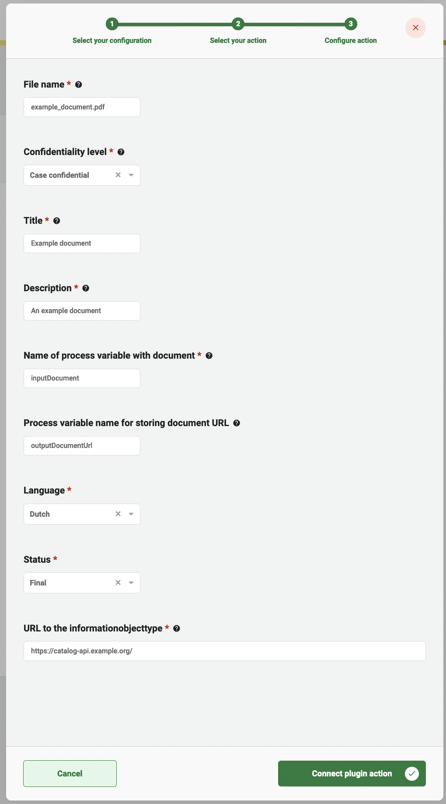

# Documenten API plugin


The Documenten API plugin is a ZGW plugin and can only be used in the GZAC edition.


The Documenten API plugin is used to store documents and their metadata in an application that supports the Documenten API standard created and used by the Dutch government.

## Configure the plugin

A plugin configuration is required before the plugin can be used. A general description on how to configure plugins can be found [here](./#configuring-plugins).

If the Documenten API plugin is not visible in the plugin menu, it is possible the application is missing a dependency. Instructions on how to add the Documenten API dependency can be found [here](../../fundamentals/getting-started/modules/zgw/documenten-api.md).

To configure this plugin the following properties have to be entered:

* **Configuration ID (`id`).** The plugin will be saved under this ID. The ID must be in the format of a UUID.
* **Documenten API URL (`url`).** Contains the complete base URL of the Documenten API to connect to. This generally includes the path `/api/v1/`.
* **Organisation RSIN (`bronorganisatie`).** Contains the RSIN of the organisation. The RSIN number (Rechtspersonen en Samenwerkingsverbanden Identificatie Nummer in Dutch) is an identification number for legal entities and partnerships. This will be used when storing document to indicate who is responsible for creating the Document record in the API.
* **Authentication plugin configuration (`authenticationPluginConfiguration`).** Reference to another plugin configuration that will be used to add authentication to any request performed on the Documenten API. If no option is available in this field a plugin has to be configured that is able to authenticate for the specific application that hosts the Documenten API. (e.g. OpenZaak)
*   **Documenten API version (`apiVersion`).** Contains the API version of the Documenten API that is used. An example plugin configuration:

    <figure><figcaption></figcaption></figure>

### Documenten API version

Newer versions of the Documenten API offer more functionality. The version of the Documenten API determines which features are available in Valtimo.

| Feature            | Version                    | Feature description                                                                               |
| ------------------ | -------------------------- | ------------------------------------------------------------------------------------------------- |
| Trefwoorden        | 1.4.0 and up               | Tags can be added to uploaded documents.                                                          |
| Filterable columns | 1.4.2-maykin-1.13.0 and up | Makes it possible to search for a specific document based on title and other document properties. |
| Sortable columns   | 1.4.2-maykin-1.13.0 and up | Some of the columns of the uploaded documents can now be sorted.                                  |

#### Maykin Media

Maykin Media has released their own Documenten API implementation that offers additional experimental functionality. Maykin Media's release that first supported the experimental functionality is [Open Zaak 1.13.0](https://github.com/open-zaak/open-zaak/tree/stable/1.13.x) which makes use of the Documenten API version **1.4.2**. Valtimo can make use of the experimental functionality from Maykin Media when selecting version **1.4.2-maykin-1.13.0** inside the Documenten API plugin.

## Available actions

The Documenten API plugin supports the following actions that can be configured in process links in order to store documents and their metadata.

A general description on how to create process links, can be found [here](../process/process-link.md#creating-a-plugin-process-link).

### Save document

The **Save document** action takes a file from the local temporary storage and stores it in the Documenten API as a new Document. A reference to the document has to be available as a process variable. After storing the document, the resulting document URL will be saved in a process variable.

When creating a process link the following properties have to be entered:

* **File name.** The name of the physical file in which the content of the document is captured, including extension.
* **Confidentiality level.** Indication of the extent to which the document is intended for public access.
* **Title.** The name by which the document is formally known.
* **Description.** A generic description of the content of the document.
* **Name of process variable with document.** The name of the process variable in which the ID of a local file in the temporary file storage has been stored.
* **Process variable name for storing document URL.** The name of the process variable in which the resulting document URL will be stored.
* **Language.** The language of the document.
* **Status.** The status of the document. Possible values are `Editing`, `To be confirmed`, `Final` and `Archived` as per the Documenten API standard.
* **Information object type.** The type of the document. This is the complete URL referring to the document type (or informatieobjecttype) in the Catalogi API. (e.g. https://catalogi-api.example.org/api/v1/informatieobjecttypen/d4acf297-978d-4b2c-a9d3-5efd010ebcb2)

An example process link configuration:

<figure><figcaption></figcaption></figure>

### Save uploaded document

The **Save uploaded document** action saves a document to the Documenten API. Metadata provided by the user through a form after uploading a file, is transferred together with the file to the Documenten API. No configuration data has to be provided in order to configure this plugin action.

This process link does the following steps:

1. Gets the temporary file using the ID retrieved from a process variable `resourceId`.
2. Saves the document in the Documenten API.
3. Creates a new process variable `documentUrl` containing the URL to the uploaded document.

### Download document

The **Download document** action downloads a document from the Documenten API and saves it as a temporary file. No configuration data has to be provided in order to configure this plugin action.

This process link does the following steps:

1. Take the document URL that is saved in the process variable `documentUrl`.
2. Download the document and saves it to a temporary file.
3. Creates a new process variable with the name of your choosing, by default: `resourceId`, containing the temporary file ID.
