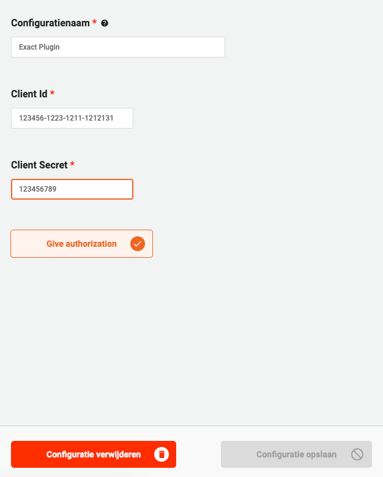
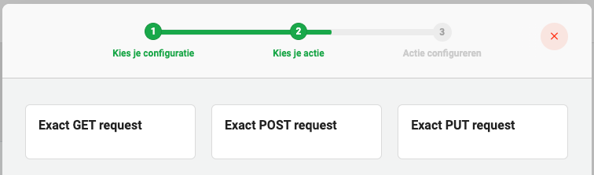
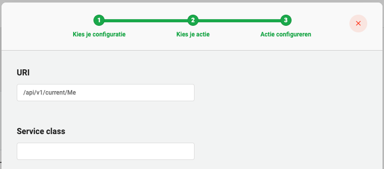
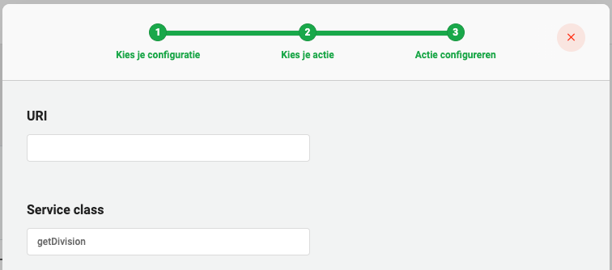

# Exact Plugin

The Exact plugin can be used to save a connection and configuration for your Exact online environment. It allows you to send GET, POST and PUT requests to Exact with either a static message, or a dynamic message via Java.

See [Exact API Reference](https://start.exactonline.nl/docs/HlpRestAPIResources.aspx) for all possible requests.

## Integrating in your own Valtimo app

### Backend

#### Maven dependency:

```xml
<dependencies>
    <dependency>
        <groupId>com.ritense.valtimo</groupId>
        <artifactId>exact-plugin</artifactId>
        <version>${valtimo_version}</version>
    </dependency>
</dependencies>
```

#### Gradle dependency:

```kotlin
dependencies {
    implementation("com.ritense.valtimo:exact-plugin:${valtimo_version}")
}
```

#### Properties

There are some properties that have to be set in the properties files of the Valtimo implementation.

```yaml

exact:
    baseUrl: https://start.exactonline.nl
    redirectUrl: <HOSTNAME>/plugins/exact/redirect
    checkRefreshTokensCron: 0 0 1 * * * # Every day at 01:00

```

### Frontend

#### Package.json dependency:

```javascript
"@valtimo/exact-plugin": "<valtimo_frontend_version>"
```

## Configure the plugin

A plugin configuration is required before the plugin can be used. A general description on how to configure plugins can be found [here](./#configuring-plugins).

To configure this plugin the following properties have to be entered:

* **Client ID (`clientId`)** A Client ID for the Exact app that is being used for setting up the connection.
* **Client Secret (`clientSecret`)** A Client Secret for the Exact app that is being used for setting up the connection.

To be able to save the configuration an access token and refresh token should be retrieved first. This can be done with the help of the 'Give authorization' button. This allows the user to login to exact and give permission. This will open a new window to Exact where you can give your permission, if successful the button to save the configuration should turn green.



## Actions

There are three type of actions that can constructed.

1. **Get request** This will send a HTTP GET request to Exact
2. **Post request** This will send a HTTP POST request to Exact
3. **Put request** This will send a HTTP PUT request to Exact

There are two ways in which you can send these requests, a static one or via a Java Bean. When you fill in the `uri` and `content` fields of the action you will send a 'static' request with that information to Exact.

If you fill in the `service class` input field, you must have a Java Bean with that name that implements on of the following interfaces `ExactGetRequest`, `ExactPostRequest` or `ExactPutRequest`. This interface is requested instead to supply the `uri` and `content` of the request.



### Example of a static request

In this example, a fixed call to the endpoint `/api/v1/current/Me` endpoint is made and stored in the process under the variable name `exactGetResult` as a `JsonNode` type.



### Example of a service class request

In this example, the bean `getDivision` should be present in your application. The function `createRequest` then creates a GET request with the token and the URI. The `handleResponse` function will handle the result of the request. In this case it is the same call as the static request above, however implemented as a service class.

```kotlin
@Service
class GetDivision : ExactGetRequest {
    override fun createRequest(execution: DelegateExecution, token: String): GetEndpoint {
        return GetEndpoint(token, "/api/v1/current/Me")
    }

    override fun handleResponse(execution: DelegateExecution, response: JsonNode) {
        execution.setVariables("exactGetResult", response)
    }

}
```


