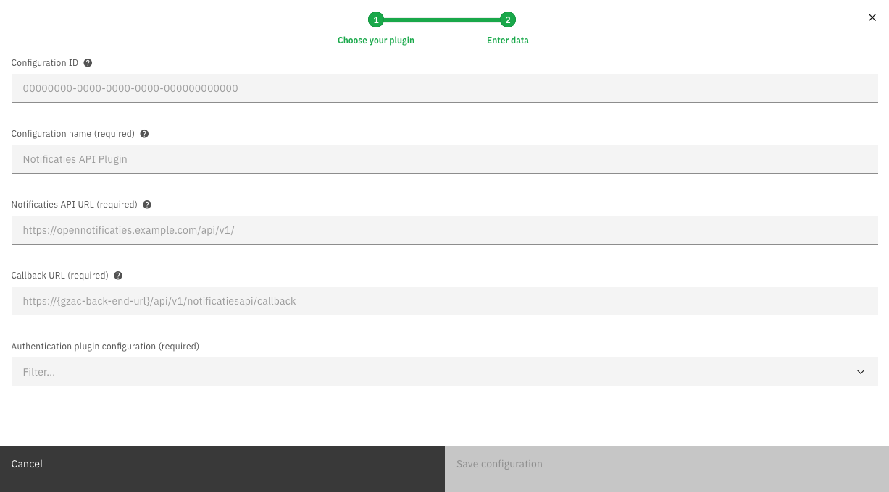

# Notificaties API plugin


The Notificaties API plugin is a ZGW plugin and can only be used in the GZAC edition.


Use the Notificaties API plugin to subscribe to and process notifications that comply with the Dutch Notificaties API standard.

### Prerequisites

This page requires knowledge on how to configure the Notificaties API

## Configuring the plugin

A plugin configuration is required before the plugin can be used. A general description on how to configure plugins can be found [here](broken-reference).

If the Notificaties API plugin is not visible in the plugin menu, it is possible the application is missing a dependency. Instructions on how to add the Notificaties API dependency can be found [here](broken-reference).

To configure this plugin the following properties have to be entered (in addition to the optional Configuration ID and required Configuration name):

* **Notificaties API URL (`url`).** Contains the complete base URL of the Notificaties API to connect to. This generally includes the path `/api/v1/`.
* **Callback URL (`callbackUrl`).** Contains the complete callback url of Valtimo the Notificaties API will send updates on subscriptions to.
* **Authentication plugin configuration (`authenticationPluginConfiguration`).** Reference to another plugin configuration that will be used to add authentication to any request performed on the Notificaties API. If no option is available in this field a plugin has to be configured that is able to authenticate for the specific application that hosts the Notificaties API.

An example plugin configuration:&#x20;

<figure><figcaption></figcaption></figure>

After saving the configuration Valtimo automatically ensures the required kanalen exist and that an abonnement with a generated secret is registered against the configured Notificaties API instance. Disabling this behaviour is possible by setting `valtimo.zgw.register-abonnementen=false` in the `application.yml`.

## Subscriptions

When working with the Notificaties API, it is important to keep subscriptions (abonnementen) as specific as possible.
Otherwise, the Notificaties API will send more messages than Valtimo is interested in, leading to more stress on both
systems.

The number of subscriptions is kept to a minimum by evaluating plugin configurations that depend on the Notificaties
API, such as the Portaaltaak plugin and the Verzoek plugin. As a result, all channels that are subscribed to are combined
into a single subscription.

## How does the plugin process notifications

The Notificaties API plugin stores each notification before delivering it to the rest of the application, ensuring reliable handling even when downstream components are temporarily unavailable. In broad strokes:

1. The Notificaties API posts a notification to `POST /api/v1/notificatiesapi/callback`.
2. Valtimo saves the payload so it will not be lost and automatically ignores duplicate messages.
3. A background worker picks up saved notifications, delivers them to the rest of the application, and keeps trying the configured number of times when something temporarily fails. 
4. Administrators can review and retry notifications through the management endpoints, while health checks warn when too many notifications stay in the failed list.

To make the management page visible in the user interface, add the menu entry for failed notifications in `frontend/src/environments/environment.ts`:

```ts
// admin menu excerpt
{
  roles: [ROLE_ADMIN],
  title: 'Admin',
  iconClass: 'icon mdi mdi-tune',
  sequence: 5,
  children: [
    // ...other admin links
    {
      link: ['/notifications-api/notifications/failed'],
      title: 'Notifications',
      sequence: 11,
    },
    // ...more items
  ],
},
```

The processing properties below directly influence how quickly notifications are retried, how long they are kept, and how much work the background worker tries to handle at once.

Additionally, a dedicated Spring Boot health indicator named `notificatiesApiInboundEvent` transitions to `RESTRICTED` when the number of failed events exceeds the configured threshold.

## Spring configuration

All processing properties live in the `application.yml` under the prefix `valtimo.notificaties-api.processing`. Use the suffixes below to complete the property name (for example, `valtimo.notificaties-api.processing.enabled`). Duration values follow ISO-8601 notation (e.g. `PT5M` for five minutes, `P14D` for fourteen days).

| Property | Description | Environment variable | Default value |
| --- | --- | --- | --- |
| `enabled` | Turns the background worker on or off. | `VALTIMO_NOTIFICATIES_API_PROCESSING_ENABLED` | `true` |
| `batch-size` | Maximum notifications picked up per processing cycle. | `VALTIMO_NOTIFICATIES_API_PROCESSING_BATCH_SIZE` | `5` |
| `initial-retries` | Number of retries before an event remains failed. | `VALTIMO_NOTIFICATIES_API_PROCESSING_INITIAL_RETRIES` | `3` |
| `retry-delay` | Base waiting time between retries. | `VALTIMO_NOTIFICATIES_API_PROCESSING_RETRY_DELAY` | `PT5M` |
| `retry-backoff-multiplier` | Multiplier applied to the retry delay after each attempt. | `VALTIMO_NOTIFICATIES_API_PROCESSING_RETRY_BACKOFF_MULTIPLIER` | `2.0` |
| `retention-period` | How long processed events stay stored before clean-up. | `VALTIMO_NOTIFICATIES_API_PROCESSING_RETENTION_PERIOD` | `P30D` |
| `received-warning-threshold` | Time after which stuck `RECEIVED` events trigger a warning. | `VALTIMO_NOTIFICATIES_API_PROCESSING_RECEIVED_WARNING_THRESHOLD` | `PT2H` |
| `failed-count-health-threshold` | Failed-event count that flips the health indicator to `RESTRICTED`. | `VALTIMO_NOTIFICATIES_API_PROCESSING_FAILED_COUNT_HEALTH_THRESHOLD` | `0` |
| `executor-core-pool-size` | Minimum number of worker threads kept alive. | `VALTIMO_NOTIFICATIES_API_PROCESSING_EXECUTOR_CORE_POOL_SIZE` | `2` |
| `executor-max-pool-size` | Maximum number of worker threads. | `VALTIMO_NOTIFICATIES_API_PROCESSING_EXECUTOR_MAX_POOL_SIZE` | `4` |
| `executor-queue-capacity` | Size of the queue buffering pending notifications. | `VALTIMO_NOTIFICATIES_API_PROCESSING_EXECUTOR_QUEUE_CAPACITY` | `20` |
| `poll-interval` | How often the scheduled worker checks for pending events. | `VALTIMO_NOTIFICATIES_API_PROCESSING_POLL_INTERVAL` | `PT1M` |

Example `application.yml` snippet:

```yaml
valtimo:
  notificaties-api:
    processing:
      enabled: true
      batch-size: 10
      initial-retries: 5
      retry-delay: PT2M
      retry-backoff-multiplier: 1.5
      retention-period: P14D
      received-warning-threshold: PT1H
      failed-count-health-threshold: 10
      executor-core-pool-size: 2
      executor-max-pool-size: 6
      executor-queue-capacity: 50
      poll-interval: PT30S
```

Set the properties in `application.yml` or via environment variables to tune retry behaviour, clean-up, and processing throughput according to your deployment requirements.
