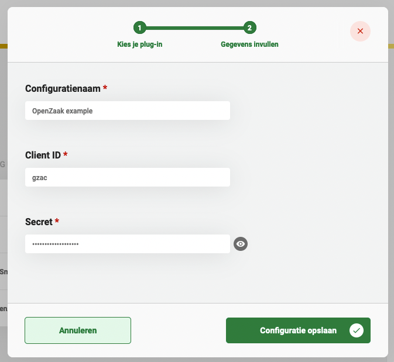

# OpenZaak plugin


The OpenZaak plugin is a ZGW plugin and can only be used in the GZAC edition.


The OpenZaak plugin is used to provide authentication for ZGW (Zaakgericht Werken) plugins that connect to APIs that are supported in OpenZaak. Currently, the plugins that this plugin can provide authentication for are the following:

* [Documenten API](configure-documenten-api-plugin.md)
* [Zaken API](configure-zaken-api-plugin.md)

### Prerequisites

This page requires knowledge on how to configure OpenZaak

## Configuring the plugin

A plugin configuration is required before the plugin can be used. A general description on how to configure plugins can be found [here](./#configuring-plugins).

If the OpenZaak plugin is not visible in the plugin menu, it is possible the application is missing a dependency.

To configure this plugin the following properties have to be entered:

* **Client ID (`clientId`).** The client ID as configured for the 'applicatie' in OpenZaak
* **Secret (`clientSecret`).** The secret as configured for the 'applicatie' in OpenZaak

An example plugin configuration:

<figure><figcaption></figcaption></figure>
