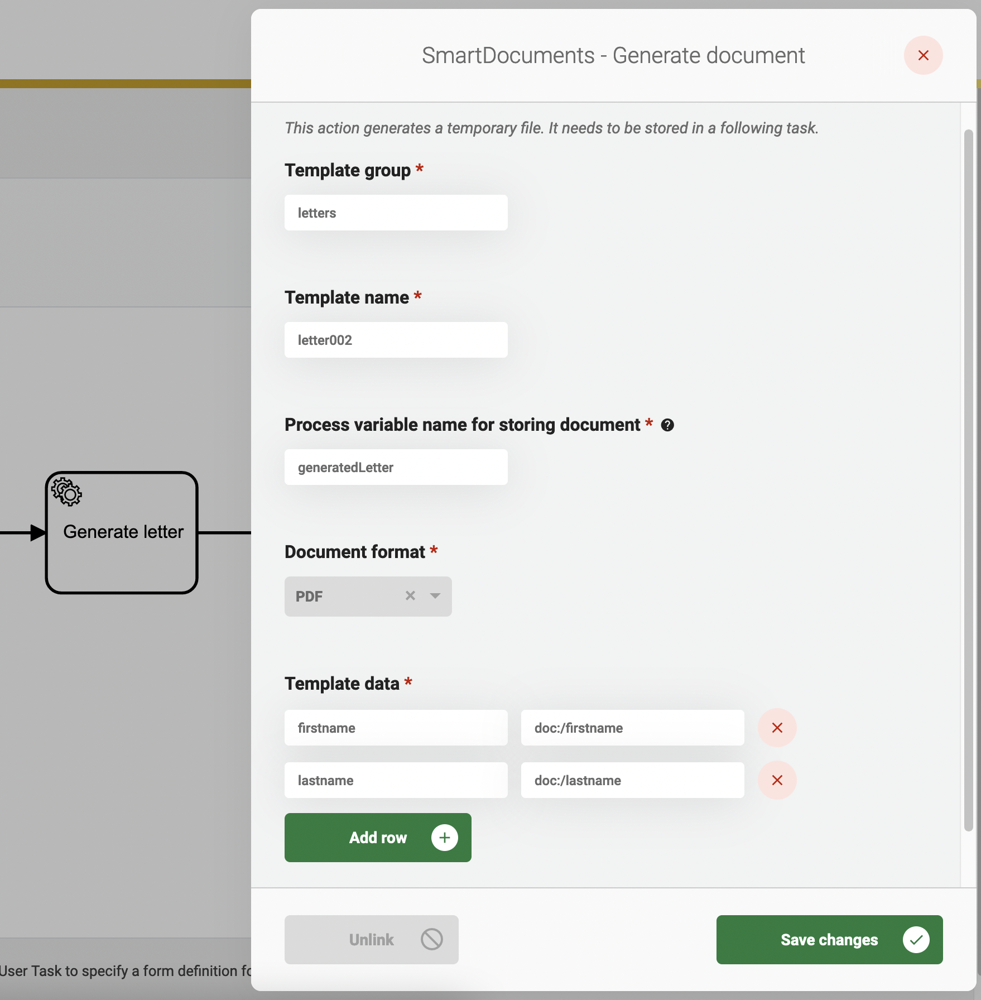

# SmartDocuments plugin

The SmartDocuments plugin makes use of [SmartDocuments](https://smartdocuments.com/) to generate documents based on a template.

## Configure the plugin

A plugin configuration is required before the plugin can be used. A general description on how to configure plugins can be found [here](./#configuring-plugins).

If the SmartDocuments plugin is not visible in the plugin menu, it is possible the application is missing a dependency. Instructions on how to add the SmartDocuments dependency can be found [here](../../fundamentals/getting-started/modules/zgw/smartdocuments.md).

The **SmartDocuments URL** (`url`), **Username** (`username`) and **Password** (`password`) should all be retrieved from the SmartDocuments application.

An example plugin configuration:

<figure><figcaption></figcaption></figure>

## Available actions

SmartDocuments' main function is to generate documents based on a template.

A general description on how to create process links can be found [here](../process/process-link.md#creating-a-plugin-process-link).

### Generate document

Both the 'Template group' and 'Template name' can be retrieved from the SmartDocuments application.

The 'Process variable name for storing document' is the name of the process variable where the generated document is stored. This process variable can be used to access the document in another BPMN task.

The 'Document format' contains all supported formats for the generated document.

A document is generated with data taken from the 'Template data'. The value on the left-hand side must match the placeholder in the SmartDocuments template. The value on the right-hand side can contain any of the following values:

1. A fixed value. This value will be put directly into the template without alterations. For example `John`
2. A value retrieved from the case-data. This value should start with `doc:` and should end with the path to the case-data property. For example `doc:/firstname`.
3. A value retrieved from a process variable. This value should start with `pv:` and should end with the name of the process variable. For example `pv:firstname`.

After filling in all fields, the process-link can be saved. From now on, every time the service task is executed, a document is generated. Remember that the generated document is not visible anywhere yet. A logical next step is to handle the generated document. For example, the next service task can add the generated document to the case.

An example process link configuration:

<figure><figcaption></figcaption></figure>
