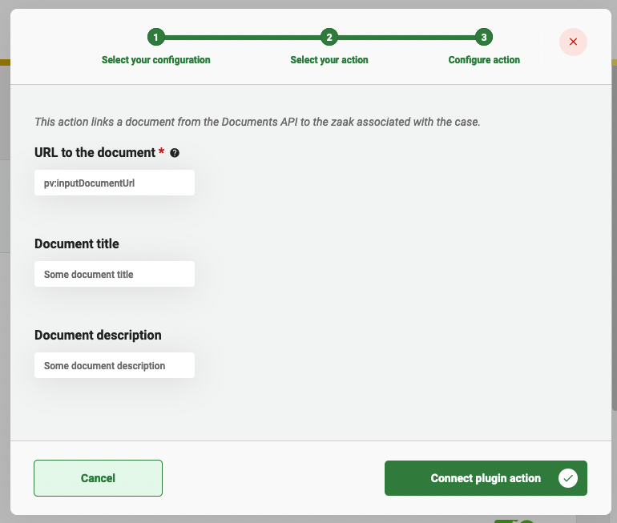

# Zaken API plugin


The Zaken API plugin is a ZGW plugin and can only be used in the GZAC edition.


The Zaken API plugin can be used to store and access data about a Zaak (case) in an application that supports the Zaken API standard created and used by the Dutch government.

## Configure the plugin

A plugin configuration is required before the plugin can be used. A general description on how to configure plugins can be found [here](./#configuring-plugins).

If the Zaken API plugin is not visible in the plugin menu, it is possible the application is missing a dependency. Instructions on how to add the Zaken API dependency can be found [here](../../fundamentals/getting-started/modules/zgw/documenten-api.md).

To configure this plugin the following properties have to be entered:

* **URL.** Contains the complete base URL of the Zaken API to connect to. This generally includes the path `/api/v1/`.
* **Authentication plugin configuration.** Reference to another plugin configuration that will be used to add authentication to any request performed on the Zaken API. If no option is available in this field a plugin has to be configured that is able to authenticate for the specific application that hosts the Zaken API. (e.g. OpenZaak)
* **Synchronise Case note as Zaak-notitie to the Zaak.** .
* **ZaakNotitie subject.** The fixed value which will be used for the 'onderwerp' when a Zaak-notitie is created/updated.

An example plugin configuration:&#x20;

<figure><figcaption></figcaption></figure>

## Available actions

The Zaken API plugin supports the following actions that can be configured in process links in order to manage data that is part of the Zaak.

A general description on how to create process links, can be found [here](../process/process-link.md#creating-a-plugin-process-link).

### Link document to zaak

The **Link document to zaak.** action takes a Document stored in a Documenten API and links it to a zaak. The zaak to which the Document is linked is based on the process for which the action is performed. The process belongs to a case that should already have a zaak instance link before this action is performed. The link between a zaak and a document is stored as a 'zaakinformatieobject' in the Zaken API.

When creating a process link the following properties have to be entered:

* **URL to the document.** The complete URL of the document in a Documenten API.
* **Document title.** The title of the document within the context of the zaak that is stored in the 'zaakinformatieobject' record in the Zaken API.
* **Document description.** The description of the document within the context of the zaak that is stored in the 'zaakinformatieobject' record in the Zaken API.

An example process link configuration:&#x20;

<figure><figcaption></figcaption></figure>

### Link uploaded document to zaak

The **Link uploaded document to zaak** action takes a document stored in a Documenten API and links it to a zaak. The zaak to which the document is linked is based on the process for which the action is performed. The process belongs to a case that should already have a zaak instance link before this action is performed. The link between a zaak and a document is stored as a 'zaakinformatieobject' in the Zaken API. After this plugin action has been selected, the user does not have to input any configuration data.

This process link does the following steps:

1. Take the document URL that is saved in the process variable `documentUrl`.
2. Take the Zaak instance that is linked to the case.
3. Link the Zaak instance to the document URL.

### Create zaak

The **Create zaak** action creates a zaak in the zaken API. When creating a process link the following properties have to be entered:

* **RSIN.** Contains the RSIN of the organisation. The RSIN number (Rechtspersonen en Samenwerkingsverbanden Identificatie Nummer in Dutch) is an identification number for legal entities and partnerships. This will be used when creating the zaak to indicate who is responsible for creating the zaak record in the API.
* **Zaak type.** The type of the zaak that is created.
* **Description** (Optional) A brief description of the zaak.
* **Planned end date** (Optional) The date by which the zaak is scheduled to be completed.
* **Final delivery date** (Optional) The last date by which the zaak must be completed according to law and regulations.
* **Explanation.**  (Optional) An explanation of the zaak.
* **Communication channel.** (Optional) The medium through which the reason for initiating a zaak was received. URL to a communication channel in the VNG Reference List of communication channels. 
* **Payment indication.** (Optional) Indication of whether the costs associated with handling the zaak have been paid by the person involved.
  * Options: 
    * `nvt` - There are no costs associated with the case to be paid.
    * `nog_niet` - The costs associated with the case have not (yet) been paid.
    * `gedeeltelijk` - The costs associated with the case have been partially paid.
    * `geheel` - The costs associated with the case have been fully paid.
* **Case geometry.** (Optional) Point, line or (multi-)plane geometry information.
  * **Type.** The geometry shape/type.
    * Options: 
      * `Point`
      * `MultiPoint`
      * `LineString`
      * `MultiLineString`
      * `Polygon`
      * `GeometryCollection`
      * `MultiPolygon`
  * **Coordinates.** Collection of coordinates/points representing the geometry shape/type.
* **Main Case.** (Optional) URL reference to the zaak requested by its initiator, which is dealt with in two or more separate zaken, of which the present zaak is one.

### Patch zaak

The **Patch zaak** action updates a zaak in the zaken API. When creating a process link at least one of the following properties has to be provided:

* **Description.** A short description of the Zaak.
* **Explanation.** An explanation of the Zaak.
* **Planned end-date.** The date by which the Zaak is scheduled to be completed.
* **Final delivery-date.** The last date by which the Zaak must be completed according to law and regulations.
* **Publication date.** Date on which (the start of) the Zaak is or will be published.
* **Communication channel.** The medium through which the reason for initiating a case was received. URL to a communication channel in the VNG Reference List of communication channels.
* **Communication channel name.** (Experimental) The name of the medium through which the impetus for starting a Case was received.
* **Payment indication.** Indication of whether the costs associated with handling the case have been paid by the person concerned.
* **Last payment date.** The date on which the most recent payment was processed for costs associated with handling the case.
* **Case geometry.** Point, line, or (multi-)plane geometry information, in GeoJSON. (Long, Lat order). Exists of a type and a list of coordinates
* **Main Case.** URL reference to the Zaak requested by its initiator, which is dealt with in two or more separate Zaken, of which the present Zaak is one.
* **Archive action-date.** The date on which the archived Zaak file should be destroyed or transferred to an archive repository.
* **Start-date retention period.** The date that marks the start of the period by which the Zaak file must be destroyed.

### Create zaakrol - natural person

The **Create zaakrol - natural person** action creates a zaakrol in the zaken API. Using this action, a person can be linked to a zaak. When creating a process link the following properties have to be entered:

* **Role type URL.** Every person that is linked to a zaak has a role within that zaak. This property contains a URL to the role of the zaak.
* **Role explanation.** An explanation of the role that the person has within the zaak.
* **Initiator BSN.** The BSN (Citizen service number) of the person that should be linked to the zaak.
* **Other natural person identification.** (Optional) The unique number issued by the municipality for another natural person.
* **Administration number person.** (Optional) The administration number of the person, as referred to in the BRP Act.

### Create zaakrol - non natural person

The **Create zaakrol - non-natural person** action creates a zaakrol in the zaken API. Using this action, a non-natural person can be linked to a zaak. When creating a process link the following properties have to be entered:

* **Role type URL.** Every person that is linked to a zaak has a role within that zaak. This property contains a URL to the type of the role within the zaak.
* **Role explanation.** An explanation of the role that the person has within the zaak.
* **Initiator non-natural person identification.** The unique number assigned by a chamber for the registered non-natural person that should be linked to the zaak.
* **Other non-natural person identification.** (Optional) The unique number issued by the municipality for another non-natural person.
* **Administration number person.** (Optional) The administration number of the person, as referred to in the BRP Act.
* **Chamber of Commerce number.** (Optional) A unique number assigned by the Chamber of Commerce.
* **Branch number.** (Optional) A short unique designation of the branch.

### Create zaakrol - medewerker

The **Create zaakrol - employee** action creates a zaakrol in the zaken API. Using this action, an employee can be linked to a zaak. When creating a process link the following properties have to be entered:

* **Role type URL.** Every person that is linked to a zaak has a role within that zaak. This property contains a URL to the type of the role within the zaak.
* **Role explanation.** An explanation of the role that the person has within the zaak.
* **Identification.** A short unique designation of the employee.
* **Last name.** The last name as used by the employee in daily life.
* **Initial.** The collection of letters formed by the first letter of all forenames in order.
* **Prefix to last name** (Optional) Part of the genus name that appears in Table 36 (GBA), prefix table, and is separated from the genus name by a space.
* **Alternative name of the person involved.** (Optional) The name of the person involved under which they wish to be addressed in relation to the case.
* **Authorization indication** (Optional) The type that represents the authorization indication.

### Create zaakrol - organizational unit

The **Create zaakrol - organizational unit** action creates a zaakrol in the zaken API. Using this action, an organizational unit can be linked to a zaak. When creating a process link the following properties have to be entered:

* **Role type URL.** Every person that is linked to a zaak has a role within that zaak. This property contains a URL to the type of the role within the zaak.
* **Role explanation.** An explanation of the role that the person has within the zaak.
* **Identification.** A short identification of the organizational unit.
* **Name.** The actual name of the organizational unit.
* **Is housed in.** Location where the organizational unit is housed.
* **Alternative name of the person involved** (Optional) The name of the person involved under which they wish to be addressed in relation to the case.
* **Authorization indication.** (Optional) The type that represents the authorization indication.

### Create zaakeigenschap

The **Create zaakeigenschap** action creates a zaakeigenschap in the zaken API. When creating a process link the following properties can be entered:

* **Case definition.** The case definition that is linked to a zaken API plugin configuration.
* **Eigenschap.** The eigenschap as configured in the catalogi API.
* **Property URL.** Alternatively, a URL can be entered that references to an eigenschap in the catalogi API.
* **Eigenschap value.** The value that the zaakeigenschap should get when the process-link action is executed.

### Update zaakeigenschap

The **Update zaakeigenschap** action updates a zaakeigenschap in the zaken API. When creating a process link the following properties can be entered:

* **Case definition.** The case definition that is linked to a zaken API plugin configuration.
* **Eigenschap.** The eigenschap as configured in the catalogi API.
* **Property URL.** A URL can be entered that references to an eigenschap in the catalogi API. This is an alternative to providing an eigenschap.
* **Eigenschap value.** The value that the zaakeigenschap should get when the process-link action is executed.

### Delete zaakeigenschap

The **Delete zaakeigenschap** action deletes a zaakeigenschap in the zaken API. When creating a process link the following properties can be entered:

* **Case definition.** The case definition that is linked to a zaken API plugin configuration.
* **Eigenschap.** The eigenschap as configured in the catalogi API.
* **Property URL.** A URL can be entered that references to an eigenschap in the catalogi API. This is an alternative to providing an eigenschap.

### Create zaak object

The **Create zaak object** action adds a [zaakobject](https://vng-realisatie.github.io/gemma-zaken/standaard/zaken/#zaakobject) to a Zaak in the zaken API. When creating a process link the following properties can be entered:

* **Case URL**: URL reference to the zaak. When this field is empty, the zaak linked to the process instance will be used.
* **Object URL**: URL reference to the resource that describes the object.
* **Case object type**: URL reference to the zaak objecttype (in the Catalog API).
* **Object Type**: Describes the type of object related to the zaak. If there is no suitable type, then the type must be specified under `objectTypeOverige`.
* **Relationship description**: Description of the relationship between the zaak and the object.

When the **Object Type** is set to `overige`, then the following field can/must be provided:

* **Object type other**: Describes the type of object when objectType has the value 'overige'.
* **Object type other URL**: URL reference to the object type resource in an API. This resource must contain the JSON schema definition of the object type.
* **Object type other Schema**: A valid [jq expression](https://jqlang.org/). This is combined with the resource from the `url` attribute to read the schema of the object type. Example: `.jsonSchema`.
* **Object type other Object data**: A valid [jq expression](https://jqlang.org/). This is combined with the JSON data from the object url to read the object data and validate the data structure against the schema. Example: `.record.data`.

Beside the above fields there are other fields that depend on the selected 'Object Type'. These fields are under the `objectIdentificatie` property of the Zaakobject in the Zaken API.

Currently, only two of these types are fully worked out in this plugin action. These are `zakelijk_recht` and `overige`. Other types can be used out of the box if they don't require the `objectIdentificatie` property.

If you need a different Object Type and need the fields under `objectIdentificatie`, then there are two options:

- Request these fields to be added to the plugin. (Or do it yourself and deliver the changes via a pull request.)
- (Backend only) Create a new class that inherits the [`ZaakObjectRequest`](https://github.com/valtimo-platform/valtimo-backend-libraries/blob/next-minor/zgw/zaken-api/src/main/kotlin/com/ritense/zakenapi/domain/zaakobjectrequest/ZaakObjectRequest.kt) interface and add the fields that are needed.
  - This is only possible if you configure the process link via a configuration file (`*.process-link.json`) in the implementation project.

More information about the zaakobject and its properties can be found in [the specification](https://vng-realisatie.github.io/gemma-zaken/standaard/zaken/redoc-1.5.1#tag/zaakobjecten/operation/zaakobject_create).

### Start recovery period

The **Start recovery period** will start a recovery period for the linked zaak in the zaken API. If a zaak has a due date (Uiterlijke einddatum afdoening) set, the due date will be extended with the configured maximum duration of the recovery period. The zaak will also be suspended.

After starting the recovery period, the due date becomes: `zaak.originalDueDate + maximumDuration`

* **Maximum duration in days.** The maximum duration of the recovery period in days.

### End recovery period

The **End recovery period** will end a recovery period for the linked zaak in the zaken API. The original due date (Uiterlijke einddatum afdoening) of the zaak will be extended by the actual duration of the recovery period. This is achieved by _subtracting_ the difference between the actual duration and the maximum duration of the recovery period. The zaak is no longer suspended.

After ending the recovery period, the due date becomes: `(zaak.originalDueDate + maximumDuration) - (actualDuration - maximumDuration)`

### Create Zaak-notitie

The **Create Zaak-notitie** action creates a Zaak-notitie for the zaak linked to the process instance in the zaken API. When creating the process link, the following properties can be provided:

* **Subject.** The subject.
* **Text.** The text.
* **Created by.** (Optional) The name of the person that created the Zaak-notitie.
* **Note type.** (Optional) The type (internal, external). When not specified, the default value is 'internal'.
* **Status.** (Optional) The status (concept, definitief). When not specified, the default value is 'concept'. Keep in mind that only zaak-noties with the status 'concept' can be edited.

### Patch Zaak-notitie

The **Patch Zaak-notitie** action updates specific properties of the Zaak-notitie in the zaken API. When creating the process link, the following properties can be provided:

* **Zaak-notitie URL**: URL reference to the Zaak-notitie.
* **Subject.** (Optional) The new value for the subject.
* **Text.** (Optional) The new value for the text.
* **Note type.** (Optional) The new value for the type (internal, external).
* **Status.** (Optional) The new value for the status (concept, definitief)

Note: at least one of the properties marked with optional has to be provided.
