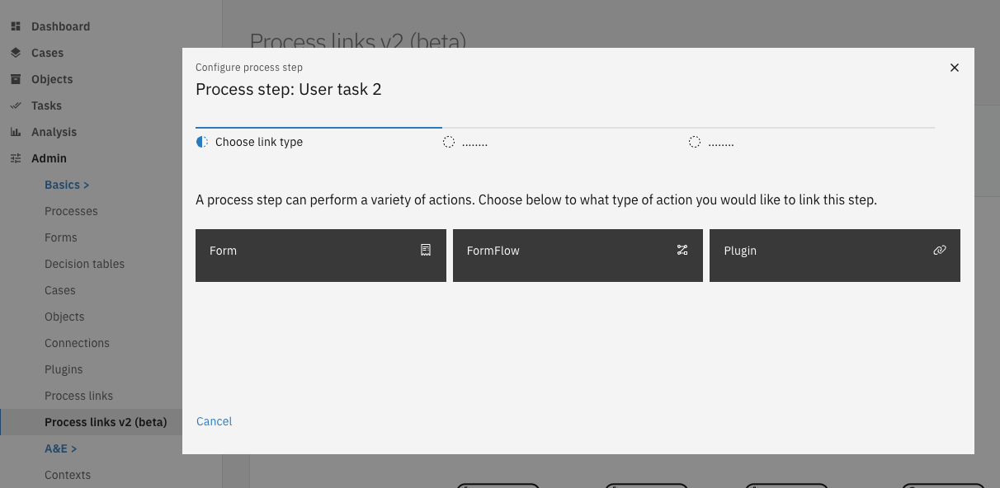
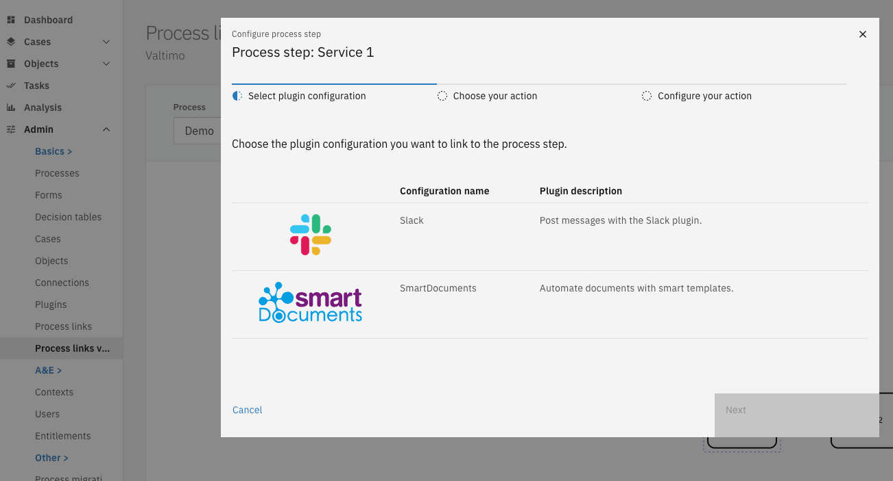

# Creating a process link

Process links can be configured manually using the [Admin UI](create-process-link.md#configuration-using-the-admin-menu), or [autodeployment](create-process-link.md#configuration-by-autodeployment)

## Configuration using the Admin menu

The process link menu is found under the admin menu. Admin privileges are required to configure process links.

1. Go to the Admin menu
2. Go to the 'Process links v2 (beta)' menu
3. Select the activity of the desired process.
   * Depending on the type of activity, a list of supported process link types might be shown.
4. Follow the steps



### Creating a form process link

A form process link can be added to user-tasks. When the process reaches the user-task, a user will be presented with the configured form when opening it.

More information about forms can be found [here](../forms/).

### Creating a form-flow process link

A form-flow process link can be added to user-tasks. When the process reaches the user-task, an instance of the form-flow will be created and be made visible to the user.

More information about form-flows can be found [here](../form-flow/).

### Creating a plugin process link

When configuring a plugin process link, a wizard is presented to choose between the available plugin configuration, actions and (optionally) additional settings for that action.



Any text fields for configuring the process link itself support several ways of providing values through value resolvers:

1. A fixed value. This value will be put directly into the template without alterations. For example `John`
2. A value retrieved from the case-data. This value should start with `doc:` and should end with the path to the case-data property. For example `doc:/firstname`.
3. A value retrieved from a process variable. This value should start with `pv:` and should end with the name of the process variable. For example `pv:firstname`.

## Configuration by autodeployment

Available since 10.6.0

Process links can also be configured using autodeployment. These process links will be created at application startup. When a conflicting configuration is found on the target activity, creation is skipped and a warning is logged in the application logs.

Autodeployed process links can be added by creating a json file with the following filename structure: `<process-id>.processlink.json`. This file can be placed anywhere in the resource folder of the application.

This is an example of an autodeployment file for 2 user task for process:

```json
[
   {
      "activityId": "do-something",
      "activityType": "bpmn:UserTask:create",
      "processLinkType": "form",
      "formDefinitionName": "do-something"
   },
   {
      "activityId": "do-another-thing",
      "activityType": "bpmn:UserTask:create",
      "processLinkType": "form-flow",
      "formFlowDefinitionId": "do-another-thing:latest"
   },
   {
      "activityId": "delete-object-from-objectsapi",
      "activityType": "bpmn:ServiceTask:start",
      "processLinkType": "plugin",
      "pluginConfigurationId": "7d77d894-6458-4213-8bc0-9a65d523845b",
      "pluginActionDefinitionKey": "delete-object",
      "actionProperties": {
         "objectUrl": "pv:myObjectUrl"
      }
   }
]
```
