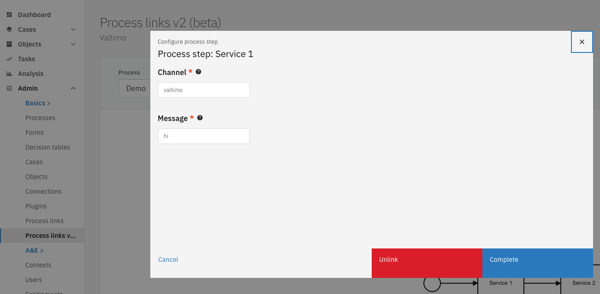

# Editing a process link

Process links that have been attached to Camunda activities, can also be edited. Admin privileges are required to configure process links.

1. Go to the Admin menu
2. Go to the 'Process links v2 (beta)' menu
3. Select the activity of the desired process.
4. Change the settings using the provided form
5. Save the new configuration by clicking 'Complete'

> Note: It is not possible cannot change the type of existing process links (form, form-flow or plugin), nor is it possible to change the selected plugin configuration. To do that, please [unlink](unlink-process-link.md) the current process link and [create a new one](create-process-link.md).

