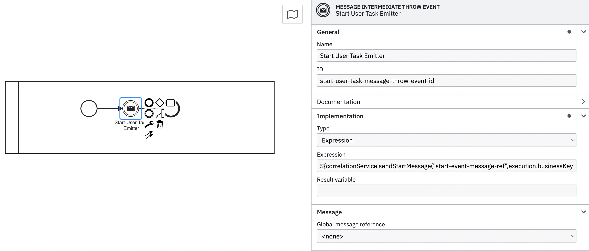

# Correlating messages

When modeling a process, correlating a message (e.g. to start another process) does not do anything by default. Valtimo offers several methods to facilitate message correlation. These can be separated into starting a process (Message Start Events) and receiving messages in a running process (Message Boundary Events and Message Intermediate Catch Events).

## How to use

Valtimo provides several methods that can be used inside a BPMN, accessible through the `correlationService` bean. Which method to use depends on the use case. For more information on the separate use cases see the two sections below.

These methods can be used in expressions applied to message throw events like this:



The first argument is the key of the message that should be sent. In this example, there should also be a message start event that waits for this particular message, like so:


### Correlating start events

As shown in the example above, Valtimo provides a `sendStartMessage` method. The following variations are possible:

```kotlin
    fun sendStartMessage(message: String): MessageCorrelationResult
    fun sendStartMessage(message: String, businessKey: String?): MessageCorrelationResult
    fun sendStartMessage(message: String, businessKey: String?, variables: Map<String, Any>?): MessageCorrelationResult
    fun sendStartMessageWithProcessDefinitionKey(message: String,targetProcessDefinitionKey: String,businessKey: String?, variables: Map<String, Any>?): MessageCorrelationResult
```

Variables passed on will be stored as process variables for the process. Providing a target process definition key means the message will be correlated to a process definition matching that process definition key.

### Correlating message catch events

There are two different ways to correlate message catch events. Either correlating a single message to a single catch event, or correlating a single message to any number of catch events. Valtimo supports both of these ways through the `sendCatchEventMessage` and `sendCatchEventMessageToAll` methods. The following variations are possible:

```kotlin
    fun sendCatchEventMessage(message: String, businessKey: String): MessageCorrelationResult
    fun sendCatchEventMessage(message: String, businessKey: String, variables: Map<String, Any>?): MessageCorrelationResult
    
    fun sendCatchEventMessageToAll(message: String, businessKey: String): List<MessageCorrelationResult>
    fun sendCatchEventMessageToAll(message: String, businessKey: String, variables: Map<String,Any>?): List<MessageCorrelationResult>
```

Variables passed on will be stored in the process. The provided business key will correlate the message to events with process instances matching that business key.
