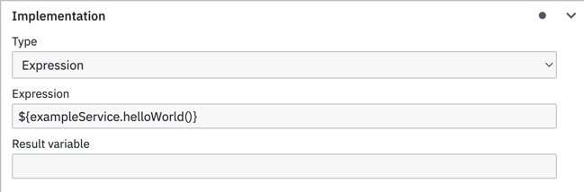

# Integrating spring beans in a process

It is possible to use custom code in your BPMN processes by referencing a [Spring bean](https://docs.spring.io/spring-framework/docs/current/reference/html/core.html) that contains the code you want to run. Any spring bean can be used in expressions by using the bean name.

```kotlin
@Component
class ExampleService {
    fun helloWorld() {
        // code goes here
    }
}
```

This method can then be called in expressions:



Beans can be used in any BPMN activity that allow expressions as its implementation such as service or send tasks. Execution listeners on any activity type have access to these beans as well.
