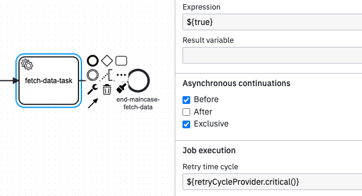

# Retry cycles for failed jobs

Jobs can fail for different reasons, for example when external services fail. 
Retry strategies provide resilience against temporary outages and help avoid incidents. 
Valtimo includes intelligent retry strategies with sensible defaults, 
which can be selectively overridden through configuration.

### Available retry cycles

The following retry cycles are available and can be applied to [specific BPMN-elements](https://docs.operaton.org/docs/documentation/user-guide/process-engine/the-job-executor/#retry-time-cycle-configuration).

* DEFAULT = R3/PT1M,PT30M,PT2H
* QUICK = R3/PT30S,PT2M,PT10M
* CRITICAL = R5/PT1M,PT15M,PT4H,PT24H,PT48H

### Overriding and custom cycles
These retry cycles can be overridden in application.yml. Furthermore, custom cycles can be added
using the Spring Boot config files. Adjust the property `valtimo.process.jobs.retry.cycles` in application.yml.

```yml
valtimo:
    process:
        jobs:
            retry:
                cycles:
                    critical: R3/PT1M,PT15M,PT1H
                    default: R4/PT10S,PT1M,PT5M,PT15M
                    custom: R5/PT10S,PT1M,PT5M,PT15M,PT2H
```

## How to use

Retry cycles are available in expressions referencing the `retryCycleProvider` bean. See the following example:



