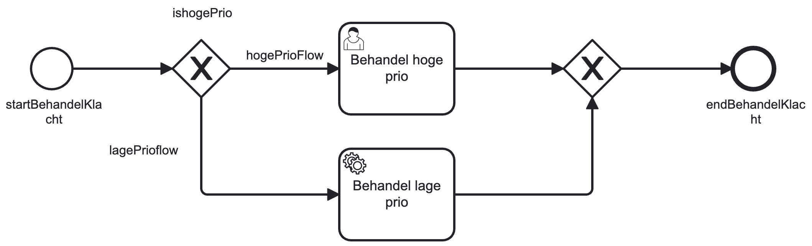
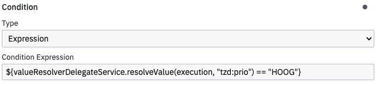

# Temporary Data

The GZAC (Generiek Zaakafhandelcomponent) Temporary Data feature library provides a flexible way 
for exchanging data between processes during case execution.

## Overview

The temporary data container is designed to handle transient data that needs to be shared between
different processes within a case lifecycle. Unlike permanent case data, temporary data has a 
controlled lifecycle and can be cleaned up when no longer needed after finishing a case. Temporary data is a 
flexible solution as the data does not need to conform to a JSON Schema. But it also bring s the responsibility to use it correctly. 

### Key Features

- **Cross-process data sharing**: Enables data exchange between different processes per case.
- **Lifecycle management**: Data can be cleaned up.
- **Type-safe data handling**: Support for structured data

## Usage
Temporary Data uses the [Value Resolver](../forms/forms/custom-value-resolvers.md) functionality to enable storing and retrieving data
in forms. This is also usable in expressions in BPMN models. Temporary Data uses `tzd` as prefix

### Forms
Temporary data can be used in forms as any other Value Resolver resource with the `tzd` prefix. See the example below using a FormIO form.
```json
"display": "form",
    "components": [
        {
            "key": "titel",
            "type": "textfield",
            "input": true,
            "label": "Titel",
            "tableView": true,
            "attributes": {
                "data-testid": "demoKlachtForm-titel"
            },
            "properties": {
                "sourceKey": "tzd:klacht.titel",
                "targetKey": "tzd:klacht.titel"
            },
            "applyMaskOn": "change"
        },
```
The value resolver can also be used in expressions in BPMN models. THe example below shows using it in a condition expression.




### BPMN expressions using Spring Bean
Temporary data offers CRUD functionality through exposing the `temporaryDataServiceImpl` service to be used in BPMN expressions. The following mehods are available:

store() 
retrieve() 
retrieveAll() for getting all process data
remove() 
removeAll() for cleanup

## Configuration

### Module Dependencies

The Temporary Data module is optional and must be explicitly included in your Valtimo implementation. Add the temporary data module to your project dependencies:

**Maven:**
```xml
<dependency>
    <groupId>com.ritense.valtimo</groupId>
    <artifactId>temporary-data</artifactId>
    <version>${version}</version>
</dependency>
```

**Gradle:**
```gradle
implementation 'com.ritense.valtimo:temporary-data:${valtimo.version}'
```
