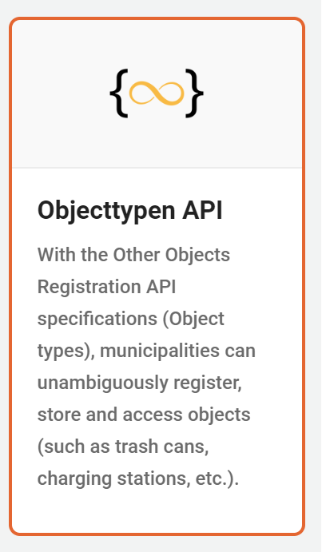
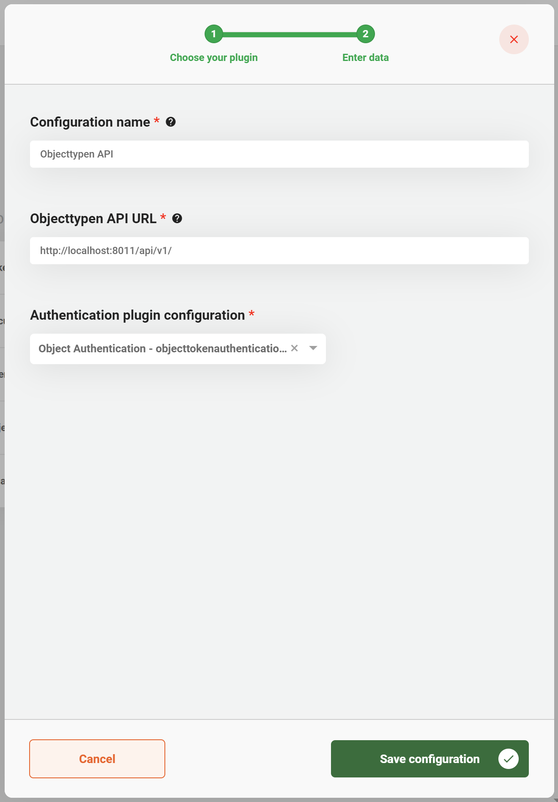

# Objecttypen API Plugin

The Objecttypen API plugin can be used to store and access data about an Object in an application that supports the Objecttypen API standard created and used by the Dutch government.

## Configure the plugin

A plugin configuration is required before the plugin can be used. A general description on how to configure plugins can be found [here](../../plugins/configure-plugin.md).

If the Objecttypen API plugin is not visible in the plugin menu, it is possible the application is missing a dependency. Instructions on how to add the Objecttypen API dependency can be found [here](../../../fundamentals/getting-started/modules/zgw/objecttypen-api.md).

To configure this plugin the following properties have to be entered:

* **URL.** Contains the complete base URL of the Objecttypen API to connect to. This generally includes the path `/api/v1/`.
* **Authentication plugin configuration.** Reference to another plugin configuration that will be used to add authentication to any request performed on the Objecttypen API. If no option is available in this field a plugin has to be configured that is able to authenticate for the specific application that hosts the Objecttypen API. (e.g. Object Token Authentication)

An example plugin configuration:

## Using the plugin

The Objecttypen API plugin is used with REST endpoints. The following endpoints are currently provided:

*   **Get object types linked to a document**

    `/document/{documentId}/zaak/objecttype`

    * Response type: `Array<{name: string; url: string}>`
