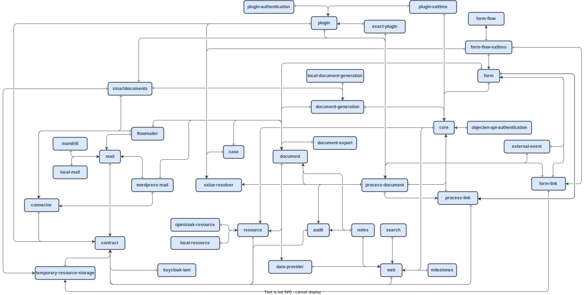
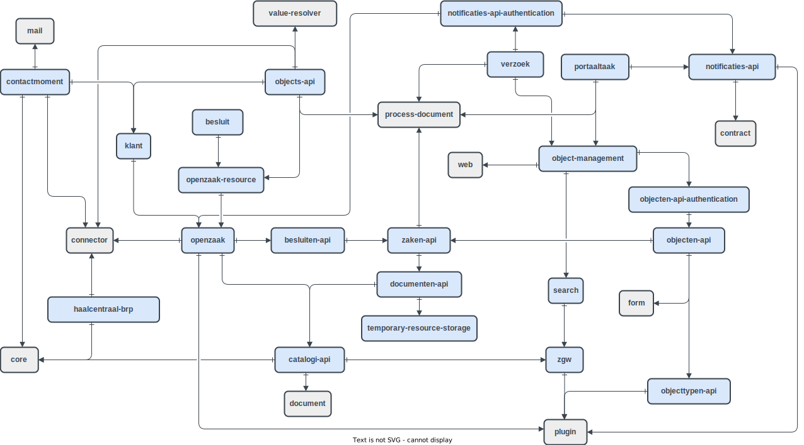

# ⚙️ Available modules

## Core

### Audit

Auditing is used to check a users actions in the system after the fact. It can be used to check if authorisation is set up correctly, or being able to follow a trail in data changes.

Audit provides a framework to record and store actions performed by users. Certain actions in the other modules of Valtimo - like completing a task or uploading a file - are audited by default. It is possible to audit other actions by using this feature in the implementation code. The audit trail is available for each case to show the history of actions of that case.

### Authorization

Valtimo supports Policy Based Access Control (PBAC) as an authorization layer via this module. This layer allows you to restrict access to functionality or data based on policies. Other modules that utilize the authorization module can define their own resource types (e.g. camunda tasks), so they can be used to grant access to certain functionality in Valtimo.

### Connector

Connectors are Valtimo configurable components that can be used to connect to external systems. This module provides a framework to create, configure, and use connectors. Certain Valtimo modules include their own connectors that become available automatically for configuration when starting a Valtimo instance.

> _**NOTE:**_ Connectors will be replaced by Plugins in the future

### Contract

Contract contains certain interfaces and events that Valtimo uses in several other modules. Consider it the 'glue' between a module and Core.

Apart from this, contract sanitizes endpoint output when exceptions occur. A liquibase runner is available that allows other modules to define liquibase configuration that is run on startup. Finally, Contract includes several helper that can be used in criteria queries to call DBMS specific functions in a generic way (e.g. finding JSON data). query.

### Core

Core is the main module of Valtimo. It contains and builds upon the Camunda process engine that enables Valtimo to run processes. Several endpoints and functions are available that provide task data and process data.

It also includes choice fields, a generic way to create lists of values that can be used by the application (e.g. selectboxes or radiobuttons). Some security features used to control access to any Valtimo endpoints are also part of this module.

### Dashboards

Dashboards give users quick insight into the current state of the application. Usually by giving the user statistical information about cases and processes. Using this information, the user will be enabled to prioritize and focus on specific tasks.

### Documents

A document is the main data storage entity that contains data of a case. Processes can act upon and change the data that is contained in the document, which allows for the document to be created when the case is started.

The content of the document is defined in a document definition, in JSON schema. Users interact with the document via user tasks; document data can be loaded into task forms, and user input can be stored in the document after completing a task.

### Document generation

Document generation provides an interface in Valtimo for generating files like (like PDF) using given data. An implementation needs to be provided by another module or the Valtimo application that this is used in.

### Exporter

The exporter module provides export functionality for Valtimo. By default, Valtimo provides a way to export case definitions, but this can be used for other kinds of exports as well.

### Flowmailer

[Flowmailer](https://flowmailer.com/) is a SaaS email service that Valtimo uses to send transactional emails. By including this module in a Valtimo application, it will be used automatically as the email solution of the application.

### Form

Forms can be used to complete user tasks in Valtimo with a visual interface where the user can validate an/or input data. These forms can be composed using [Form.IO](https://www.form.io/).

Forms can be managed by using the provided endpoints, or loaded from a configuration file at application startup.

### Form flow

Form flow allows users to create a sequence of forms, similar to a flow chart or a form wizard. A form flow definition contains the configuration for each step, what the subsequent steps are, and the conditions under which they can be reached. A form flow can be linked to a task, which consequently allows for more forms for the same task. Form flow supports forwards and backwards movement between steps without completing the task, reducing complexity in a BPMN model.

For information on how to create form flow definitions, see [here](broken-reference).

### Form flow Valtimo

Form flow Valtimo is the glue between Valtimo and form flow. It adds the required dependencies to use the form flow module in a Valtimo application.

### Importer

The importer module provides import functionality for Valtimo. By default, Valtimo provides a way to import case definitions, but this can be used for other kinds of imports as well.

### Keycloak IAM

Valtimo uses [Keycloak](https://www.keycloak.org/) for user management and IAM (Identity and Access Management)

Keycloak IAM enables Valtimo to use Keycloak as the OAuth authentication server. When using this module, the default Keycloak JWT tokens can be used. It also allows Valtimo to get users from Keycloak for features that require this (e.g. task assignment).

### Local document generation

The local document generation module is a stub implementation of the [document generation module](modules.md#document-generation). It is used as a local test implementation that allows the application to start without having to call external services when generating a document. This does _not_ generate an actual document, but writes the calls to the application log instead.

### Local mail

The local mail module is a stub implementation of the [mail module](modules.md#mail). It is used as a local test implementation that allows the application to start without having to provide an actual implementation. This does _not_ actually send emails.

### Mail

Mail is the base module for mail implementations like [Local mail](modules.md#local-mail) and [Mandrill](modules.md#mandrill).

It orchestrates how Valtimo sends emails in a consistent way. Emails are filtered based on configured filters. For example, emails to blacklisted addresses can be filtered out. Dispatching the email after filtering is facilitated by another module.

### Mandrill

Mailchimp is a SaaS solution for sending emails. Mandrill is the name of the [transactional mail addon](https://mailchimp.com/features/transactional-email/) that Mailchimp provides. The Valtimo Mandrill module provides a mail implementation of [Mail](modules.md#mail) that Valtimo uses to send emails.

### Milestones

The milestones module offers a framework to keep a track of how a process is progressing. It can be used to communicate linear progress to the user without communication each specific step between milestones.

### Notes

Notes make it easier to collaborate with users on a case. It offers the ability to attach messages to a case that can be read by other users.

### Outbox

The `outbox` module contains an implementation of the [transactional outbox pattern](https://microservices.io/patterns/data/transactional-outbox.html).

### Outbox RabbitMQ

The `outbox-rabbitmq` module adds support for publishing `outbox` messages to RabbitMQ ([AMQP 0.9.1](https://www.rabbitmq.com/protocol.html).

### Plugins

Plugins are extensions on the Valtimo platform. These are often connections to external services, such as transactional email and document generation. Plugins can be configured without writing code, and actions can be attached to BPMN activities.

Some plugins are provided by the platform, but developers can create their own plugins as well. A more in-depth description can be found [here](https://app.gitbook.com/s/bcArISKZtxWk4tKpZb9P/features/plugins/plugins/custom-plugin-definition).

### Process document

Process document facilitates the link between [documents](modules.md#documents) and BPMN processes. In order to use a process with a document, the process needs to be linked to a document. Process document also provides access of document data from inside a process.

### Resource

Resource is a module that describes how files can be uploaded and downloaded. This implemented by other modules, such as the [temporary resource storage](modules.md#temporary-resource-storage) and [OpenZaak resource](modules.md#openzaak-resource).

### Temporary resource storage

Temporary resource storage provides a service for storing files locally, e.g. to process it during following tasks. These files are removed after a preconfigured time and should be processed further before that timer ends.

### Value resolvers

Value resolvers provide a framework to retrieve and/or store data at several sources like processvariables (pv:), documents (doc:) and more.

Custom resolvers can be created for external sources.

### Web

Web offers web related configuration, such as integration with [OpenAPI](https://www.openapis.org/) to provide REST API documentation, CORS configuration and sanitizing error messages and stacktraces).

## ZGW (Zaakgericht Werken)

### Besluit (deprecated)

Besluit contains a connector used to connect to the [Besluiten API](https://vng-realisatie.github.io/gemma-zaken/standaard/besluiten/index), a Dutch government API standard for exchanging information around besluiten. It allows the creation of besluiten and their relation to documents from processes.

### Besluiten API

The [Besluiten API](https://vng-realisatie.github.io/gemma-zaken/standaard/besluiten/index) is a Dutch government API standard for exchanging information around besluiten. A plugin is provided that allows for the creation of besluiten and their relation to documents from processes.

### Catalogi API

The [Catalogi (Catalogues) API](https://vng-realisatie.github.io/gemma-zaken/standaard/catalogi/) is a Dutch government API standard for defining the types of zaken and documenten that can be used in the Documenten API and Zaken API. A plugin is provided that allows for connecting to applications that provide a Catalogi API.

### Contactmoment

The [Contactmomenten API](https://vng-realisatie.github.io/gemma-zaken/standaard/contactmomenten/index) is a Dutch government API standard for storage of and access to contactmomenten. A connector is provided that can be used to access the Contactmomenten API. This allows for the creation of contactmomenten. Any mail sent by Valtimo will be registered in this API.

### Documenten API

The [Documenten (Documents) API](https://vng-realisatie.github.io/gemma-zaken/standaard/documenten/) is a Dutch government API standard for storage of and access to documents and their metadata. A plugin is provided that allows for connecting to applications that provide a Documenten API.

### Haalcentraal BRP

The [Haal Centraal BRP](https://vng-realisatie.github.io/Haal-Centraal-BRP-bevragen/) (basisregistratie personen) is a Dutch government API standard for getting data on civilians. This module provides a connector that can request this information.

### Klant

The [Klanten API](https://vng-realisatie.github.io/gemma-zaken/standaard/klanten/index) is a Dutch government API standard for getting and storing data on customers. This module provides a connector that can request this information.

### Notificaties API

The [Notificaties (Notifications) API](https://github.com/VNG-Realisatie/notificaties-api) routes messages from components (publishers) to other components (subscribers) according to the publish-subscribe pattern. Messages are information-poor and therefore contain no substantive information.

### Objecten API

The [Objecten (Objects) API](https://vng.nl/projecten/overige-objecten-registratie-api) is a Dutch government API standard for storage of and access to objects and their metadata. A plugin is provided that allows for connecting to applications that provide an Objecten API.

### Objecten API authentication

The Objecten (Objects) API authentication provides the Object token authentication plugin for authenticating call to the Objecten API implementation by Maykin Media. This plugin is used by other plugins for the authentication.

### Objects API

Objects API is a deprecated connector module that contains functionality based on a connection to the Objecten API. It supports the _productaanvragen_ workflow by receiving events through a connection with the Notificaties API. This module also includes the functionality to store user tasks as object in the Objecten API to be completed externally.

> _**NOTE:**_ This module has been replaced by the [Objecten API](modules.md#objecten-api) plugin

### Objecttypen API

The [Objecttypeb (Object types) API](https://vng.nl/projecten/overige-objecten-registratie-api) is a Dutch government API standard for storage of and access to object types, without having to create a new API for each object. A plugin is provided that allows for connecting to applications that provide an Objecttypen API.

### OpenZaak

> _**NOTE:**_ This module has been deprecated

[OpenZaak](https://openzaak.org/) is an application that implements APIs for the exchange of information concerning cases using the Dutch government API standards for ZGW (Zaakgericht Werken). This module provides a plugin that provides authentication for other ZGW plugins.

## OpenZaak Plugin Authentication

[OpenZaak Plugin Authentication](../getting-started/modules/zgw/openzaak-plugin-authentication.md) contains the OpenZaakPlugin which can be used for authentication in several ZGW plugins.

### OpenZaak resource

[OpenZaak](https://openzaak.org/) resource is an implementation of the [resource module](modules.md#resource), providing a way to store a resource in OpenZaak as an _eenvoudig informatie object_ (simple information object).

### Portaaltaak

This module provides a way of making BPMN user tasks available in an external portal. This allows these tasks to be completed by users that do not have accesss to the GZAC frontend.

### SmartDocuments

SmartDocuments itself is an external service that implements the [document generation module](modules.md#document-generation) and uses templates and placeholders to generate documents. This module offers a plugin which can connect to this service to generate documents.

### Verzoek

The Verzoek module contains the verzoek plugin. The verzoek plugin can create a zaak and a Valtimo case whenever a user has submitted a form in OpenFormulieren.

### Wordpress mail

The Wordpress mail plugin is a plugin for the [Wordpress CMS](https://wordpress.org/) that provides a REST API for sending emails. This module includes an implementation of the [mail module](modules.md#mail), which uses a [connector](modules.md#connector) to send emails through this API.

### Zaken API

The [Zaken (Cases) API](https://vng-realisatie.github.io/gemma-zaken/standaard/zaken/index) is a Dutch government API standard for exchanging information around cases and their related data. A plugin is provided that allows for connecting to applications that provide a Zaken API.
