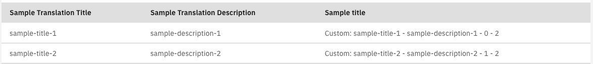

# Setting up a list with custom template columns

Through the `fields` input, you can set up column with custom template, following the following steps:

1.  Add the column in the ColumnConfig array:

    **`sample.component.ts`**

    ```typescript
    ...
    import {AfterViewInit, ViewChild} from '@angular/core';
    ...
    import {ColumnConfig, ViewType} from '@valtimo/components';
    ...

    // For custom templates, the fields need to be set after the view was initialized
    export class SampleComponent implements AfterViewInit {
    ...
    @ViewChild('sampleId') public sampleTemplate: TemplateRef<any>;
    public fields: Array<ColumnConfig>;
    ...

    public ngAfterViewInit(): void {
    ...
      this.fields = [
        {
          viewType: ViewType.TEXT,
          key: 'title',
          label: 'sample.translation.title',
        },
        {
          viewType: ViewType.TEXT,
          key: 'description',
          label: 'sample.translation.description',
        },
        {
            viewType: ViewType.TEMPLATE,
            template: this.sampleTemplate,
            key: '',
            label: 'Sample title',
        },
      ];
    ...
    }
    ...
    }
    ```
2.  Add your template in the HTML of the component

    **`sample.component.html`**

    ```angular2html
    <valtimo-carbon-list
        [items]="items"
        [fields]="fields"
    ></valtimo-carbon-list>
    ...

    // The "data" field in the template contains the item of the row, the index of the item in the list and the length of the list

    <ng-template #sampleTemplate let-data="data">
     Custom: {{data.item.title}} - {{data.item.description}} - {{data.index}} - {{data.length}}
    </ng-template>
    ```

This will create a list with a context menu:


