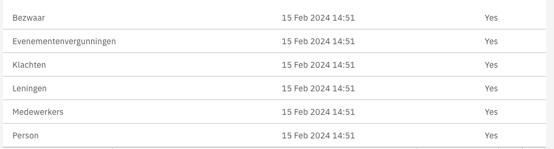

# Toolbar actions list

The CarbonListComponent supports hiding the column headers. To enable this the following steps must be followed:

1.  Set the hideColumnHeader flag to true:

    **`sample.component.html`**

    ```angular2html
    <valtimo-carbon-list
    [items]="items"
    [fields]="fields"
    [hideColumnHeader]="true"
    >
    </valtimo-carbon-list>
    ```

This will create a list with hidden column headers:


