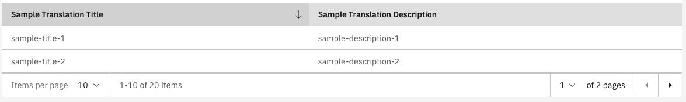

# Pagination and sorting

The CarbonListComponent supports backend pagination and sorting. In order to make use of these, a couple of things need to be set up.

1.  You need to specify in the `fields` which columns are sortable and set a pagination object:

    **`sample.component.ts`**

    ```typescript
    ...
    import {Pagination} from '@valtimo/components';
    ...
    export class SampleComponent{
     ...
     public pagination: Pagination = {
       collectionSize: 20,
       size: 10,
       page: 1,
     };
     public fields: Array<ColumnConfig> = [
       {
         viewType: ViewType.TEXT,
         key: 'title',
         label: 'sample.translation.title',
         sortable: true,
       },
       {
         viewType: ViewType.TEXT,
         key: 'description',
         label: 'sample.translation.description',
         sortable: true,
       },
     ]
     ...
    }
    ```
2.  You need to add the output listeners for pagination and sorting in the template and pass the pagination object to the list:

    **`sample.component.html`**

    ```angular2html
    ...
     <valtimo-carbon-list
        [items]="items"
        [fields]="fields"
        [pagination]="pagination"
        (paginationClicked)="onPaginationClicked($event)"
        (paginationSet)="onPaginationSet($event)"
        (sortChanged)="onSortChanged($event)"
      ></valtimo-carbon-list>
    ...
    ```
3.  Add handlers for the output listeners:

    **`sample.component.ts`**

    ```typescript
    ...
    import {SortState} from '@valtimo/config';
    ...
    export class SampleComponent{
     ...
     public onPaginationClicked(currentPage: number): void {
       // Code to process pagination change
     }

     public onPaginationSet(collectionSize: number): void {
       // Code to process pagination change
     }

     public onSortChanged(newSortState: SortState): void {
       // Code to process sort change
     }
     ...
    }
    ```

This will create a list with pagination and sorting:


