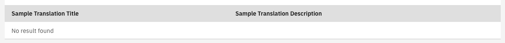
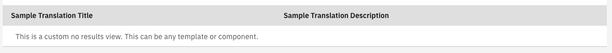

# Valtimo Carbon List

## Valtimo Carbon List

The `valtimo-carbon-list` is a component to make building lists faster and easier.

There are a few options for defining lists, besides the Simple List defined below:

* [List with actions](list-with-actions.md)
* [List with Custom Template Columns](list-with-custom-template.md)
* [List with Pagination and Sorting](list-with-pagination-sorting.md)
* [Searchable List](searchable-list.md)
* [List with multi-select](list-with-multi-select.md)
* [List with toolbar actions](list-with-toolbar-actions.md)
* [List with hidden headers](list-with-hidden-header.md)
* [List with tags](../../../reference/user-interface/components/valtimo-carbon-list/list-with-tags.md)

### Setting up a simple list

To use the CarbonListComponent there is a series of steps.

1.  Import the CarbonListModule into your module:

    **`sample.module.ts`**

    ```angular2html
    ...
    import {CarbonListModule} from '@valtimo/components'
    ...
    @NgModule({
      ...
      imports: [
        ...
        CarbonListModule,
        ...
      ]
    })
    export class SampleModule
    ```
2.  Add the `valtimo-carbon-list` tag in your template (this example displays a simple list):

    **`sample.component.html`**

    ```angular2html
    <valtimo-carbon-list
      [items]="items"
      [fields]="fields"
    ></valtimo-carbon-list>
    ```
3.  Define your attributes in the component code:

    **`sample.component.ts`**

    ```typescript
    ...
    import {ColumnConfig, ViewType} from '@valtimo/components';
    ...

    export class SampleComponent {
     ...
     public fields: Array<ColumnConfig> = [
       {
         viewType: ViewType.TEXT,
         key: 'title',
         // this could be a translation key or just a static label
         label: 'sample.translation.title',
       },
       {
         viewType: ViewType.TEXT,
         key: 'description',
         label: 'sample.translation.description',
       },F
     ];

     public items: Array<any> = [
     {
         title: 'sample-title-1',
         description: 'sample-description-1',
     },
     {
         title: 'sample-title-2',
         description: 'sample-description-2',
     }
     ];
     ...
    }
    ```

This will create a simple list that shows the two items.

.png>)

### Clicking on rows

The `(rowClicked)` property is used to add an action when the user clicks on a row

The property must be added with a reference to a method

**`sample.component.html`**

```angular2html
<valtimo-carbon-list
    [items]="items"
    [fields]="fields"
    (rowClicked)="sampleCallback($event)"
></valtimo-carbon-list>
```

The method must be defined in the component

**`sample.component.ts`**

```typescript
...
public sampleCallback(item: any) {
    // Code to process item
}
...
```

### No results view

The CarbonListComponent has a default message that displays whenever there are no results: 

However, the no results view can be customized like this:

**`sample.component.html`**

```angular2html
<valtimo-carbon-list
[items]="items"
[fields]="fields"
>
  This is a custom no results view.

  This can be any template or component.
</valtimo-carbon-list>
```

This will create a custom no results message: 

## Overview of the `@Input` and `@Output` fields of the `CarbonListComponent`

### Inputs

| Property               | Type                     | Required | Default                     | Description                                                                                                                                                                    |
| ---------------------- | ------------------------ | -------- | --------------------------- | ------------------------------------------------------------------------------------------------------------------------------------------------------------------------------ |
| `items`                | `Array<any>`             | yes      | \[]                         | The data displayed in the list.                                                                                                                                                |
| `fields`               | `Array<ColumnConfig>`    | yes      | \[]                         | The object that defines the header and displayed fields of the items. The ColumnConfig interface is defined in the '@valtimo/components' library                               |
| `actionItems`          | `Array<ActionItem>`      | no       | \[]                         | The object that defines Context Menu items. The ActionItem interface is deifned in the '@valtimo/components' library                                                           |
| `loading`              | `boolean`                | no       | false                       | Flag that defines wether or not the list displays a loading state.                                                                                                             |
| `header`               | `boolean`                | no       | false                       | Flag that defines wether or not the list displays a header.                                                                                                                    |
| `hideColumnHeader`     | `boolean`                | no       | false                       | Flag that hides or shows the column headers.                                                                                                                                   |
| `isSearchable`         | `boolean`                | no       | false                       | Flag that defines wether or not the list is searchable. Without any (search) event listener, the search is done in the FE by default.                                          |
| `initialSort`          | `SortState`              | no       | undefined                   | Object that defines if there is an initial sorting applied to the list. The SortState is an interface defined in the '@valtimo/config' library.                                |
| `movingRowsEnabled`    | `boolean`                | no       | false                       | Flag that defines wether or not arrows to move rows are displayed.                                                                                                             |
| `pagination`           | `Pagination \| false`    | no       | undefined                   | The object that defines BE supported pagination. The Pagination interface is defined in the `@valtimo/components` library.                                                     |
| `paginatorConfig`      | `CarbonPaginatorConfig`  | no       | DEFAULT\_PAGINATOR\_CONFIG  | The object that defines the options for pagination size and if a page input is displayed. The CarbonPaginatorConfig interface is defined in the `@valtimo/components` library. |
| `paginationIdentifier` | `string`                 | no       | undefined                   | An identifier for storing pagination size in localStorage.                                                                                                                     |
| `tableTranslations`    | `CarbonListTranslations` | no       | DEFAULT\_LIST\_TRANSLATIONS | The object that defines translations for the multi-select bar and the pagination. The CarbonListTranslations interface is defined in the `@valtimo/components` library.        |
| `showSelectionColumn`  | `boolean`                | no       | false                       | Flag that defines wether or not the list has multi-select enabled.                                                                                                             |
| `striped`              | `boolean`                | no       | false                       | Flag that defines wether or not the rows in the list are striped.                                                                                                              |

### Outputs

| Property            | Type                         | Description                                                                                             |
| ------------------- | ---------------------------- | ------------------------------------------------------------------------------------------------------- |
| `rowClicked`        | `EventEmitter<any>`          | Emits the item corresponded to the clicked row.                                                         |
| `paginationClicked` | `EventEmitter<number>`       | Emits the current page selected.                                                                        |
| `paginationSet`     | `EventEmitter<number>`       | Emits the page size of the list.                                                                        |
| `search`            | `EventEmitter<string>`       | Emits the search string. If this event listener is added, then the search should be provided by the BE. |
| `sortChanged`       | `EventEmitter<SortState>`    | Emits the new SortState. The SortState interface is defined in `@valtimo/config`                        |
| `moveRow`           | `EventEmitter<MoveRowEvent>` | Emits the MoveRowEvent. The MoveRowEvent interface is defined in `@valtimo/components`                  |
