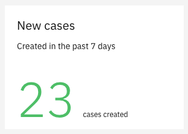
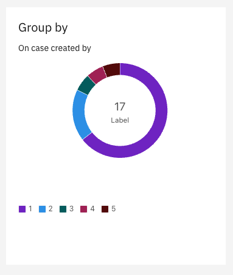
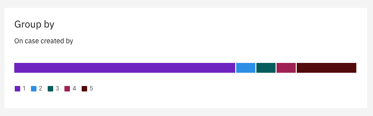
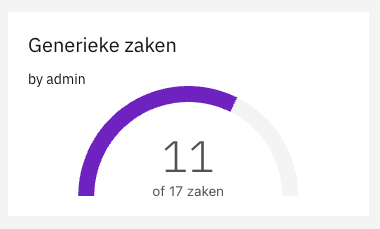

# Dashboard

The data sources and display types listed below are the ones that come included in Valtimo.

Each data source and display types used must be imported in the `AppModule` of your front-end implementation if you want
to use them. They are exported from `'@valtimo/dashboard'`.


**Note:** Permissions on dashboards are only applied when the application property `valtimo.authorization.dashboard.enabled` is set to `true`.


## Data sources

### Case count

Key: `case-count`

Front-end module: `CaseCountDataSourceModule`

Returns the number of cases of a specific type that match the criteria have been set in the configuration. 

#### Properties

| Name                 | Description                                                                                                                                                                |
|----------------------|:---------------------------------------------------------------------------------------------------------------------------------------------------------------------------|
| `documentDefinition` | Required. The key of the document definition for which cases need to be counted.                                                                                           |
| `queryConditions`    | An array of conditions that the case needs to match in order to be included in the count. Each item in the array is a query condition object described in the table below. |

#### Query condition

| Name            | Description                                                                                                                                                                                                                                                           |
|-----------------|:----------------------------------------------------------------------------------------------------------------------------------------------------------------------------------------------------------------------------------------------------------------------|
| `queryPath`     | The path of the variable that the condition uses to filter the count.                                                                                                                                                                                                 |
| `queryOperator` | The operator that the condition uses to filter the count. Available values are `!=`, `==`, `>`, `>=`, `<` and `<=`.                                                                                                                                                   |
| `queryValue`    | The value which the queryPath variable is checked against. As of version 12.1, date time expressions can be used. For example: `${localDateTimeNow.minusWeeks(2)}`. This is used to retrieve the amount of cases created in the past two weeks.    |

### Multiple case counts

Key: `case-counts`

Front-end module: `CaseCountsDataSourceModule`

Returns multiple counts of cases of a specific type that match the criteria have been set for each count.

#### Properties

| Name                 | Description                                                                                                                                                                |
|----------------------|:---------------------------------------------------------------------------------------------------------------------------------------------------------------------------|
| `documentDefinition` | Required. The key of the document definition for which cases need to be counted.  
| `queryItems`         | Required. Minimum of two need to be defined. Each `queryItem` requires a `label` and an array of `queryConditions`, the latter are similar to those require for the `case-count` data source.

### Case group by

Key: `case-group-by`

Front-end module: `CaseGroupByDataSourceModule`

| Name                 | Description                                                                                                                                                                                               |
|----------------------|:----------------------------------------------------------------------------------------------------------------------------------------------------------------------------------------------------------|
| `documentDefinition` | Required. The key of the document definition for which cases need to be counted.                                                                                                                          
| `path`               | Required. The path of which the values need to be grouped. For example `case:createdBy`.                                                                                                                  
| `queryConditions`    | Optional. An array of conditions that the case needs to match in order to be included in the counts. Each item in the array is a query condition object described in the table under `case-count`.        |
| `enum`               | Optional. An object which defines how items retrieved by the group by need to be displayed. This can be used to show technical values in a user-friendly way. For example `{"isRequired": "Is required"}`. |

## Display types

### Number

Key: `number`

Front-end module: `BigNumberModule`

Displays the data as a single number in text.

#### Properties

| Name                      | Description                                                                                                                                                                                                                        |
|---------------------------|:-----------------------------------------------------------------------------------------------------------------------------------------------------------------------------------------------------------------------------------|
| `title`                   | The title of the widget, shown at the top of the widget.                                                                                                                                                                           |
| `subtitle`                | The text shown below the title.                                                                                                                                                                                                    |
| `label`                   | The label that is displayed to the right of the number. Can be used to clarify what the number indicates.                                                                                                                          |
| `useKPI`                  | Enables the use of thresholds to change the color of the number. When set to `false` the color of the number is black. When set to `true` the color of the number is green unless it is above one or more of the threshold values. |
| `lowSeverityThreshold`    | Limit above which the color of the number becomes yellow.                                                                                                                                                                          |
| `mediumSeverityThreshold` | Limit above which the color of the number becomes orange.                                                                                                                                                                          |
| `highSeverityThreshold`   | Limit above which the color of the number becomes red.                                                                                                                                                                             |

### Donut chart

Key: `donut`

Front-end module: `DonutModule`

Displays multiple counts in a donut chart.

#### Properties

| Name                      | Description                                                                                               |
|---------------------------|:----------------------------------------------------------------------------------------------------------|
| `title`                   | Required. The title of the widget, shown at the top of the widget.                                        |
| `subtitle`                | The text shown below the title.                                                                           |
| `label`                   | The label that is displayed in the center of the donut.  |

### Meter chart

Key: `meter`

Front-end module: `MeterModule`

Displays multiple counts in a horizontal meter chart.

#### Properties

| Name                      | Description                                                                                                                                                                                                                        |
|---------------------------|:-----------------------------------------------------------------------------------------------------------------------------------------------------------------------------------------------------------------------------------|
| `title`                   | Required. The title of the widget, shown at the top of the widget.                                                                                                                                                                 |
| `subtitle`                | The text shown below the title.                                                                                                                                                                                                    |

### Gauge

Key: `gauge`

Front-end module: `GaugeModule`

Displays a count and a total count in a gauge.

#### Properties

| Name                      | Description                                                                              |
|---------------------------|:-----------------------------------------------------------------------------------------|
| `title`                   | Required. The title of the widget, shown at the top of the widget.                       |
| `subtitle`                | The text shown below the title.                                                          |
| `label`                   | The label specifies the type of item under the gauge. In the screenshot this is 'zaken'. |
